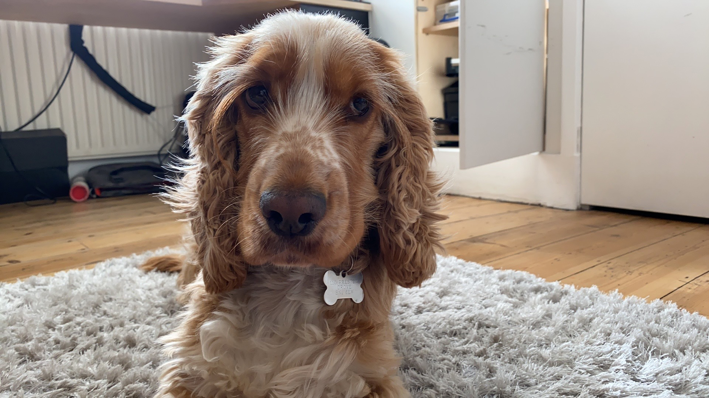

```{r}
library(easystats)
library(tidyverse)

#non tidyverse
library(afex)
library(DT)
library(gt)
library(kableExtra)
library(marginaleffects)


here::here("helpers/discovr_helpers.R") |> source()
here::here("helpers/easystats_helpers.R") |> source()

sniff_tib <- discovr::sniffer_dogs
scent_tib <- discovr::alien_scents

sniff_cons <- cbind(
  aliens_vs_non = c(1/2, -1/2, -1/2, 1/2),
  alien_vs_shape = c(1/2, 0, 0, -1/2),
  human_vs_manquin = c(0, 1/2, -1/2, 0)
  )

contrasts(sniff_tib$entity) <-  sniff_cons
```


```{r, child = "space_intro.qmd"}

```

##  {background-image="../shared_media/images/spaceship_light_ppt_hex.jpg" background-size="cover"}

::: r-stack
{.fragment fig-align="center" width="1050" height="594"}

{.fragment fig-align="center" width="1050" height="594"}
:::


## {background-image="../shared_media/images/spaceship_light_ppt_hex.jpg" background-size="cover"}

{width=1000}

- **Systematic variance**: created by our manipulation
- **Unsystematic variance**: variance created by unknown factors
  
::: notes
If we test the same puppies while sniffing humans at two points in time, we’d expect them to get similar scores (other things being equal their vocalizations shouldn't change much). A lot of unsystematic variance is removed (e.g. how much they naturally vocalise, how sensitive their nose is etc.).

Like an independent design, in a repeated measures design, differences between the two conditions can be caused by one of two things: (1) the manipulation that was carried out on the participants (whether the puppies sniffed aliens or humans), or (2) other factors that we couldn’t account for (time of day, mood, excitability). The latter factor in is likely to create much less random variation in a RM design because many sources of possible variation are controlled.

As such, there are always two sources of variation:

Systematic variation: This variation is due to the experimenter doing something to all of the participants in one condition but not in the other condition.

Unsystematic variation: This variation results from random factors that could not be controlled.

Like independent designs, repeated measures designs still compare the amount of systematic variance to the amount of unsystematic variance. In other words it compares the amount of variation caused by the experiment to the amount of natural variation (created by uncontrolled variables). However, the source of the systematic variance is different (I.e. it comes from within participants rather than between).

:::

## Benefits of repeated measures designs {background-image="../shared_media/images/spaceship_light_ppt_hex.jpg" background-size="cover"}

- Sensitivity
    - Unsystematic variance is reduced
    - More sensitive to experimental effects

- Economy
    - Less participants are needed
    + But, be careful of fatigue

::: notes
Sensitivity
The effect of our experimental manipulation is likely to be more apparent in a repeated measures design than in a between-group design because in the former unsystematic variation can be caused only by differences in the way in which someone behaves at different times. In between-group designs we have differences in innate ability contributing to the unsystematic variation. Therefore, this error variation will almost always be much larger than if the same participants had been used. When we look at the effect of our experimental manipulation, it is always against a background of ‘noise’ caused by random, uncontrollable differences between our conditions. In a repeated measures design this ‘noise’ is kept to a minimum and so the effect of the experiment is more likely to show up. This means that repeated measures designs have more power to detect effects that genuinely exist than independent designs.
Economy
Repeated measures designs make more efficient use of participants and so save time and money. However, although in theory you could have a participant take part in many different conditions, they do tend to get very bored and frustrated in long experiments. Therefore, it’s always worth trying to bear in mind what your participants will have to endure before designing an experiment with 250 different experimental conditions
:::


## Can puppies sniff out aliens? {background-image="../shared_media/images/spaceship_light_ppt_hex.jpg" background-size="cover"}

- Outcome = vocalizations during 1 min sniffing (`vocalizations`)
- Predictor: type of entity being sniffed (`entity`)
  - Alien (not in humanoid form)
  - Human (control for alien vs human)
  - Mannequin (control for humanoid form)
  - Shapeshifter (alien in humanoid form)
- `dog_name` indicates the name of the dog (*N* = 8)


::: fragment
::: {.callout-note icon = false}
##  Statis-tip

This is a **one-way repeated measures design**.

:::
:::

::: notes

Imagine a scientist wanted to look at 
:::

## The data {background-image="../shared_media/images/spaceship_light_ppt_hex.jpg" background-size="cover"}

```{r}

rowVar <- function(x, ...) {
  rowSums((x - rowMeans(x, ...))^2, ...)/(dim(x)[2] - 1)
}


sniff_dt <- sniff_tib |>
  tidyr::pivot_wider(
    id_cols = dog_name,
    names_from = entity,
    values_from = vocalizations
  ) |>
  dplyr::mutate(
    Mean = rowMeans(pick(where(is.numeric))),
    Variance = rowVar(pick(where(is.numeric))) |> round(2)
  ) |> 
  gt::gt()|> 
  gt::cols_align(
    align = "center"
    ) 

sniff_dt|>
  gt::grand_summary_rows(
    columns = c(Alien, Human, Mannequin, Shapeshifter),
    fns = list(label = md("**Mean**"), fn = "mean"),
    fmt = ~fmt_number(., decimals = 2)
  ) |>
  gt::tab_style(
    style = list(
      gt::cell_fill(color = mulberry, alpha = 0.8),
      gt::cell_text(weight = "bold", color = "white")
      ),
    locations = gt::cells_grand_summary(
      columns = c(Alien, Human, Mannequin, Shapeshifter),
      rows = 1
    )
    )
```


## The data in `r rproj()` {background-image="../shared_media/images/spaceship_light_ppt_hex.jpg" background-size="cover"}

```{r}
sniff_tib|> 
  DT::datatable(caption = 'Table 2: Data for the sniffer dog example',
                options = list(
                dom = 'tp',
                columnDefs = list(
                  list(className = 'dt-center', targets = 1:3)
                  ),
                pageLength = 10
  )
  )
```


## Repeated measures and the linear model {background-image="../shared_media/images/spaceship_light_ppt_hex.jpg" background-size="cover"}

:::{.txt_mulberry}
$$
\begin{aligned}
\text{vocalizations}_{i} & = b_{0} + b_{1}\text{entity}_{i} + \varepsilon_{i}
\end{aligned}
$$
:::

:::  fragment
:::{.center-h}
:::{.txt_mulberry}
$$
\begin{aligned}
\text{vocalizations}_{i} & = b_{0} + b_{1}\text{alien vs. manq}_{i} + b_{2}\text{shape vs. manq}_{i} + b_{3}\text{human vs. manq}_{i} + \varepsilon_{i} \\
\end{aligned}
$$
:::
:::
:::

\

:::  fragment
::: {.callout-warning icon = false}
##  The danger zone!

- Same participants in all conditions
  - Scores across conditions correlate
  - Violates the assumption of independent residuals (think back to the lecture on bias)
  
:::
:::


## Approaches to repeated measures designs and the GLM {background-image="../shared_media/images/spaceship_light_ppt_hex.jpg" background-size="cover"}

### Approach 1

- Fit a different kind of model that adjusts for these dependencies (a **multilevel model**)
  - Can model different kinds of dependency in errors
  - It's a bit complicated (we teach it at PG)


::: fragment

### Approach 2

- Assume [**sphericity**]{.txt_mulberry}
  - We make an additional assumption about dependencies between scores
  - We estimate departures from this assumption
  - We correct for these departures by adjusting the degrees of freedom for *F*

:::

## What is sphericity, $\epsilon$ ? {background-image="../shared_media/images/spaceship_light_ppt_hex.jpg" background-size="cover"}

::: center-h
```{r}
#| echo: false

spher_dt <- sniff_tib |>
  tidyr::pivot_wider(
    id_cols = dog_name,
    names_from = entity,
    values_from = vocalizations
  ) |>
  dplyr::mutate(
    `Alien-Human` = Alien - Human,
    `Alien-Mannequin` = Alien - Mannequin,
    `Alien-Shapeshifter` = Alien - Shapeshifter,
    `Human-Mannequin` = Human - Mannequin,
    `Human-Shapeshifter` = Human - Shapeshifter,
    `Mannequin-Shapeshifter` = Mannequin - Shapeshifter,
  ) |> 
  dplyr::select(-c(Alien:Shapeshifter)) |> 
  gt::gt(rowname_col = "dog_name") |> 
  gt::cols_align(
    align = "center"
    )

spher_dt |>
  gt::grand_summary_rows(
    columns = vars(`Alien-Human`, `Alien-Mannequin`, `Alien-Shapeshifter`, `Human-Mannequin`, `Human-Shapeshifter`, `Mannequin-Shapeshifter`),
    fns = list(label = "Variance", fn = "var"),
    fmt = ~fmt_number(., decimals = 2)
  ) |> 
  gt::tab_style(
    style = list(
      gt::cell_fill(color = mulberry, alpha = 0.8),
      gt::cell_text(weight = "bold", color = "white")
      ),
    locations = gt::cells_grand_summary(
      columns = vars(`Alien-Human`, `Alien-Mannequin`, `Alien-Shapeshifter`, `Human-Mannequin`, `Human-Shapeshifter`, `Mannequin-Shapeshifter`),
      rows = 1
    )
    )
```

:::

## Sphericity, $\epsilon$ {background-image="../shared_media/images/spaceship_light_ppt_hex.jpg" background-size="cover"}

> The differences between pairs of groups should have equal variances

::: fragment

### How is it estimated?

- Greenhouse-Geisser estimate, $\hat{\epsilon}$
- Huynh-Feldt estimate, $\tilde{\epsilon}$
- If $\epsilon = 1$, sphericity is perfect
- If $\epsilon < 1$, sphericity is violated (to some degree)
  
:::
::: fragment

### What do we do about it?

- (`r rproj()` can) multiply *df* by these estimates to correct for the effect of sphericity
- In doing so, we correct the *df* by the degree to which spehercity is violated
  - *df* get smaller making it harder for the test statistic to be significant
- Routinely apply the G-G correction and forget about sphericity

:::

## {background-video="media/sphericity_song.mp4" background-size="cover"}


## Fitting the model {background-image="../shared_media/images/spaceship_light_ppt_hex.jpg" background-size="cover"}

::: columns
:::{.column width="50%}

- The `afex::aov_4()` function
  - Specify the repeated measures with `(rm_predictors|id_var)`
  - Automatically sets contrasts
  - Built in interaction plot with `afex_plot()`
  - But ... no parameter estimates, limited diagnostic plots, no robust methods

:::

:::{.column width="50%}

- Use `glmmTMB::glmmTMB()`

  - A trickier but more flexible option that we don't teach you
  - Manually set contrasts
  - Can get parameter estimates, diagnostic plots, and robust methods

:::
:::

## {background-image="../shared_media/images/spaceship_light_ppt_hex.jpg" background-size="cover"}

{fig-align="center" height=600}

## [L]{.txt_ong}oad and [L]{.txt_ong}ook {background-image="../shared_media/images/spaceship_light_ppt_hex.jpg" background-size="cover"}

```{r}
#| echo: true

sniff_tib |> 
  group_by(entity) |> 
  describe_distribution(select = "vocalizations") |> 
  data_remove(c("Variable", "n_Missing")) |> # optional to remove redundant column
  display()
```


{.absolute top=0 left=800 height="80"}


## [V]{.txt_ong}isualize {background-image="../shared_media/images/spaceship_light_ppt_hex.jpg" background-size="cover"}

```{r}
#| fig-width: 10
#| fig-height: 5

ggplot(sniff_tib, aes(x = entity, y = vocalizations)) +
  geom_violin(colour = "#999933", fill = "#DDCC77", alpha = 0.3) +
  stat_summary(fun.data = "mean_cl_normal", colour = "#999933") +
  scale_y_continuous(breaks = 0:12) +
  labs(x = "Entity sniffed", y = "Vocalizations (in 1 minute)") +
  theme_minimal()
```

{.absolute top=0 left=800 height="80"}


## Fit the model: Contrasts {background-image="../shared_media/images/spaceship_light_2_ppt_hex.jpg" background-size="cover"}

If the dog training has been successful then we'd expect sniffer dogs to make more vocalizations when sniffing alien entities than non alien-entities. 

- **Contrast 1**: {alien, shapeshifter} vs. {human, mannequin}

We have two 'chunks' in contrast 1 that would then need to be decomposed:

- **Contrast 2**: {alien} vs. {shapeshifter}
- **Contrast 3**: {human} vs. {mannequin}

Using the rules for contrast coding we'd get the codes in Table 4:

:::{.center-h}
```{r}
#| fig-width: 11.5
#| fig-height: 5.5

con_tbl <- tibble(
  `Group` = c("Alien", "Human", "Mannequin", "Shapeshifter"),
  `Contrast 1` = c("1/2", "-1/2", "-1/2", "1/2"),
  `Contrast 2` = c("1/2", 0, 0, "-1/2"),
  `Contrast 3` = c(0, "1/2", "-1/2", 0),
  )

knitr::kable(con_tbl,
             caption = "Table 4: Contrast coding for the entity variable",
             align = "lccc") |> 
  style_my_kable(nrows = 4, padding = 10)
```
:::


## Fitting the model {background-image="../shared_media/images/spaceship_light_2_ppt_hex.jpg" background-size="cover"}

::: txt_xl
```{r}
#| echo: true

sniff_afx <- afex::aov_4(vocalizations ~ entity + (entity|dog_name),
                         data = sniff_tib)
```
:::

## [E]{.txt_ong}valuate fit {background-image="../shared_media/images/spaceship_light_2_ppt_hex.jpg" background-size="cover"}


```{r}
#| echo: true
#| eval: false

model_parameters(sniff_afx, es_type = "omega") |> 
  display(use_symbols = TRUE)
```

\

::: {.whitebox}
::: tbl_s
```{r}
model_parameters(sniff_afx, es_type = "omega") |> 
  display(use_symbols = TRUE, footer = "")
```

:::
:::


</br>

```{r}
sniff_aov <- model_parameters(sniff_afx, es_type = "omega")
```


:::{.callout-important icon=false}
##  Report`r rproj()`


The entity sniffed had a non-significant effect on the number of vocalizations by sniffer dogs, `r report_ez_aov(sniff_aov, es_type = "Omega2_partial")`.

:::

{.absolute top=0 left=800 height="80"}


## [E]{.txt_mulberry}valuate assumptions {background-image="../shared_media/images/spaceship_light_2_ppt_hex.jpg" background-size="cover"}

::: center-h
```{r}
#| echo: true
#| message: false
#| warning: false
#| fig-width: 7
#| fig-height: 6

check_model(sniff_afx)
```
:::


## [I]{.txt_ong}nterpret {background-image="../shared_media/images/spaceship_light_2_ppt_hex.jpg" background-size="cover"}

::: txt_xl
::: {.callout-warning icon = false}
##  The danger zone!

- At this point we would stop interpreting the results **because the overall effect was non-significant**.
- What follows is for pedagogic kicks and giggles.

:::
:::


{.absolute top=0 left=900 height="80"}

## [I]{.txt_ong}nterpret contrasts {background-image="../shared_media/images/spaceship_light_2_ppt_hex.jpg" background-size="cover"}

```{r}
#| echo: true
#| eval: false
#| code-line-numbers: 1-2|3|4|7-8

sniff_cons <- cbind(
  aliens_vs_non = c(1/2, -1/2, -1/2, 1/2),
  alien_vs_shape = c(1/2, 0, 0, -1/2),
  human_vs_manquin = c(0, 1/2, -1/2, 0)
  )

estimate_contrasts(sniff_afx, contrast = "entity", comparison = sniff_cons) |> 
  display()
```


::: {.whitebox}
```{r}
sniff_cons <- cbind(
  aliens_vs_non = c(1/2, -1/2, -1/2, 1/2),
  alien_vs_shape = c(1/2, 0, 0, -1/2),
  human_vs_manquin = c(0, 1/2, -1/2, 0)
  )

estimate_contrasts(sniff_afx, contrast = "entity", comparison = sniff_cons) |> 
  display(footer = "")
```

:::

```{r}
sniff_pars <- estimate_contrasts(sniff_afx, contrast = "entity", comparison = sniff_cons)
sniff_ph <- estimate_contrasts(sniff_afx, contrast = "entity", p_adjust = "bonferroni")
```


:::{.callout-important icon=false}
##  Report`r rproj()`

Contrasts revealed that vocalizations were significantly higher when sniffing aliens compared to non-aliens, `r report_ph(sniff_pars, row = 1)`), but not when sniffing an alien compared to a shapeshifter, `r report_ph(sniff_pars, row = 2)` or when sniffing a human compared to a mannequin, `r report_ph(sniff_pars, row = 3)`).
:::


{.absolute top=0 left=900 height="80"}


## [I]{.txt_ong}nterpret *post hoc* tests {background-image="../shared_media/images/spaceship_light_2_ppt_hex.jpg" background-size="cover"}

::: {.callout-warning icon = false}
##  The danger zone!

- You wouldn’t do contrasts AND *post hoc* tests, you’d do one or the other.
- We wouldn’t interpret these particular *post hoc* tests given the main effect of the entity sniffed was not significant.

:::

```{r}
#| echo: true
#| eval: false

estimate_contrasts(sniff_afx, contrast = "entity", p_adjust = "bonferroni") |> 
  display()
```


::: {.whitebox}
```{r}
#| eval: true

estimate_contrasts(sniff_afx, contrast = "entity", p_adjust = "bonferroni") |> 
  display(footer = "")
```

:::


```{r, child = "space_middle.qmd"}

```


#  Scenting a victory ... factorial repeated measures designs {background-image="../shared_media/images/spaceship_light_ppt_hex.jpg" background-size="cover"}

## Can scents distract the sniffer dogs? {background-image="../shared_media/images/spaceship_light_ppt_hex.jpg" background-size="cover"}

::: columns
:::{.column width="70%"}

- 50 sniffer dogs
  - Participated in all conditions
  - Sniffed 9 different 'things'
- Predictor: `entity`
  - **Human**: the dog sniffs a human
  - **Shapeshifter** the dog sniffs an alien in humanoid form
  - **Alien** the dog sniffs an alien in lizard form
- Predictor: `scent_mask`
  - The entity had no masking scent (**none**)
  - The entity was smeared with **human** pheromones
  - The entity was smeared with **fox** pheromones
- Outcome: The number of `vocalizations` during each 1 minute sniff
:::


:::{.column width="30%"}


::: {.callout-note icon = false}
##  Statis-tip

This is a **two-way repeated measures design**.

:::
:::
:::

## The model {background-image="../shared_media/images/spaceship_light_2_ppt_hex.jpg" background-size="cover"}

- Let's simplify things by ignoring the fact that `entity` and `scent_mask` will be represented by two dummy variables each (and the interaction by 4!)
- The simplest version of the repeated measures model instead treats the effects of predictor variables as fixed, but acknowledges that dogs, overall, will vary in their vocalizations

:::{.center-h}
:::{.txt_mulberry}
$$
\begin{aligned}
\text{vocalizations}_{ij} & = \left[\hat{b}_{0} + \hat{b}_{1}\text{entity}_{ij} + \hat{b}_{2}\text{scent}_{ij} + \hat{b}_{3}(\text{entity}_{ij}\times\text{scent}_{ij})\right] +\\
&\quad \left[u_{0j} + e_{ij}\right]\\
u_{0j} &\sim N(0, \sigma^{2}_{\mu_0})
\end{aligned}
$$

:::
:::

::: fragment

- $u_{0j}$ represents the difference in vocalizations for a particular dog from the overall mean number of vocalizations
- The model also includes a parameter that estimates the variance in vocalizations across dogs ($\sigma^{2}_{\mu_0}$)

:::


## [L]{.txt_ong}oad and [L]{.txt_ong}ook {background-image="../shared_media/images/spaceship_light_2_ppt_hex.jpg" background-size="cover"}

```{r}
scent_tib|> 
  DT::datatable(caption = 'Table 7: Data for the scent masking example',
                options = list(
                dom = 'tp',
                columnDefs = list(
                  list(className = 'dt-center', targets = 1:3)
                  ),
                pageLength = 10
  )
  )
```


## [L]{.txt_ong}oad and [L]{.txt_ong}ook {background-image="../shared_media/images/spaceship_light_ppt_hex.jpg" background-size="cover"}

```{r}
#| echo: true

scent_tib |> 
  group_by(entity, scent_mask) |> 
  describe_distribution(select = "vocalizations")  |> 
  data_remove(c("Variable", "n_Missing")) |> # optional to remove redundant column
  display()
```


{.absolute top=0 left=800 height="80"}


## [V]{.txt_ong}isualize {background-image="../shared_media/images/spaceship_light_ppt_hex.jpg" background-size="cover"} 

```{r}
#| fig-width: 10
#| fig-height: 6

scent_int_plot <- ggplot2::ggplot(scent_tib, aes(x = scent_mask, y = vocalizations, colour = entity)) +
  geom_point(alpha = 0.2, position = position_jitter(width = 0.1)) +
  stat_summary(fun.data = "mean_cl_normal", geom = "pointrange", size = 1) +
  scale_colour_manual(values = viridis_3) +
  coord_cartesian(ylim = c(0,15)) +
  scale_y_continuous(breaks = 0:15) +
  labs(x = "Masking scent", y = "Number of vocalizations", colour  = "Entity") +
  theme_minimal(base_size = 18)
scent_int_plot
```

{.absolute top=0 left=800 height="80"}


## Fit the model {background-image="../shared_media/images/spaceship_light_2_ppt_hex.jpg" background-size="cover"}

::: txt_xl

```{r}
#| echo: true

scent_afx <- afex::aov_4(vocalizations ~ entity*scent_mask + (entity*scent_mask|dog_id),
                         data = scent_tib)
```

:::


## [E]{.txt_ong}valuate {background-image="../shared_media/images/spaceship_light_ppt_hex.jpg" background-size="cover"}

```{r}
#| echo: true
#| eval: false

model_parameters(scent_afx, es_type = "omega") |> 
  display(use_symbols = TRUE)
```

:::{.whitebox}
::: tbl_s
```{r}
#| echo: false

model_parameters(scent_afx, es_type = "omega") |> 
  display(use_symbols = TRUE, footer = "")
```

:::
:::


```{r}
scent_aov <- model_parameters(scent_afx, es_type = "omega")
```

:::{.callout-important icon=false}
##  Report`r rproj()`

The interaction effect suggests that the effect of entity on vocalizations was significantly moderated by what scent the entity was wearing, `r report_ez_aov(scent_aov, row = 3)`.
:::

::: fragment
::: {.callout-warning icon = false}
##  The danger zone!

**"It is never sensible to interpret main effects in the presence of a significant interaction effect."**

:::
:::

{.absolute top=0 left=800 height="80"}


## [E]{.txt_mulberry}valuate assumptions {background-image="../shared_media/images/spaceship_light_ppt_hex.jpg" background-size="cover"}

::: center-h
```{r}
#| echo: true
#| message: false
#| warning: false
#| fig-width: 7
#| fig-height: 6

check_model(scent_afx)
```
:::

{.absolute top=0 left=800 height="80"}


## Robust tests {background-image="../shared_media/images/spaceship_light_ppt_hex.jpg" background-size="cover"}

{fig-align="center" height=600}

::: notes
You can't do them so here's a picture of a spaniel looking sad
:::

## [I]{.txt_ong}nterpret: Entity × scent_mask interaction

:::{.callout-important icon=false}
##  Report`r rproj()`

The interaction effect suggests that the effect of entity on vocalizations was significantly moderated by what scent the entity was wearing, `r report_ez_aov(scent_aov, row = 3)`.
:::

:::{.center-h}
```{r}
#| fig-width: 10
#| fig-height: 4.5

scent_int_plot
```
:::


{.absolute top=0 left=900 height="80"}


## [I]{.txt_ong}nterpret simple effects {background-image="../shared_media/images/spaceship_light_ppt_hex.jpg" background-size="cover"}

### The effect of `entity` within type of `scent_mask`

```{r}
#| echo: true
#| eval: false

estimate_contrasts(model = scent_afx,
                   contrast = "entity",
                   by = "scent_mask",
                   comparison = "joint",
                   p_adjust = "bonferroni") |> 
  display()
```

:::{.whitebox}

```{r}
estimate_contrasts(model = scent_afx,
                   contrast = "entity",
                   by = "scent_mask",
                   comparison = "joint",
                   p_adjust = "bonferroni") |> 
  display(footer = "")
```

:::


```{r}
scent_ss1 <- estimate_contrasts(model = scent_afx,
                   contrast = "entity",
                   by = "scent_mask",
                   comparison = "joint",
                   p_adjust = "bonferroni")

scent_ss2 <- estimate_contrasts(model = scent_afx,
                   contrast = "scent_mask",
                   by = "entity",
                   comparison = "joint",
                   p_adjust = "bonferroni")
```


:::{.callout-important icon=false}
##  Report`r rproj()`

Simple effects analysis revealed that the effect of entity was significant when no scent was used, `r report_con(scent_ss1, row = 1)`, when human scent was used, `r report_con(scent_ss1, row = 2)` and also when fox scent was used, `r report_con(scent_ss1, row = 3)`.

:::

::: fragment

- The effect of `entity` is significant for all three scents.
- That's not a helpful finding.

:::

{.absolute top=0 left=900 height="80"}


## [I]{.txt_ong}nterpret simple effects {background-image="../shared_media/images/spaceship_light_ppt_hex.jpg" background-size="cover"}

### The effect of `scent_mask` within each `entity`

```{r}
#| echo: true
#| eval: false

estimate_contrasts(model = scent_afx,
                   contrast = "scent_mask",
                   by = "entity",
                   comparison = "joint",
                   p_adjust = "bonferroni") |> 
  display()
```

:::{.whitebox}

```{r}
estimate_contrasts(model = scent_afx,
                   contrast = "scent_mask",
                   by = "entity",
                   comparison = "joint",
                   p_adjust = "bonferroni") |> 
  display(footer = "")
```

:::


:::{.callout-important icon=false}
##  Report`r rproj()`

Simple effects analysis revealed that the effect of scant mask was significant when sniffing a human, `r report_con(scent_ss2, row = 1)`, shapeshifter, `r report_con(scent_ss2, row = 2)` and alien, `r report_con(scent_ss2, row = 3)`.

:::

::: fragment

- The effect of `scent_mask` is significant for all three entities
- That's also not a helpful finding.

:::

{.absolute top=0 left=900 height="80"}

## [I]{.txt_ong}nterpret *post hoc* tests across an interaction {background-image="../shared_media/images/spaceship_light_ppt_hex.jpg" background-size="cover"}


```{r}
#| fig-width: 10
#| fig-height: 6.5

scent_int_plot +
  annotate("rect", xmin = 0.5, xmax = 1.5, ymin = 0, ymax = 15, fill = viridis_6[1], alpha = 0.1) +
  annotate("rect", xmin = 1.5, xmax = 2.5, ymin = 0, ymax = 15, fill = viridis_6[3], alpha = 0.1) +
  annotate("rect", xmin = 2.5, xmax = 3.5, ymin = 0, ymax = 15, fill = viridis_6[6], alpha = 0.1) +
  theme_minimal()
```

::: notes

If we compare all 9 means against all other means we'll end up with 36 tests, so we might want to focus in on particular tests. For example, what are the differences between entities within each scent. This yields 9 tests (1/4 of what we'd otherwise have).

:::

## [I]{.txt_ong}nterpret *post hoc* tests across an interaction {background-image="../shared_media/images/spaceship_light_ppt_hex.jpg" background-size="cover"}


```{r}
#| echo: true
#| eval: false

estimate_contrasts(model = scent_afx,
                   contrast = "entity",
                   by = "scent_mask",
                   p_adjust = "bonferroni") |> 
  display()
```


:::{.whitebox}

```{r}
estimate_contrasts(model = scent_afx,
                   contrast = "entity",
                   by = "scent_mask",
                   p_adjust = "bonferroni") |> 
  display(footer = "")
```

:::


{.absolute top=0 left=900 height="80"}

## [I]{.txt_ong}nterpret *post hoc* tests across an interaction {background-image="../shared_media/images/spaceship_light_ppt_hex.jpg" background-size="cover"}


::: txt_xl
:::{.callout-important icon=false}
##  Report`r rproj()`

- When no scent is worn, mean vocalizations differ between all entities: aliens elicit significantly more vocalizations than both shapeshifters and humans, and shapeshifters elicit significantly more vocalizations than humans.
- This pattern of findings is the same when a human scent is worn. 
- When fox scent is worn, there are still significantly more vocalizations when sniffing aliens and shapeshifters compared to humans, but the difference between shapeshifters and aliens is *not significant*.
- To sum up, the scents don't distract the sniffer dogs from detecting aliens compared to humans, but confuses them when distinguishing aliens in their lizard form compared to when in humanoid form.


:::
:::


{.absolute top=0 left=900 height="80"}


##  {background-video="../shared_media/video/space_closing_scene.mp4" background-size="cover"}


