# Mixed designs

**… and three-way interactions**

Professor Andy Field, University of Sussex

Links: [bsky.app](https://bsky.app/profile/profandyfield.bsky.social) \| [youtube.com](https://www.youtube.com/user/ProfAndyField) \| [discoveringstatistics.com](https://www.discoveringstatistics.com) \| [discovr.rocks](https://www.discovr.rocks) \| [statisticsadventure.com](https://www.statisticsadventure.com)

## About this version

This is a plain-text version of the lecture slides. Each slide starts with a heading such as “Slide 5”, and the numbers match the slide numbers shown in the lecture. Content that appeared one piece at a time, in columns or in tabs is shown in reading order. Videos and interactive apps are given as links.

## Slide 2

Video clip: [xmas santa 01](https://profandyfield.github.io/statistics_lectures/shared_media/video/xmas_santa_01.mp4)

## Slide 3

Video clip: [xmas santa 02](https://profandyfield.github.io/statistics_lectures/shared_media/video/xmas_santa_02.mp4)

## Slide 4


## Slide 5


## Slide 6: A festive example


Santa Claus wanted to test the effect of different types of treats on the speed of delivery in two types of helpers :

- Predictors
  - **treat**: Christmas pudding, Mulled wine (within-participant, repeated measures)
  - **helper**: Elf, Fairy (between-participant, independent)
- Outcome
  - **speed**: The speed at which presents were delivered (ms).

## Slide 7: The design


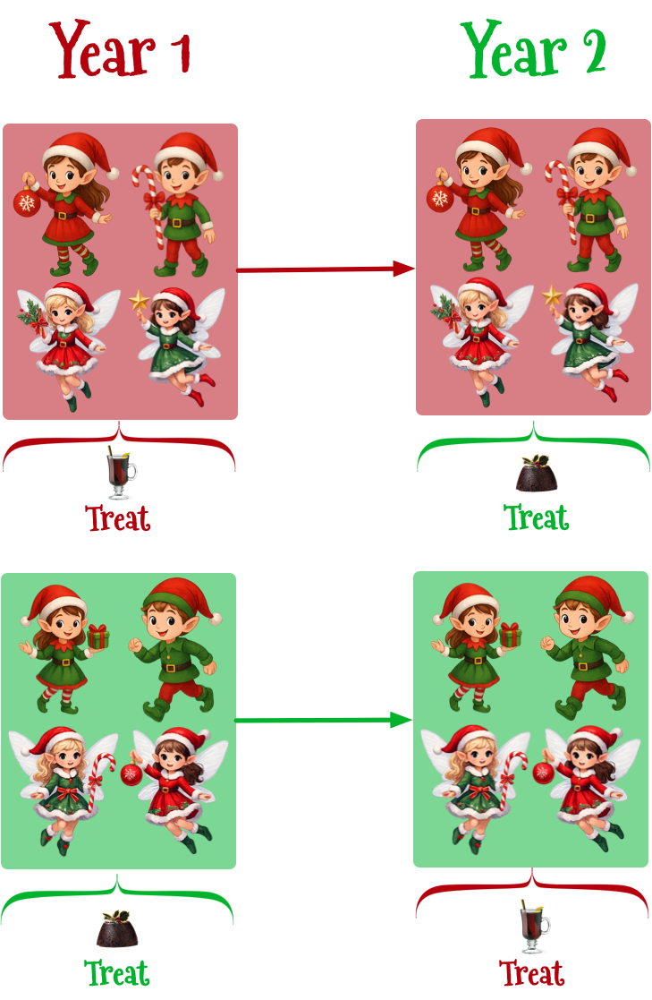

> **Note: Statis-tip**
>
> This is a **two-way mixed design**
>
> - `treat` is a repeated measures because all participants consumed all treats
> - `helper` is an independent measure because participants could be an elf or a fairy but not both

## Slide 8: Load and Look

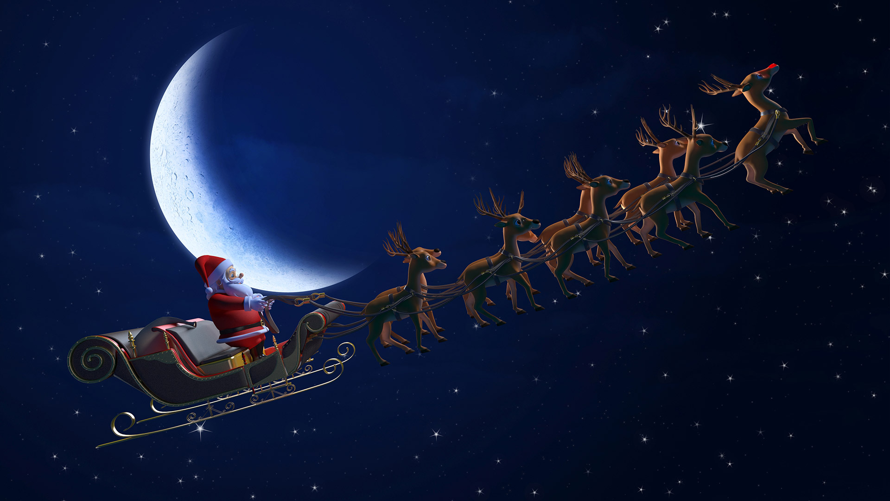

|     | id                                    | helper | treat   | speed |
|-----|---------------------------------------|--------|---------|-------|
| 1   | Aaron the Delighted                   | Elf    | Pudding | 17    |
| 2   | Rand the Pinguid                      | Elf    | Pudding | 17    |
| 3   | Dreary the Fergal-fargel              | Elf    | Pudding | 19    |
| 4   | Jongle the Determined                 | Elf    | Pudding | 13    |
| 5   | Ogdoad the Eigen vector               | Elf    | Pudding | 16    |
| 6   | Vicki the Invisible                   | Elf    | Pudding | 17    |
| 7   | Sisifus the Dextrous                  | Elf    | Pudding | 14    |
| 8   | Milton the Jubulant                   | Elf    | Pudding | 21    |
| 9   | Jojo the Statistical                  | Elf    | Pudding | 18    |
| 10  | Merkin the Dwaal                      | Elf    | Pudding | 15    |
| 11  | Belphegor the Jubulant                | Elf    | Pudding | 17    |
| 12  | Mustafi the Argute                    | Elf    | Pudding | 13    |
| 13  | Edwin the Witch                       | Elf    | Pudding | 19    |
| 14  | Oxter the Knee-scratcher              | Elf    | Pudding | 22    |
| 15  | Ogdoad the Xylopolist                 | Elf    | Pudding | 11    |
| 16  | Oxter the Chopwooder                  | Elf    | Pudding | 22    |
| 17  | Ogdoad the Crank                      | Elf    | Pudding | 14    |
| 18  | Vicki the Unconscious                 | Elf    | Pudding | 19    |
| 19  | Hughy the Jubulant                    | Elf    | Pudding | 11    |
| 20  | Fipple the Potato carver              | Elf    | Pudding | 16    |
| 21  | Edwin the Visible                     | Elf    | Pudding | 17    |
| 22  | Cleo the Defensive midfielder         | Elf    | Pudding | 12    |
| 23  | Cog the Mudlark                       | Elf    | Pudding | 25    |
| 24  | Juniper the Fairy disguised as an elf | Elf    | Pudding | 20    |
| 25  | Jangle the Pickler                    | Elf    | Pudding | 23    |
| 26  | Rob the Extroverted                   | Elf    | Pudding | 15    |
| 27  | Dojan the Conscious                   | Elf    | Pudding | 18    |
| 28  | Ramsey the Truculent                  | Elf    | Pudding | 15    |
| 29  | Skelf the Fugacious                   | Elf    | Pudding | 32    |
| 30  | Wickham the Chopwooder                | Elf    | Pudding | 15    |
| 31  | Cleo the Innocuous                    | Elf    | Pudding | 9     |
| 32  | Milton the Industrious                | Elf    | Pudding | 16    |
| 33  | Liv the Nepharious                    | Elf    | Pudding | 14    |
| 34  | Vicki the Biddible                    | Elf    | Pudding | 14    |
| 35  | Jingle the Eigen vector               | Elf    | Pudding | 20    |
| 36  | Sisifus the Rubiginous                | Elf    | Pudding | 10    |
| 37  | Dreary the Cuddle                     | Elf    | Pudding | 22    |
| 38  | Edwin the Partial derivative          | Elf    | Pudding | 19    |
| 39  | Erwin the Knee-scratcher              | Elf    | Pudding | 32    |
| 40  | Per the Wrapper                       | Elf    | Pudding | 22    |
| 41  | Tinsel the Busy                       | Elf    | Pudding | 25    |
| 42  | Bellerin the Xylopolist               | Elf    | Pudding | 18    |
| 43  | Petr the Musical                      | Elf    | Pudding | 24    |
| 44  | Compote the Xylopolist                | Elf    | Pudding | 24    |
| 45  | Jingle the Dextrous                   | Elf    | Pudding | 14    |
| 46  | Gillan the Truculent                  | Elf    | Pudding | 21    |
| 47  | Compote the Invisible                 | Elf    | Pudding | 13    |
| 48  | Quo the Dextrous                      | Elf    | Pudding | 14    |
| 49  | Petr the Strong                       | Elf    | Pudding | 19    |
| 50  | Florence the Cute                     | Elf    | Pudding | 25    |

Table 1: Santa's data (first 50 of 200 rows)


## Slide 9: Load and Look


``` r
treat_tib |> 
  group_by(treat, helper) |> 
  describe_distribution(select = "speed") |> 
  data_remove(c("Variable", "n_Missing")) |> 
  display()
```

| treat       | helper | Mean  | SD   | IQR   | Range          | Skewness | Kurtosis | n   |
|-------------|--------|-------|------|-------|----------------|----------|----------|-----|
| Pudding     | Elf    | 17.96 | 5.02 | 7.25  | (9.00, 32.00)  | 0.76     | 0.80     | 50  |
| Mulled wine | Elf    | 25.06 | 7.05 | 9.00  | (10.00, 42.00) | 0.07     | 0.03     | 50  |
| Pudding     | Fairy  | 20.02 | 5.04 | 7.00  | (7.00, 29.00)  | -0.51    | 0.05     | 50  |
| Mulled wine | Fairy  | 25.92 | 8.00 | 11.25 | (8.00, 41.00)  | -0.21    | -0.28    | 50  |

## Slide 10: Visualize


``` r
treat_int_gg <- ggplot(treat_tib, aes(x = treat, y = speed, colour = helper, shape = helper, fill = helper)) +
  geom_violin(alpha = 0.1) +
  stat_summary(fun.data = "mean_cl_normal", geom = "pointrange", position = position_dodge(width = 0.9)) +
  coord_cartesian(ylim = c(0, 45)) +
  scale_y_continuous(breaks = seq(0, 45, 5)) +
  scale_colour_manual(values = c("#B3000C", "#00B32C")) +
  scale_fill_manual(values = c("#B3000C", "#00B32C")) +
  labs(x = "Treat consumed", y = "Speed of delivery (ms)", colour = "Helper", fill = "Helper", shape = "Helper") +
  theme_minimal()
treat_int_gg
```

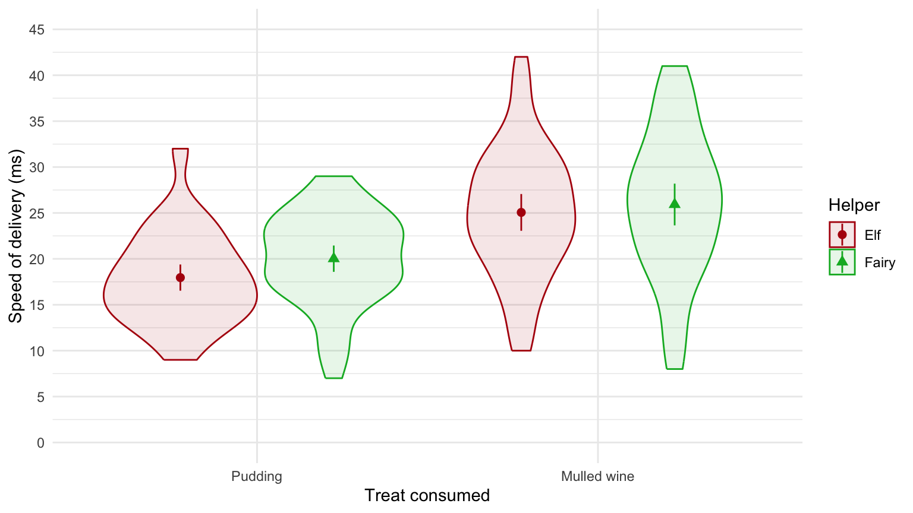


## Slide 11: The model


``` math
 \begin{aligned} \text{speed}_{ij} &= \hat{b}_{0} + \hat{b}_{1}\text{helper}_{i} + \hat{b}_{2}\text{treat}_{ij} + \hat{b}_{3}\left(\text{helper}_{i} \times \text{treat}_{ij} \right) + u_{0j} + e_{i} \end{aligned} 
```

``` r
treat_afx <- afex::aov_4(speed ~ treat*helper + (treat|id), data = treat_tib)
```

## Slide 12: Evaluate


``` r
model_parameters(treat_afx, es_type = "omega") |> 
  display(use_symbols = TRUE)
```

 

| Parameter | Sum_Squares | Sum_Squares_Error | df | df (error) | Mean_Square | F | p | ω² (partial) |
|----|----|----|----|----|----|----|----|----|
| helper | 106.58 | 5136.90 | 1 | 98 | 52.42 | 2.03 | 0.157 | 0.01 |
| treat | 2112.50 | 2910.50 | 1 | 98 | 29.70 | 71.13 | \< .001 | 0.20 |
| helper:treat | 18.00 | 2910.50 | 1 | 98 | 29.70 | 0.61 | 0.438 | 0.00 |

ANOVA estimation for factorial designs using ‘afex’


## Slide 13: Evaluate assumptions

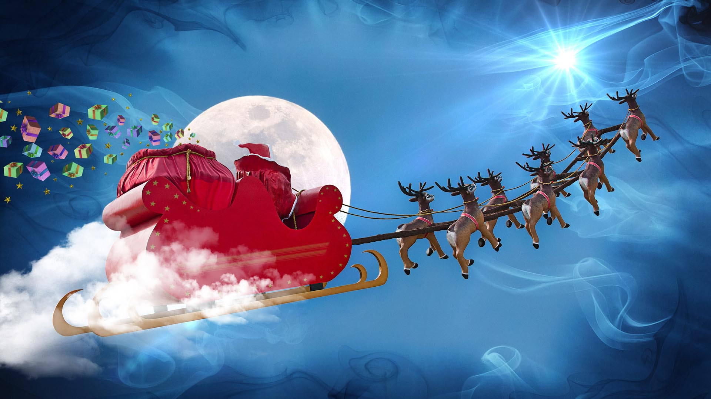

``` r
check_model(treat_afx)
```

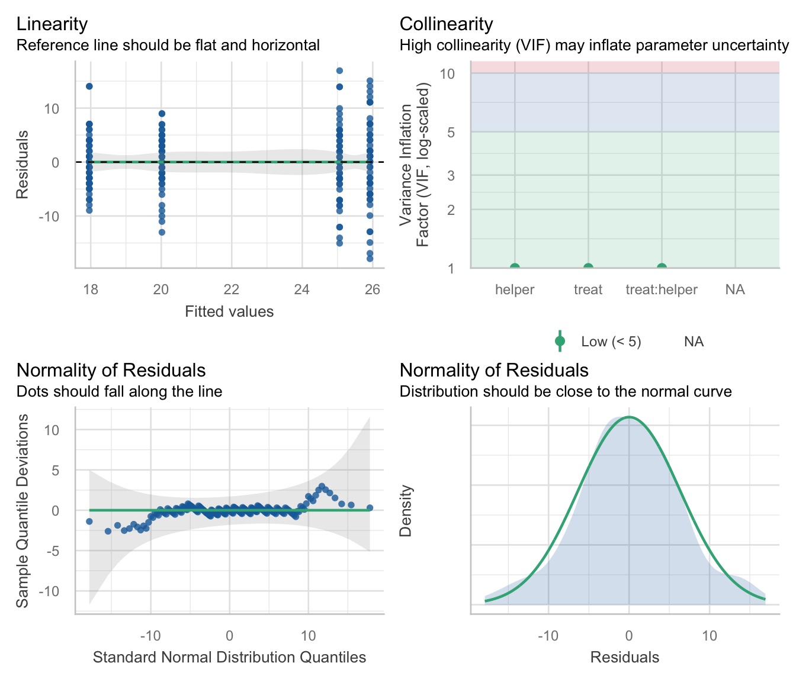


## Slide 14: Interpret the main effect of treat


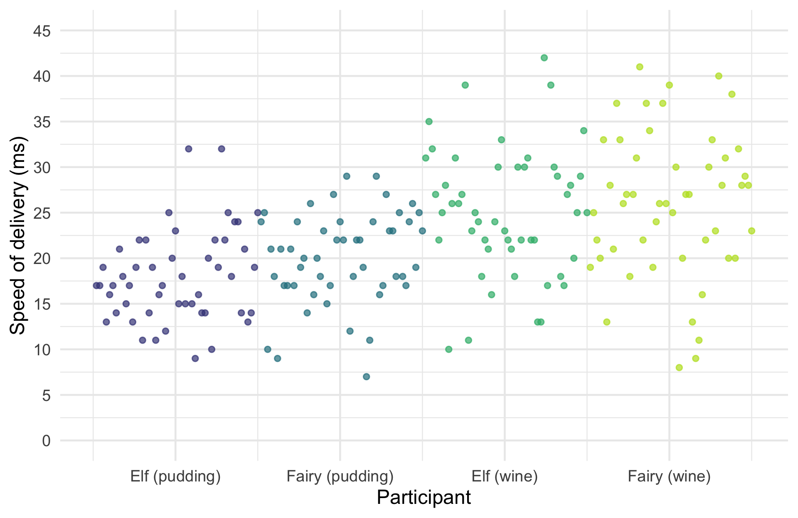


## Slide 15: Interpret the main effect of treat


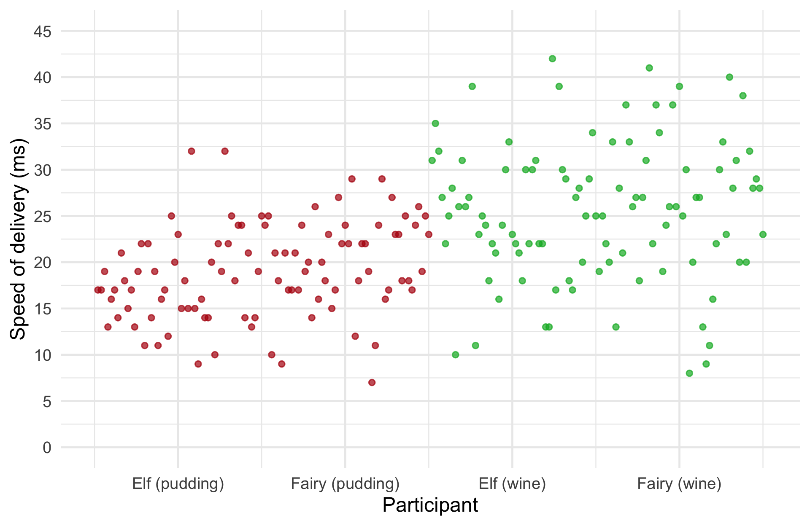


## Slide 16: Interpret the main effect of treat


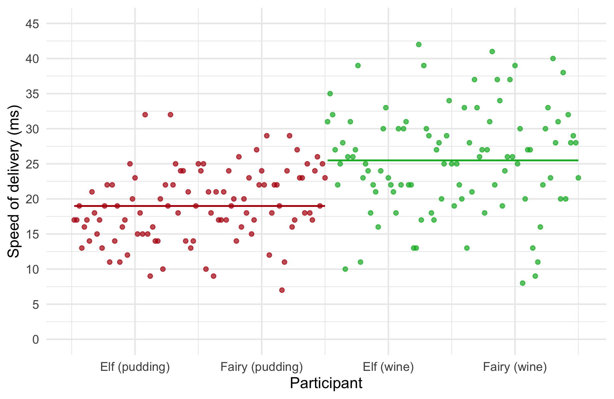


## Slide 17: Interpret


| Parameter | Sum_Squares | Sum_Squares_Error | df | df (error) | Mean_Square | F | p | ω² (partial) |
|----|----|----|----|----|----|----|----|----|
| helper | 106.58 | 5136.90 | 1 | 98 | 52.42 | 2.03 | 0.157 | 0.01 |
| treat | 2112.50 | 2910.50 | 1 | 98 | 29.70 | 71.13 | \< .001 | 0.20 |
| helper:treat | 18.00 | 2910.50 | 1 | 98 | 29.70 | 0.61 | 0.438 | 0.00 |

ANOVA estimation for factorial designs using ‘afex’

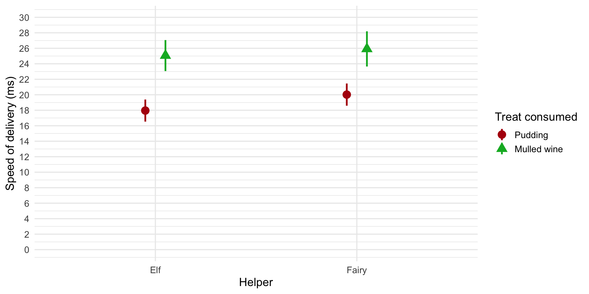

> **Important: ReportR**
>
> Delivery speeds were significantly longer after mulled wine than pudding, F(1, 98) = 71.13, *p* \< 0.001. This effect was not significantly moderated by the type of helper, F(1, 98) = 0.61, *p* = 0.438.

## Slide 18

Video clip: [xmas scene 2](https://profandyfield.github.io/statistics_lectures/shared_media/video/xmas_scene_2.mp4)

## Slide 19: A festive example


Santa Claus wanted to test the effect of different quantities of different types of treats on the speed of delivery in two types of helpers.

Predictors

- **treat**: Christmas pudding, Mulled wine (within-participant, repeated measures)
- **quantity**: one, two, three, four, five (within-participant, repeated measures)
- **helper**: Elf, Fairy (between-participant, independent)

Outcome

- **speed**: The speed at which presents were delivered (ms).

## Slide 20: The design


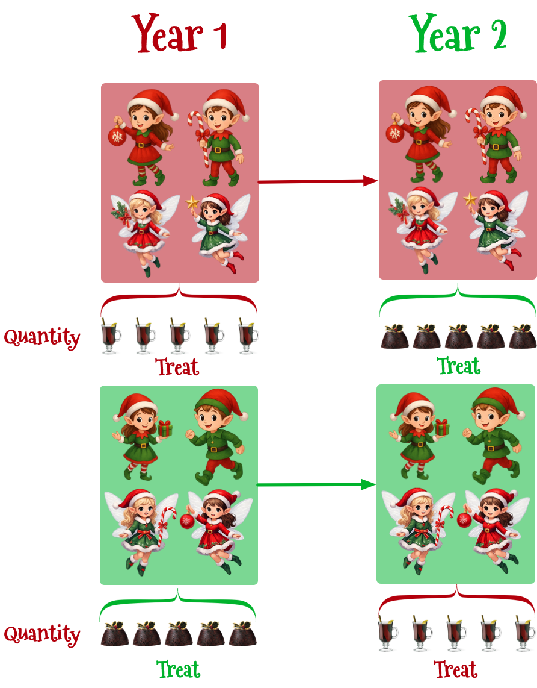

> **Note: Statis-tip**
>
> This is a **three-way mixed design**
>
> - `treat` is a repeated measures because all participants consumed all treats
> - `quantity` is a repeated measures because speed was measured after each participant consumed, 1, 2, 3, 4 and 5 treats
> - `helper` is an independent measure because participants could be an elf or a fairy but not both

## Slide 21: Load and Look


|     | id                                    | helper | treat   | quantity | speed |
|-----|---------------------------------------|--------|---------|----------|-------|
| 1   | Aaron the Delighted                   | Elf    | Pudding | One      | 10    |
| 2   | Rand the Pinguid                      | Elf    | Pudding | One      | 13    |
| 3   | Dreary the Fergal-fargel              | Elf    | Pudding | One      | 10    |
| 4   | Jongle the Determined                 | Elf    | Pudding | One      | 11    |
| 5   | Ogdoad the Eigen vector               | Elf    | Pudding | One      | 12    |
| 6   | Vicki the Invisible                   | Elf    | Pudding | One      | 11    |
| 7   | Sisifus the Dextrous                  | Elf    | Pudding | One      | 9     |
| 8   | Milton the Jubulant                   | Elf    | Pudding | One      | 14    |
| 9   | Jojo the Statistical                  | Elf    | Pudding | One      | 11    |
| 10  | Merkin the Dwaal                      | Elf    | Pudding | One      | 12    |
| 11  | Belphegor the Jubulant                | Elf    | Pudding | One      | 15    |
| 12  | Mustafi the Argute                    | Elf    | Pudding | One      | 14    |
| 13  | Edwin the Witch                       | Elf    | Pudding | One      | 17    |
| 14  | Oxter the Knee-scratcher              | Elf    | Pudding | One      | 4     |
| 15  | Ogdoad the Xylopolist                 | Elf    | Pudding | One      | 8     |
| 16  | Oxter the Chopwooder                  | Elf    | Pudding | One      | 11    |
| 17  | Ogdoad the Crank                      | Elf    | Pudding | One      | 12    |
| 18  | Vicki the Unconscious                 | Elf    | Pudding | One      | 11    |
| 19  | Hughy the Jubulant                    | Elf    | Pudding | One      | 12    |
| 20  | Fipple the Potato carver              | Elf    | Pudding | One      | 15    |
| 21  | Edwin the Visible                     | Elf    | Pudding | One      | 14    |
| 22  | Cleo the Defensive midfielder         | Elf    | Pudding | One      | 8     |
| 23  | Cog the Mudlark                       | Elf    | Pudding | One      | 9     |
| 24  | Juniper the Fairy disguised as an elf | Elf    | Pudding | One      | 12    |
| 25  | Jangle the Pickler                    | Elf    | Pudding | One      | 14    |
| 26  | Rob the Extroverted                   | Elf    | Pudding | One      | 12    |
| 27  | Dojan the Conscious                   | Elf    | Pudding | One      | 12    |
| 28  | Ramsey the Truculent                  | Elf    | Pudding | One      | 15    |
| 29  | Skelf the Fugacious                   | Elf    | Pudding | One      | 13    |
| 30  | Wickham the Chopwooder                | Elf    | Pudding | One      | 12    |
| 31  | Cleo the Innocuous                    | Elf    | Pudding | One      | 14    |
| 32  | Milton the Industrious                | Elf    | Pudding | One      | 8     |
| 33  | Liv the Nepharious                    | Elf    | Pudding | One      | 13    |
| 34  | Vicki the Biddible                    | Elf    | Pudding | One      | 12    |
| 35  | Jingle the Eigen vector               | Elf    | Pudding | One      | 10    |
| 36  | Sisifus the Rubiginous                | Elf    | Pudding | One      | 10    |
| 37  | Dreary the Cuddle                     | Elf    | Pudding | One      | 14    |
| 38  | Edwin the Partial derivative          | Elf    | Pudding | One      | 14    |
| 39  | Erwin the Knee-scratcher              | Elf    | Pudding | One      | 15    |
| 40  | Per the Wrapper                       | Elf    | Pudding | One      | 16    |
| 41  | Tinsel the Busy                       | Elf    | Pudding | One      | 15    |
| 42  | Bellerin the Xylopolist               | Elf    | Pudding | One      | 13    |
| 43  | Petr the Musical                      | Elf    | Pudding | One      | 14    |
| 44  | Compote the Xylopolist                | Elf    | Pudding | One      | 10    |
| 45  | Jingle the Dextrous                   | Elf    | Pudding | One      | 13    |
| 46  | Gillan the Truculent                  | Elf    | Pudding | One      | 12    |
| 47  | Compote the Invisible                 | Elf    | Pudding | One      | 8     |
| 48  | Quo the Dextrous                      | Elf    | Pudding | One      | 13    |
| 49  | Petr the Strong                       | Elf    | Pudding | One      | 9     |
| 50  | Florence the Cute                     | Elf    | Pudding | One      | 13    |

Table 2: Santa's data (first 50 of 1000 rows)


## Slide 22: Extending the model

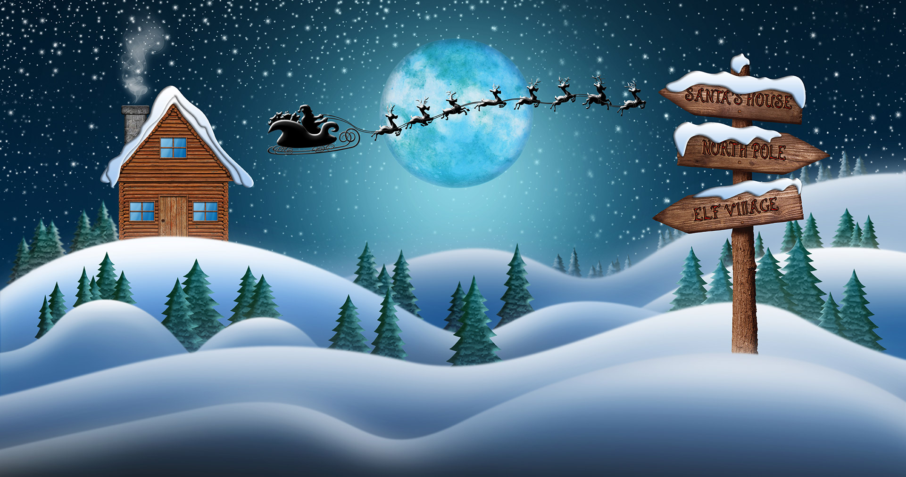

- Let’s simplify things by ignoring the fact that `quantity` will be represented by four dummy variables (as will all interactions that involve it)

``` math
 \begin{aligned} \text{speed}_{ij} &= \hat{b}_{0} + \hat{b}_{1}\text{helper}_{i} + \hat{b}_{2}\text{treat}_{ij} + \hat{b}_{3}\text{quantity}_{ij} \\ &\quad + \hat{b}_{4}\left(\text{helper}_{i} \times \text{treat}_{ij}\right) + \hat{b}_{5}\left(\text{helper}_{i} \times \text{quantity}_{ij} \right) \\ &\quad + \hat{b}_{6}\left(\text{treat}_{ij} \times \text{quantity}_{ij}\right) + \\ &\quad +\hat{b}_{7}\left(\text{helper}_{i} \times \text{treat}_{ij} \times \text{quantity}_{ij}\right) + u_{0j} + e_{i} \end{aligned} 
```

## Slide 23: Summary of effects


We will get an *F*-statistic for the following effects:

- Main effects
  - helper
  - treat
  - quantity
- Two-way interactions
  - helper × treat
  - helper × quantity
  - treat × quantity
- Three-way Interaction
  - helper × treat × quantity

> **Note: Statis-tip**
>
> Repeat the following mantras:
>
> - “It is never sensible to interpret main effects in the presence of a significant interaction effect.”
> - “It is also never sensible to interpret interaction effects in the presence of a significant higher-order interaction effect.”

## Slide 24: Contrasts

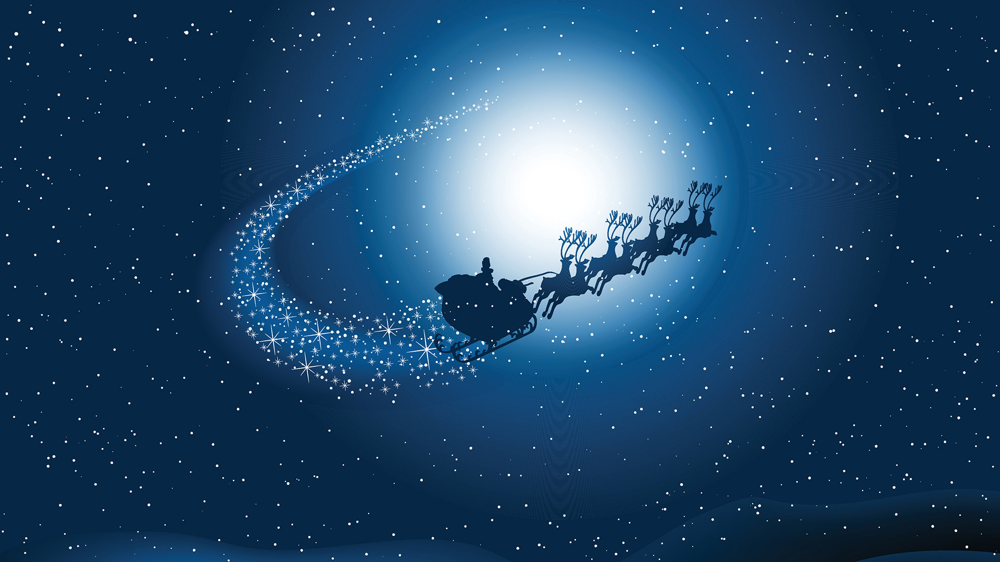

- For both `helper` and `treat` there are two categories so the Fs are directly interpretable.
- For `quantity` we need 4 contrast variables. These would work:
  - **Contrast 1**: {two} vs. {one}
  - **Contrast 2**: {three} vs. {one}
  - **Contrast 3**: {four} vs. {one}
  - **Contrast 4**: {five} vs. {one}
- We can extract these using `estimate_contrasts()`
  - `"trt.vs.ctrl"`: compares each category to a declared reference category (by default the first category). Use `ref = x` to make `x` the reference category.
  - `"consec"`: compares each level/category (except the first) to the previous

## Slide 25

Video clip: [three way design song instrumental](https://profandyfield.github.io/statistics_lectures/ds_11_mixed_designs/media/three_way_design_song_instrumental.mp4)

## Slide 26

Video clip: [three way design song](https://profandyfield.github.io/statistics_lectures/ds_11_mixed_designs/media/three_way_design_song.mp4)

## Slide 27: Fit the model


``` r
xmas_afx <- afex::aov_4(speed ~ treat*quantity*helper + (treat*quantity|id), data = xmas_tib)
```

### Evaluate

``` r
model_parameters(xmas_afx, es_type = "omega") |> 
  display(use_symbols = TRUE)
```

| Parameter | Sum_Squares | Sum_Squares_Error | df | df (error) | Mean_Square | F | p | ω² (partial) |
|----|----|----|----|----|----|----|----|----|
| helper | 1334.02 | 14765.23 | 1.00 | 98.00 | 150.67 | 8.85 | 0.004 | 0.07 |
| treat | 18054.00 | 3845.67 | 1.00 | 98.00 | 39.24 | 460.07 | \< .001 | 0.49 |
| helper:treat | 893.02 | 3845.67 | 1.00 | 98.00 | 39.24 | 22.76 | \< .001 | 0.04 |
| quantity | 1.21e+05 | 15073.70 | 2.84 | 278.23 | 54.18 | 784.93 | \< .001 | 0.80 |
| helper:quantity | 2141.75 | 15073.70 | 2.84 | 278.23 | 54.18 | 13.92 | \< .001 | 0.06 |
| treat:quantity | 20918.91 | 13104.42 | 2.83 | 277.81 | 47.17 | 156.44 | \< .001 | 0.42 |
| helper:treat:quantity | 3390.47 | 13104.42 | 2.83 | 277.81 | 47.17 | 25.36 | \< .001 | 0.10 |

ANOVA estimation for factorial designs using ‘afex’


## Slide 28: Evaluate assumptions

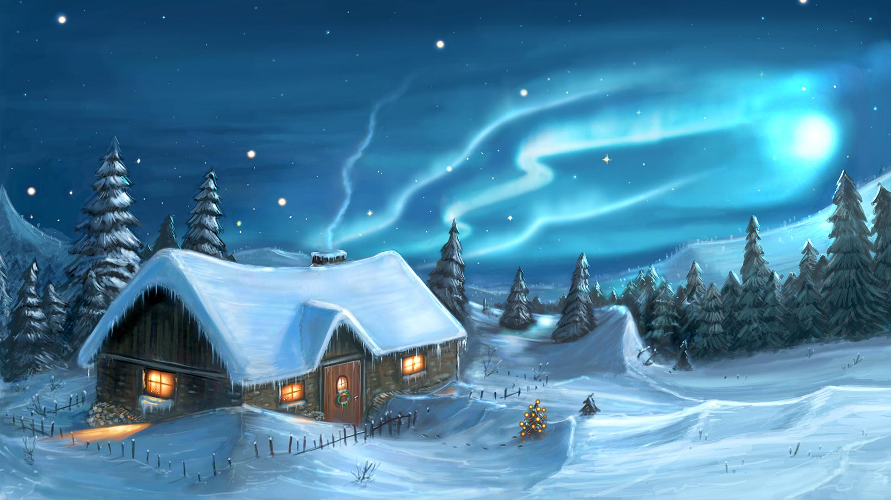

``` r
check_model(xmas_afx)
```

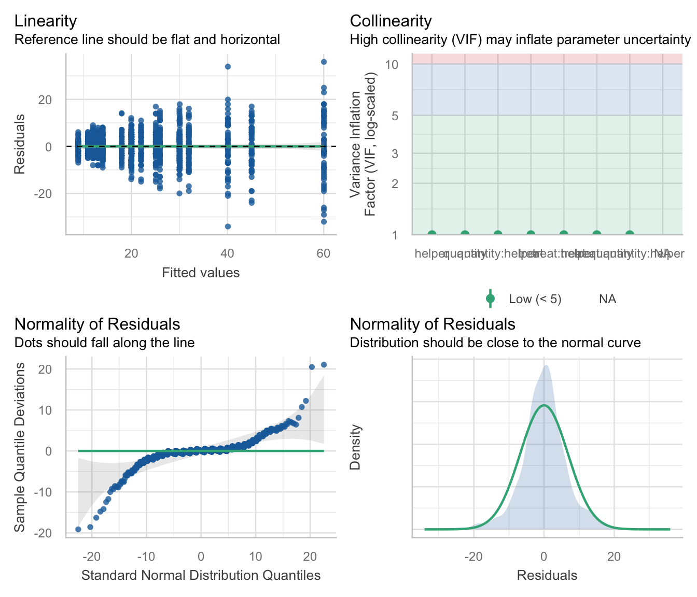


## Slide 29: Interpret the highest-order interaction


``` r
ggplot(xmas_tib, aes(x = quantity, y= speed, colour = treat)) +
  geom_point(size = 0.75, position = position_jitter(width = 0.1), alpha = 0.2) +
  stat_summary(aes(group = treat), fun = mean, geom = "line") +
  stat_summary(fun.data = "mean_cl_normal", size = 0.25) +
  scale_colour_manual(values = c("#B3000C",  "#00B32C")) +
  facet_wrap(~helper) +
  labs(x = "Number of portions", y = "Speed of delivery (ms)", colour = "Treat") +
  scale_y_continuous(breaks = seq(0, 100, 10)) +
  coord_cartesian(ylim = c(0, 100)) +
  theme_minimal(base_size = 18)
```

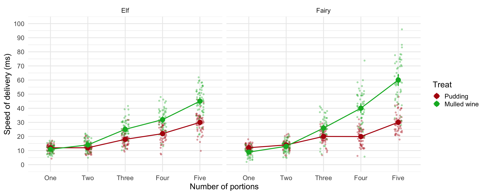

## Slide 30: Contrasts across the interaction


``` r
three_way_emm <- estimate_means(model = xmas_afx, 
                                by = c("quantity", "treat", "helper"))

estimate_contrasts(model = xmas_afx,
                   contrast = c("quantity", "treat", "helper"),
                   interaction = c(quantity = "trt.vs.ctrl", treat = "trt.vs.ctrl", helper = "trt.vs.ctrl"),
                   ref = 1,
                   p_adjust = "bonferroni",
                   backend = "emmeans") |> 
  display()
```

| quantity_trt.vs.ctrl | treat_trt.vs.ctrl | helper_trt.vs.ctrl | Difference | 95% CI | SE | t(98) | p |
|----|----|----|----|----|----|----|----|
| Five - One | Mulled.wine - Pudding | Fairy - Elf | 17.06 | (10.54, 23.58) | 2.56 | 6.66 | \< .001 |
| Four - One | Mulled.wine - Pudding | Fairy - Elf | 12.26 | ( 6.90, 17.62) | 2.11 | 5.82 | \< .001 |
| Three - One | Mulled.wine - Pudding | Fairy - Elf | 0.88 | (-3.37, 5.13) | 1.67 | 0.53 | \> .999 |
| Two - One | Mulled.wine - Pudding | Fairy - Elf | -0.90 | (-3.67, 1.87) | 1.09 | -0.83 | \> .999 |

Marginal Contrasts Analysis

## Slide 31: Contrast 1


| quantity_trt.vs.ctrl | treat_trt.vs.ctrl | helper_trt.vs.ctrl | Difference | CI | SE | t(98) | p |
|----|----|----|----|----|----|----|----|
| Five - One | Mulled.wine - Pudding | Fairy - Elf | 17.06 | (10.54, 23.58) | 2.56 | 6.66 | \< .001 |


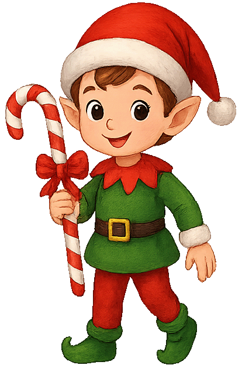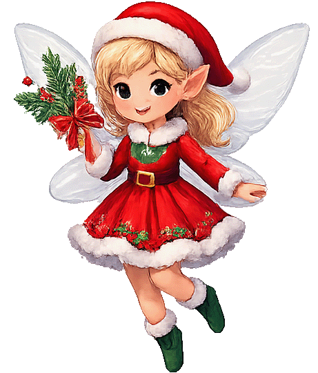

## Slide 32: Contrast 1


| quantity_trt.vs.ctrl | treat_trt.vs.ctrl | helper_trt.vs.ctrl | Difference | CI | SE | t(98) | p |
|----|----|----|----|----|----|----|----|
| Five - One | Mulled.wine - Pudding | Fairy - Elf | 17.06 | (10.54, 23.58) | 2.56 | 6.66 | \< .001 |

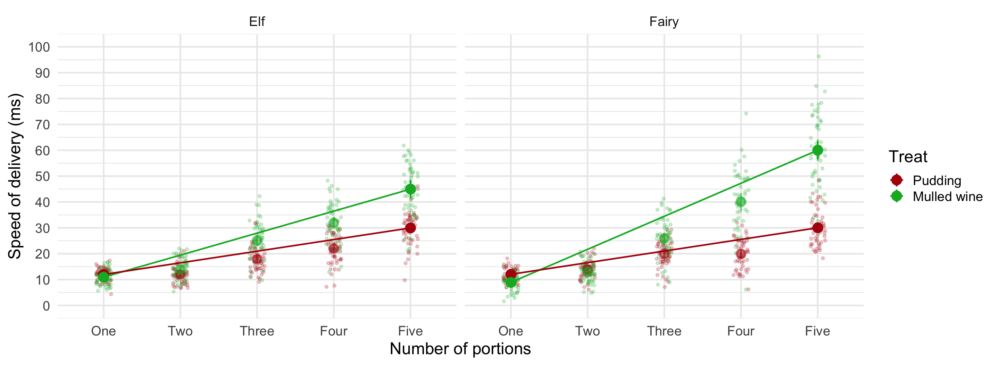


## Slide 33: Contrast 2


| quantity_trt.vs.ctrl | treat_trt.vs.ctrl | helper_trt.vs.ctrl | Difference | CI | SE | t(98) | p |
|----|----|----|----|----|----|----|----|
| Four - One | Mulled.wine - Pudding | Fairy - Elf | 12.26 | (6.90, 17.62) | 2.11 | 5.82 | \< .001 |

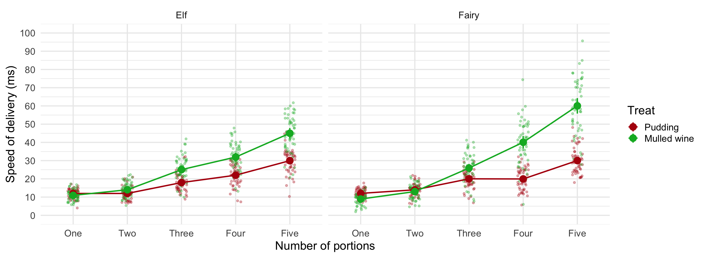

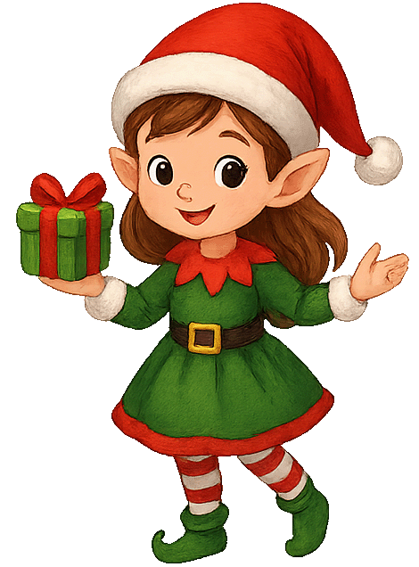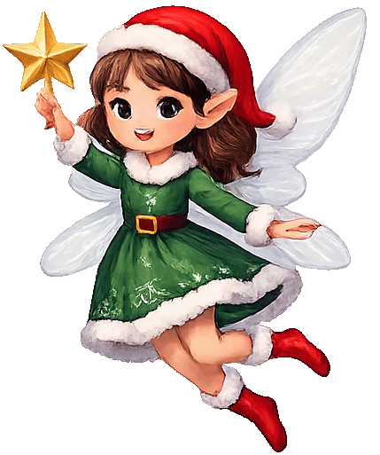

## Slide 34: Contrast 2


| quantity_trt.vs.ctrl | treat_trt.vs.ctrl | helper_trt.vs.ctrl | Difference | CI | SE | t(98) | p |
|----|----|----|----|----|----|----|----|
| Four - One | Mulled.wine - Pudding | Fairy - Elf | 12.26 | (6.90, 17.62) | 2.11 | 5.82 | \< .001 |

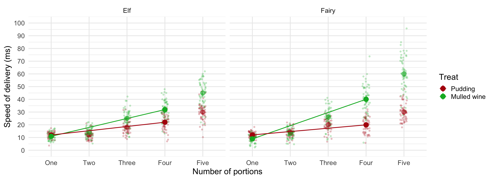


## Slide 35: Contrast 3


| quantity_trt.vs.ctrl | treat_trt.vs.ctrl | helper_trt.vs.ctrl | Difference | CI | SE | t(98) | p |
|----|----|----|----|----|----|----|----|
| Three - One | Mulled.wine - Pudding | Fairy - Elf | 0.88 | (-3.37, 5.13) | 1.67 | 0.53 | \> .999 |

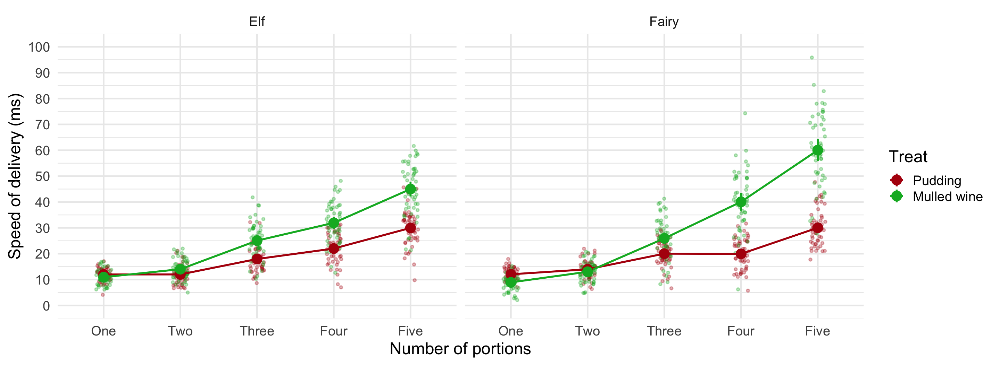

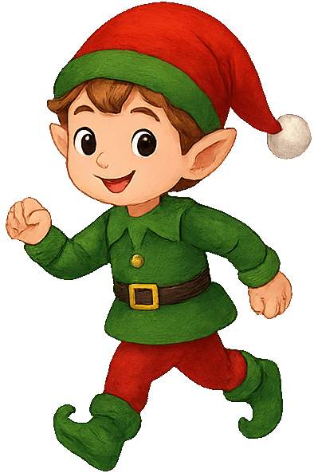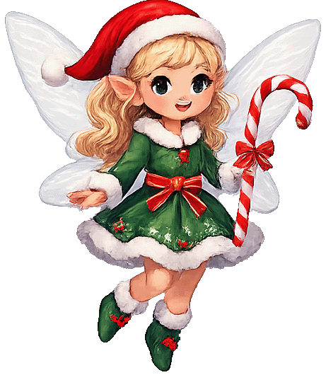

## Slide 36: Contrast 3


| quantity_trt.vs.ctrl | treat_trt.vs.ctrl | helper_trt.vs.ctrl | Difference | CI | SE | t(98) | p |
|----|----|----|----|----|----|----|----|
| Three - One | Mulled.wine - Pudding | Fairy - Elf | 0.88 | (-3.37, 5.13) | 1.67 | 0.53 | \> .999 |

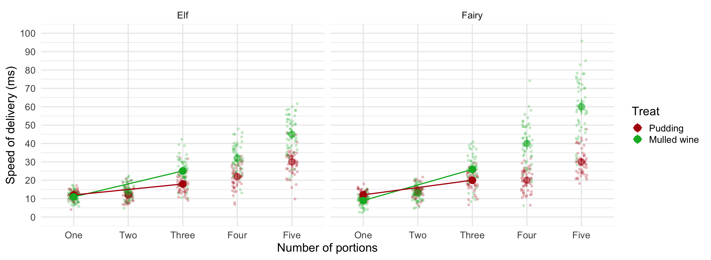


## Slide 37: Contrast 4


| quantity_trt.vs.ctrl | treat_trt.vs.ctrl | helper_trt.vs.ctrl | Difference | CI | SE | t(98) | p |
|----|----|----|----|----|----|----|----|
| Two - One | Mulled.wine - Pudding | Fairy - Elf | -0.90 | (-3.67, 1.87) | 1.09 | -0.83 | \> .999 |


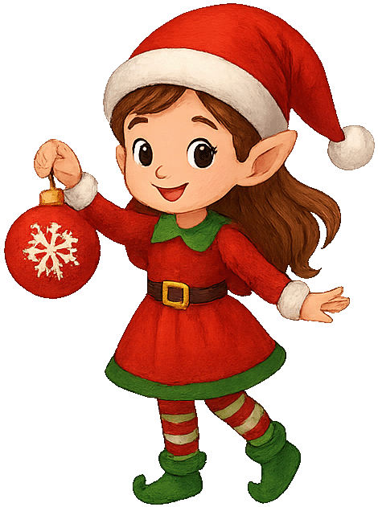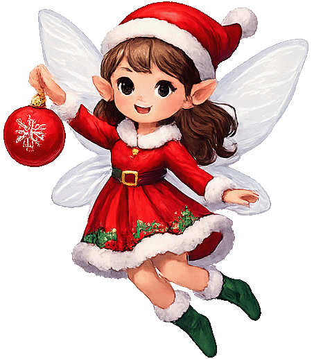

## Slide 38: Contrast 4


| quantity_trt.vs.ctrl | treat_trt.vs.ctrl | helper_trt.vs.ctrl | Difference | CI | SE | t(98) | p |
|----|----|----|----|----|----|----|----|
| Two - One | Mulled.wine - Pudding | Fairy - Elf | -0.90 | (-3.67, 1.87) | 1.09 | -0.83 | \> .999 |

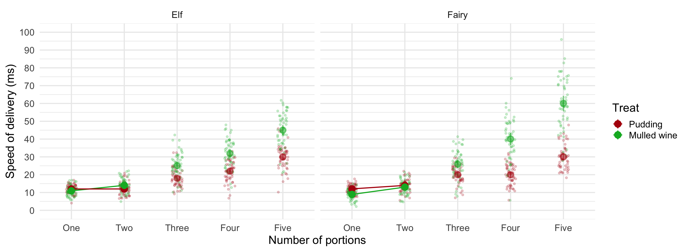


## Slide 39

Video clip: [xmas santa 03](https://profandyfield.github.io/statistics_lectures/shared_media/video/xmas_santa_03.mp4)

## Slide 40

Video clip: [i wish it could be christmas](https://profandyfield.github.io/statistics_lectures/shared_media/video/i_wish_it_could_be_christmas.mp4)
