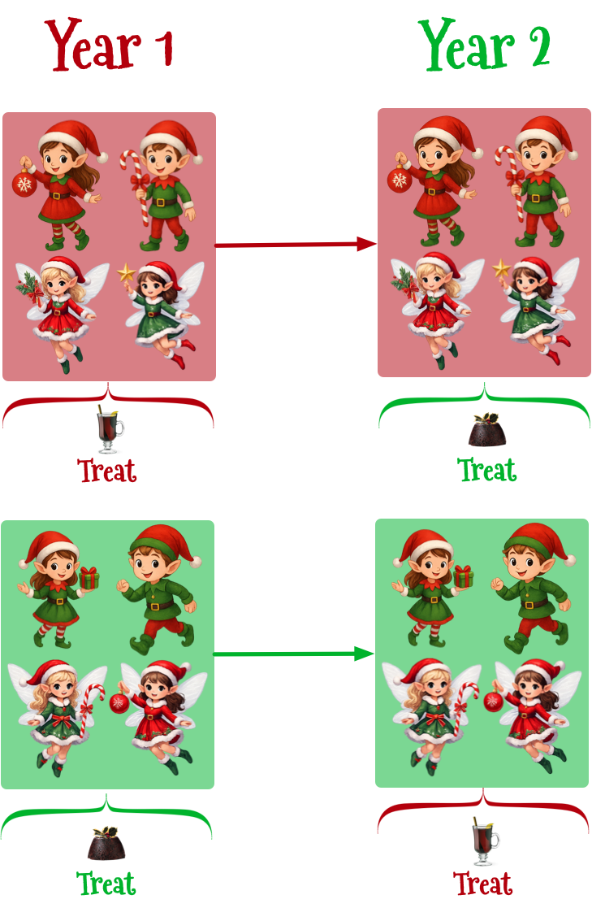
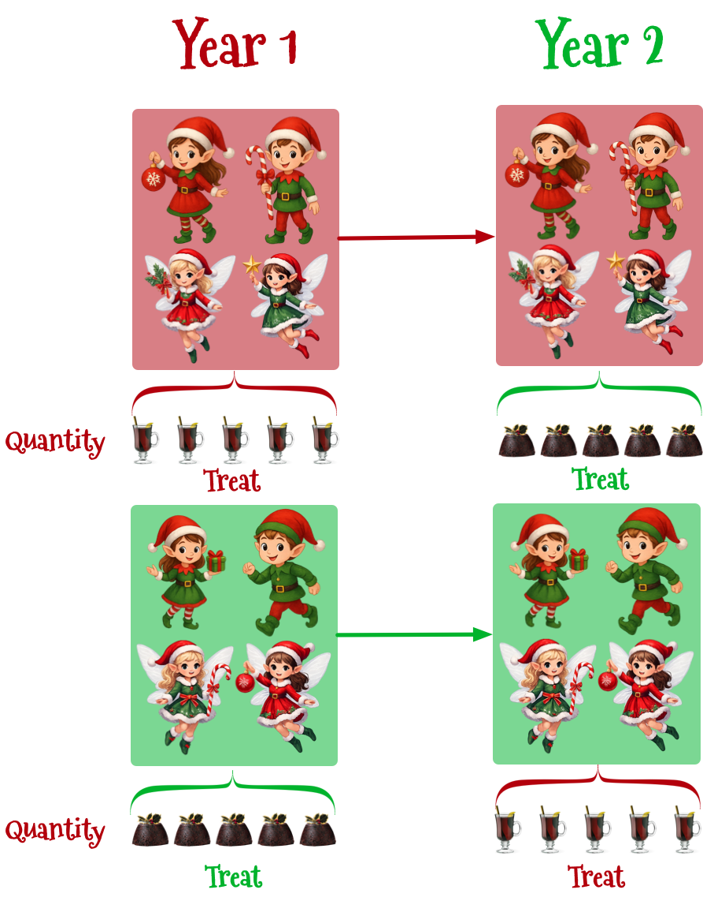

```{r}
# general
library(easystats)
library(tidyverse)
# specific
library(afex)
library(DT)

source("../helpers/discovr_helpers.R")
source("../helpers/easystats_helpers.R")
xmas_red <- "#B3000C"
xmas_green <- "#00B32C"

xmas_tib <- here::here("ds_11_mixed_designs/data/xmas_mixed.rds") |> read_rds()

treat_tib <- xmas_tib |> 
  filter(quantity == "Three")

santa_tib <- discovr::santas_log
krampus_tib <- readr::read_csv("data/santa_log_complete_separation.csv")

```


## {background-video="../shared_media/video/xmas_santa_01.mp4" background-size="cover"}

::: notes
Santa: long intro

[After Santa says about Krampus and head popping out of bucket ...]

Andy: Santa, I can help. Tell me about your operations.
:::


## {background-video="../shared_media/video/xmas_santa_02.mp4" background-size="cover"}


## 

::: r-stack
{.fragment fig-align="center" width="1050" height="594"}

{.fragment fig-align="center" width="1050" height="594"}
:::

##

{fig-align="center" height=600}

## [A festive example]{.txt_ong} {background-image="../shared_media/images/as_blu_house_93514381.jpg" background-size="cover"}

:::: columns
::: {.column width="50%"}
:::

::: {.column width="50%"}
::: txt_white
Santa Claus wanted to test the effect of different types of treats on the speed of delivery in two types of helpers :

- Predictors
  - [treat]{.txt_ong}: Christmas pudding, Mulled wine (within-participant, repeated measures)
  - [helper]{.txt_ong}: Elf, Fairy (between-participant, independent)
- Outcome
  - [speed]{.txt_ong}: The speed at which presents were delivered (ms).

:::
:::
::::

## The design {background-image="../shared_media/images/as_snowman_wave_303329070.jpg" background-size="cover"}


:::: columns
::: {.column width="60%"}
{fig-align="center" height=600}
:::

::: {.column width="40%"}
::: {.callout-note icon = false}
##  Statis-tip

This is a **two-way mixed design**

  - `treat` is a repeated measures because all participants consumed all treats
  - `helper` is an independent measure because participants could be an elf or a fairy but not both

:::
:::
::::


## [L]{.txt_ong}[oad]{.txt_white} [and]{.txt_white} [L]{.txt_ong}[ook]{.txt_white} {background-image="../shared_media/images/as_santa_moon_36326866.jpg" background-size="cover"}

::: fragment
::: whitebox9
```{r}
treat_tib |>
  dplyr::select(-quantity) |> 
  DT::datatable(caption = 'Table 1: Santa\'s data',
                options = list(
                dom = 'tp',
                columnDefs = list(
                  list(className = 'dt-center', targets = 1:3)
                  ),
                pageLength = 10
  )
  )
```

:::
:::

{.absolute top=0 left=800 height="80"}


## [L]{.txt_ong}[oad]{.txt_white} [and]{.txt_white} [L]{.txt_ong}[ook]{.txt_white} {background-image="../shared_media/images/as_santa_moon_36326866.jpg" background-size="cover"}

```{r}
#| echo: true
#| eval: false

treat_tib |> 
  group_by(treat, helper) |> 
  describe_distribution(select = "speed") |> 
  data_remove(c("Variable", "n_Missing")) |> 
  display()
```

\

::: fragment
::: whitebox9
```{r}
treat_tib |> 
  group_by(treat, helper) |> 
  describe_distribution(select = "speed") |> 
  data_remove(c("Variable", "n_Missing")) |> 
  display()
```

:::
:::


## [V]{.txt_ong}[isualize]{.txt_white} {background-image="../shared_media/images/as_snowy_trees_126530339.jpg" background-size="cover"}

::: fragment

```{r}
#| echo: true
#| fig-width: 8
#| fig-height: 4.5

treat_int_gg <- ggplot(treat_tib, aes(x = treat, y = speed, colour = helper, shape = helper, fill = helper)) +
  geom_violin(alpha = 0.1) +
  stat_summary(fun.data = "mean_cl_normal", geom = "pointrange", position = position_dodge(width = 0.9)) +
  coord_cartesian(ylim = c(0, 45)) +
  scale_y_continuous(breaks = seq(0, 45, 5)) +
  scale_colour_manual(values = c("#B3000C", "#00B32C")) +
  scale_fill_manual(values = c("#B3000C", "#00B32C")) +
  labs(x = "Treat consumed", y = "Speed of delivery (ms)", colour = "Helper", fill = "Helper", shape = "Helper") +
  theme_minimal()
treat_int_gg
```

:::

{.absolute top=0 left=800 height="80"}


## [The model]{.txt_ong} {background-image="../shared_media/images/as_snowy_trees_126530339.jpg" background-size="cover"}

::: center-h
::: txt_white
::: txt_l

$$
\begin{aligned}
\text{speed}_{ij} &= \hat{b}_{0} + \hat{b}_{1}\text{helper}_{i} + \hat{b}_{2}\text{treat}_{ij} + \hat{b}_{3}\left(\text{helper}_{i} \times \text{treat}_{ij}  \right) + u_{0j} + e_{i}
\end{aligned}
$$

:::
:::
:::

\

::: txt_xl
```{r}
#| echo: true

treat_afx <- afex::aov_4(speed ~ treat*helper + (treat|id), data = treat_tib)

```
:::

## [E]{.txt_ong}[valuate]{.txt_white} {background-image="../shared_media/images/as_blu_globe_391811093.jpg" background-size="cover"}

```{r}
#| echo: true
#| eval: false

model_parameters(treat_afx, es_type = "omega") |> 
  display(use_symbols = TRUE)
```

\ 

::: fragment
::: whitebox9
::: tbl_s

```{r}
#| echo: false

model_parameters(treat_afx, es_type = "omega") |> 
  display(use_symbols = TRUE, footer = "")
```

:::
:::
:::

```{r}
treat_aov <- model_parameters(treat_afx, es_type = "omega")
```


{.absolute top=0 left=800 height="80"}


## [E]{.txt_ong}[valuate assumptions]{.txt_white} {background-image="../shared_media/images/as_santa_vortex_94489562.jpg" background-size="cover"}


```{r}
#| echo: true
#| eval: false
#| message: false
#| warning: false
#| fig-width: 7
#| fig-height: 6

check_model(treat_afx)
```

::: fragment
::: center-h
```{r}
#| message: false
#| warning: false
#| fig-width: 7
#| fig-height: 6

check_model(treat_afx)
```
:::
:::


{.absolute top=0 left=800 height="80"}

## [I]{.txt_ong}[nterpret the main effect of]{.txt_white} [treat]{.txt_ong} {background-image="../shared_media/images/as_gingerbread_229820523.jpg" background-size="cover"}

::: fragment

```{r} 
#| fig-width: 10
#| fig-height: 6.5


treat_means <- modelbased::estimate_means(treat_afx, by = "treat")


treat_tib <- treat_tib |> 
  mutate(
  id = c(1:50, 51:100, 101:150, 151:200),
  group_id = gl(4, 50, labels = c("Elf_pudding", "Fairy_pudding", "Elf_wine", "Fairy_wine")),
  treat_me = c(rep(treat_means$Mean[1], 100), rep(treat_means$Mean[2], 100))
  )

treat_gg <- ggplot(treat_tib, aes(id, speed, colour = group_id)) + 
  scale_x_continuous(breaks = c(25, 75, 125, 175), labels = c("Elf (pudding)", "Fairy (pudding)", "Elf (wine)",  "Fairy (wine)")) +
  scale_colour_manual(values = viridis_4) + 
  geom_point(size = 2, alpha = 0.7) +
  coord_cartesian(ylim = c(0,45), xlim = c(0, 201)) +
  scale_y_continuous(breaks = seq(0, 45, 5)) +
  labs(y = "Speed of delivery (ms)", x = "Participant") + 
  theme_minimal(base_size = 18) +
  theme(legend.position = "none")
treat_gg
```

:::

{.absolute top=0 left=900 height="80"}


## [I]{.txt_ong}[nterpret the main effect of]{.txt_white} [treat]{.txt_ong} {background-image="../shared_media/images/as_gingerbread_229820523.jpg" background-size="cover"}

```{r} 
#| fig-width: 10
#| fig-height: 6.5

treatmain_gg <- ggplot(treat_tib, aes(id, speed, colour = treat)) + 
  scale_x_continuous(breaks = c(25, 75, 125, 175), labels = c("Elf (pudding)", "Fairy (pudding)", "Elf (wine)",  "Fairy (wine)")) +
  scale_colour_manual(values = c(xmas_red, xmas_green)) + 
  geom_point(size = 2, alpha = 0.7) +
  coord_cartesian(ylim = c(0,45), xlim = c(0, 201)) +
  scale_y_continuous(breaks = seq(0, 45, 5)) +
  labs(y = "Speed of delivery (ms)", x = "Participant") + 
  theme_minimal(base_size = 18) +
  theme(legend.position = "none")
treatmain_gg
```


{.absolute top=0 left=900 height="80"}


## [I]{.txt_ong}[nterpret the main effect of]{.txt_white} [treat]{.txt_ong} {background-image="../shared_media/images/as_gingerbread_229820523.jpg" background-size="cover"}


```{r} 
#| fig-width: 10
#| fig-height: 6.5

treatmain_gg +
  annotate("segment", x = 1, xend = 100, y = treat_means$Mean[1], yend = treat_means$Mean[1], linewidth = 1, colour = xmas_red) +
  annotate("segment", x = 101, xend = 200, y = treat_means$Mean[2], yend = treat_means$Mean[2], linewidth = 1, colour = xmas_green)
```

{.absolute top=0 left=900 height="80"}

## [I]{.txt_ong}[nterpret]{.txt_white} {background-image="../shared_media/images/as_red_santa_globe_45715114.jpg" background-size="cover"}

::::: fragment
::: whitebox9
::: tbl_s
```{r}
#| echo: false

model_parameters(treat_afx, es_type = "omega") |> 
  display(use_symbols = TRUE, footer = "")
```

:::
:::

\

:::: columns
::: {.column width="50%"}
::: whitebox9
```{r}
ggplot(treat_tib, aes(x = helper, y = speed, colour = treat, shape = treat)) +
  stat_summary(fun.data = "mean_cl_normal", geom = "pointrange", position = position_dodge(width = 0.2), size = 1, linewidth = 1) +
  coord_cartesian(ylim = c(0, 30)) +
  scale_y_continuous(breaks = seq(0, 30, 2)) +
  scale_colour_manual(values = c("#B3000C", "#00B32C")) +
  scale_fill_manual(values = c("#B3000C", "#00B32C")) +
  labs(x = "Helper", y = "Speed of delivery (ms)", colour = "Treat consumed", shape = "Treat consumed") +
  theme_minimal(base_size = 14)
```
:::
:::

::: {.column width="50%"}
::: whitebox9
:::{.callout-important icon=false}
##  Report`r rproj()`

Delivery speeds were significantly longer after mulled wine than pudding, `r report_ez_aov(treat_aov, row = 2)`. This effect was not significantly moderated by the type of helper, `r report_ez_aov(treat_aov, row = 3)`.
:::
:::
:::
::::

:::::


## {background-video="../shared_media/video/xmas_scene_2.mp4" background-size="cover"}

## [A festive example]{.txt_ong} {background-image="../shared_media/images/as_blu_house_93514381.jpg" background-size="cover"}

:::: columns
::: {.column width="50%"}
::: txt_white
Santa Claus wanted to test the effect of different quantities of different types of treats on the speed of delivery in two types of helpers.
:::
:::

::: {.column width="50%"}
::: txt_white

Predictors

  - [treat]{.txt_ong}: Christmas pudding, Mulled wine (within-participant, repeated measures)
  - [quantity]{.txt_ong}: one, two, three, four, five (within-participant, repeated measures)
  - [helper]{.txt_ong}: Elf, Fairy (between-participant, independent)

Outcome

  - [speed]{.txt_ong}: The speed at which presents were delivered (ms).

:::
:::
::::

## The design {background-image="../shared_media/images/as_snowman_wave_303329070.jpg" background-size="cover"}


:::: columns
::: {.column width="60%"}
{fig-align="center" height=600}
:::

::: {.column width="40%"}
::: whitebox
::: {.callout-note icon = false}
##  Statis-tip

This is a **three-way mixed design**

  - `treat` is a repeated measures because all participants consumed all treats
  - `quantity` is a repeated measures because speed was measured after each participant consumed, 1, 2, 3, 4 and 5 treats
  - `helper` is an independent measure because participants could be an elf or a fairy but not both

:::
:::
:::
::::

## [L]{.txt_ong}[oad]{.txt_white} [and]{.txt_white} [L]{.txt_ong}[ook]{.txt_white} {background-image="../shared_media/images/as_santa_moon_36326866.jpg" background-size="cover"}

::: fragment
::: whitebox9
```{r}
xmas_tib |>
  DT::datatable(caption = 'Table 2: Santa\'s data',
                options = list(
                dom = 'tp',
                columnDefs = list(
                  list(className = 'dt-center', targets = 1:3)
                  ),
                pageLength = 10
  )
  )
```

:::
:::

{.absolute top=0 left=800 height="80"}

## [Extending the model]{.txt_white} {background-image="../shared_media/images/as_north_pole_301582384.jpg" background-size="cover"}

::: fragment

::: whitebox9

- Let's simplify things by ignoring the fact that `quantity`  will be represented by four dummy variables (as will all interactions that involve it)

:::


\

:::: center-h
::: whitebox9
$$
\begin{aligned}
\text{speed}_{ij} &= \hat{b}_{0} + \hat{b}_{1}\text{helper}_{i} + \hat{b}_{2}\text{treat}_{ij} + \hat{b}_{3}\text{quantity}_{ij} \\
&\quad + \hat{b}_{4}\left(\text{helper}_{i} \times \text{treat}_{ij}\right) + \hat{b}_{5}\left(\text{helper}_{i} \times \text{quantity}_{ij} \right) \\
&\quad + \hat{b}_{6}\left(\text{treat}_{ij} \times \text{quantity}_{ij}\right) + \\
&\quad +\hat{b}_{7}\left(\text{helper}_{i} \times \text{treat}_{ij} \times \text{quantity}_{ij}\right) + u_{0j} + e_{i}
\end{aligned}
$$
:::
:::
:::


## [Summary of effects]{.txt_ong} {background-image="../shared_media/images/as_tree_train_93514522.jpg" background-size="cover"}


:::: columns
::: {.column width="60%"}
::: txt_white

We will get an *F*-statistic for the following effects:

- Main effects
  - helper
  - treat
  - quantity
- Two-way interactions
  - helper × treat
  - helper × quantity
  - treat × quantity
- Three-way Interaction
  + helper × treat × quantity
:::
:::

::: {.column width="40%"}
::: fragment
::: whitebox9
::: {.callout-note icon = false}
##  Statis-tip

Repeat the following mantras:

- "It is never sensible to interpret main effects in the presence of a significant interaction effect."
- "It is also never sensible to interpret interaction effects in the presence of a significant higher-order interaction effect."

:::
:::
:::

:::
::::


## [Contrasts]{.txt_ong} {background-image="../shared_media/images/as_santa_moon_37337682.jpg" background-size="cover"}

::: fragment
::: whitebox9

- For both `helper` and `treat` there are two categories so the Fs are directly interpretable.
- For `quantity` we need 4 contrast variables. These would work:
  - **Contrast 1**: {two} vs. {one}
  - **Contrast 2**: {three} vs. {one}
  - **Contrast 3**: {four} vs. {one}
  - **Contrast 4**: {five} vs. {one}
- We can extract these using `estimate_contrasts()`
  - `"trt.vs.ctrl"`: compares each category to a declared reference category (by default the first category). Use `ref = x` to make `x` the reference category.
  - `"consec"`: compares each level/category (except the first) to the previous

:::
:::

## {background-video="media/three_way_song_instrumental.mp4" background-size="cover"}

## {background-video="media/three_way_song.mp4" background-size="cover"}

## [Fit the model]{.txt_ong} {background-image="../shared_media/images/as_snowy_trees_white_126530339.jpg" background-size="cover"}

::: txt_xl
```{r}
#| echo: true

xmas_afx <- afex::aov_4(speed ~ treat*quantity*helper + (treat*quantity|id), data = xmas_tib)

```
:::

\

:::: fragment

### [Evaluate]{.txt_ong} {background-image="../shared_media/images/as_blu_snowman_389261412.jpg" background-size="cover"}

::: txt_xl
```{r}
#| echo: true
#| eval: false

model_parameters(xmas_afx, es_type = "omega") |> 
  display(use_symbols = TRUE)
```
:::

\

::: whitebox9
::: tbl_s
```{r}
model_parameters(xmas_afx, es_type = "omega") |> 
  display(use_symbols = TRUE, footer = "")
```
:::
:::

{.absolute top=150 left=800 height="80"}

::::

## [E]{.txt_ong}[valuate assumptions]{.txt_white} {background-image="../shared_media/images/as_log_cabin_184043999.jpg" background-size="cover"}

::: fragment
::: center-h
::: txt_xl
```{r}
#| echo: true
#| message: false
#| warning: false
#| fig-width: 7
#| fig-height: 6

check_model(xmas_afx)
```
:::
:::
:::

{.absolute top=0 left=800 height="80"}

## [I]{.txt_ong}[nterpret the highest-order interaction]{.txt_white} {background-image="../shared_media/images/as_snowy_village.jpg" background-size="cover"}

::: fragment

```{r}
#| echo: true
#| eval: false

ggplot(xmas_tib, aes(x = quantity, y= speed, colour = treat)) +
  geom_point(size = 0.75, position = position_jitter(width = 0.1), alpha = 0.2) +
  stat_summary(aes(group = treat), fun = mean, geom = "line") +
  stat_summary(fun.data = "mean_cl_normal", size = 0.25) +
  scale_colour_manual(values = c("#B3000C",  "#00B32C")) +
  facet_wrap(~helper) +
  labs(x = "Number of portions", y = "Speed of delivery (ms)", colour = "Treat") +
  scale_y_continuous(breaks = seq(0, 100, 10)) +
  coord_cartesian(ylim = c(0, 100)) +
  theme_minimal(base_size = 18)
```


```{r}
#| fig-height: 6
#| fig-width: 15

int_plot <- ggplot(xmas_tib, aes(x = quantity, y= speed, colour = treat)) +
  geom_point(size = 1, position = position_jitter(width = 0.1), alpha = 0.3) +
  stat_summary(aes(group = treat), fun = mean, geom = "line", linewidth = 1) +
  stat_summary(fun.data = "mean_cl_normal", linewidth = 1) +
  scale_colour_manual(values = c(xmas_red, xmas_green)) +
  facet_wrap(~helper) +
  labs(x = "Number of portions", y = "Speed of delivery (ms)", colour = "Treat") +
  scale_y_continuous(breaks = seq(0, 100, 10)) +
  coord_cartesian(ylim = c(0, 100)) +
  theme_minimal(base_size = 18)
int_plot
```

:::

## [Contrasts across the interaction]{.txt_ong} {background-image="../shared_media/images/as_santa_vortex_94489562.jpg" background-size="cover"}

```{r}
#| echo: true
#| eval: false


three_way_emm <- estimate_means(model = xmas_afx, 
                                by = c("quantity", "treat", "helper"))

estimate_contrasts(model = xmas_afx,
                   contrast = c("quantity", "treat", "helper"),
                   interaction = c(quantity = "trt.vs.ctrl", treat = "trt.vs.ctrl", helper = "trt.vs.ctrl"),
                   ref = 1,
                   p_adjust = "bonferroni",
                   backend = "emmeans") |> 
  display()
```

\

::: whitebox9
::: tbl_s
```{r}
#| echo: false

three_way_emm <- estimate_means(model = xmas_afx, 
                                by = c("quantity", "treat", "helper"))

three_way_con <- estimate_contrasts(model = xmas_afx, 
                                    contrast = c("quantity", "treat", "helper"), 
                                    interaction = c(quantity = "trt.vs.ctrl", treat = "trt.vs.ctrl", helper = "trt.vs.ctrl"),
                                    ref = 1,
                                    p_adjust = "bonferroni", backend = "emmeans")

three_way_con |> 
  display(footer = "")
```

:::
:::


## [Contrast 1]{.txt_ong} {background-image="../shared_media/images/as_snowy_trees_white_126530339.jpg" background-size="cover"}

::: whitebox9
::: tbl_s
```{r}
three_way_con <- three_way_con |> 
  mutate(Contrast = 1:4)

three_way_con |> 
  filter(Contrast == 1) |> 
  select(-Contrast) |> 
  display()
```
:::
:::

\

::: whitebox9
```{r}
#| fig-width: 15
#| fig-height: 5.5

int_plot <-
  int_plot +
  theme(legend.position = "right")
int_plot
```
:::

{.absolute height=100 left=110 top="250"}
{.absolute height=100 left=500 top="250"}


## [Contrast 1]{.txt_ong} {background-image="../shared_media/images/as_snowy_trees_white_126530339.jpg" background-size="cover"}

::: whitebox9
::: tbl_s
```{r}
three_way_con |> 
  filter(Contrast == 1) |> 
  select(-Contrast) |> 
  display()
```
:::
:::

\

::: whitebox9
```{r}
#| fig-width: 15
#| fig-height: 5.5


three_way_emm_tib <- three_way_emm |> 
  as_tibble() |> 
  mutate(
    treat = ifelse(treat == "Mulled.wine", "Mulled wine", "Pudding")
  )
  
con_1_emm <- three_way_emm_tib |> 
  filter(quantity == "One" | quantity == "Five") 

ggplot(xmas_tib, aes(x = quantity, y= speed, colour = treat)) +
  geom_point(size = 1, position = position_jitter(width = 0.1), alpha = 0.2) +
  stat_summary(fun.data = "mean_cl_normal", linewidth = 1, alpha = 0.5) +
  geom_line(data = con_1_emm, aes(x = quantity, y = Mean, group = treat)) +
  geom_pointrange(data = con_1_emm, aes(x = quantity, y = Mean, group = treat, colour = treat, ymin = CI_low, ymax = CI_high)) +
  facet_wrap(~helper) +
  labs(x = "Number of portions", y = "Speed of delivery (ms)", colour = "Treat") +
  scale_y_continuous(breaks = seq(0, 100, 10)) +
  scale_colour_manual(values = c(xmas_red, xmas_green)) +
  coord_cartesian(ylim = c(0, 100)) +
  theme_minimal(base_size = 18)
```
:::

{.absolute height=100 left=110 top="250"}
{.absolute height=100 left=500 top="250"}


## [Contrast 2]{.txt_ong} {background-image="../shared_media/images/as_snowy_trees_white_126530339.jpg" background-size="cover"}

::: whitebox9
::: tbl_s
```{r}
three_way_con |> 
  filter(Contrast == 2) |> 
  select(-Contrast) |> 
  display()
```
:::
:::

\

::: whitebox9
```{r}
#| fig-width: 15
#| fig-height: 5.5

int_plot
```
:::

{.absolute height=100 left=110 top="250"}
{.absolute height=100 left=500 top="250"}


## [Contrast 2]{.txt_ong} {background-image="../shared_media/images/as_snowy_trees_white_126530339.jpg" background-size="cover"}

::: whitebox9
::: tbl_s
```{r}
three_way_con |> 
  filter(Contrast == 2) |> 
  select(-Contrast) |> 
  display()
```
:::
:::

\

::: whitebox9
```{r}
#| fig-width: 15
#| fig-height: 5.5

con_2_emm <- three_way_emm_tib |> 
  filter(quantity == "One" | quantity == "Four") 

ggplot(xmas_tib, aes(x = quantity, y= speed, colour = treat)) +
  geom_point(size = 1, position = position_jitter(width = 0.1), alpha = 0.2) +
  stat_summary(fun.data = "mean_cl_normal", linewidth = 1, alpha = 0.5) +
  geom_line(data = con_2_emm, aes(x = quantity, y = Mean, group = treat)) +
  geom_pointrange(data = con_2_emm, aes(x = quantity, y = Mean, group = treat, colour = treat, ymin = CI_low, ymax = CI_high)) +
  facet_wrap(~helper) +
  labs(x = "Number of portions", y = "Speed of delivery (ms)", colour = "Treat") +
  scale_y_continuous(breaks = seq(0, 100, 10)) +
  scale_colour_manual(values = c(xmas_red, xmas_green)) +
  coord_cartesian(ylim = c(0, 100)) +
  theme_minimal(base_size = 18)
```
:::

{.absolute height=100 left=110 top="250"}
{.absolute height=100 left=500 top="250"}

## [Contrast 3]{.txt_ong} {background-image="../shared_media/images/as_snowy_trees_white_126530339.jpg" background-size="cover"}

::: whitebox9
::: tbl_s
```{r}
three_way_con |> 
  filter(Contrast == 3) |> 
  select(-Contrast) |> 
  display()
```
:::
:::

\

::: whitebox9
```{r}
#| fig-width: 15
#| fig-height: 5.5

int_plot
```
:::

{.absolute height=100 left=110 top="250"}
{.absolute height=100 left=500 top="250"}

## [Contrast 3]{.txt_ong} {background-image="../shared_media/images/as_snowy_trees_white_126530339.jpg" background-size="cover"}

::: whitebox9
::: tbl_s
```{r}
three_way_con |> 
  filter(Contrast == 3) |> 
  select(-Contrast) |> 
  display()
```
:::
:::

\

::: whitebox9
```{r}
#| fig-width: 15
#| fig-height: 5.5

con_3_emm <- three_way_emm_tib |> 
  filter(quantity == "One" | quantity == "Three") 

ggplot(xmas_tib, aes(x = quantity, y= speed, colour = treat)) +
  geom_point(size = 1, position = position_jitter(width = 0.1), alpha = 0.2) +
  stat_summary(fun.data = "mean_cl_normal", linewidth = 1, alpha = 0.5) +
  geom_line(data = con_3_emm, aes(x = quantity, y = Mean, group = treat)) +
  geom_pointrange(data = con_3_emm, aes(x = quantity, y = Mean, group = treat, colour = treat, ymin = CI_low, ymax = CI_high)) +
  facet_wrap(~helper) +
  labs(x = "Number of portions", y = "Speed of delivery (ms)", colour = "Treat") +
  scale_y_continuous(breaks = seq(0, 100, 10)) +
  scale_colour_manual(values = c(xmas_red, xmas_green)) +
  coord_cartesian(ylim = c(0, 100)) +
  theme_minimal(base_size = 18)
```
:::

{.absolute height=100 left=110 top="250"}
{.absolute height=100 left=500 top="250"}

## [Contrast 4]{.txt_ong} {background-image="../shared_media/images/as_snowy_trees_white_126530339.jpg" background-size="cover"}

::: whitebox9
::: tbl_s
```{r}
three_way_con |> 
  filter(Contrast == 4) |> 
  select(-Contrast) |> 
  display()
```
:::
:::

\

::: whitebox9
```{r}
#| fig-width: 15
#| fig-height: 5.5

int_plot
```
:::

{.absolute height=100 left=110 top="250"}
{.absolute height=100 left=500 top="250"}


## [Contrast 4]{.txt_ong} {background-image="../shared_media/images/as_snowy_trees_white_126530339.jpg" background-size="cover"}

::: whitebox9
::: tbl_s
```{r}
three_way_con |> 
  filter(Contrast == 4) |> 
  select(-Contrast) |> 
  display()
```
:::
:::

\

::: whitebox9
```{r}
#| fig-width: 15
#| fig-height: 5.5

con_4_emm <- three_way_emm_tib |> 
  filter(quantity == "One" | quantity == "Two") 

ggplot(xmas_tib, aes(x = quantity, y= speed, colour = treat)) +
  geom_point(size = 1, position = position_jitter(width = 0.1), alpha = 0.2) +
  stat_summary(fun.data = "mean_cl_normal", linewidth = 1, alpha = 0.5) +
  geom_line(data = con_4_emm, aes(x = quantity, y = Mean, group = treat)) +
  geom_pointrange(data = con_4_emm, aes(x = quantity, y = Mean, group = treat, colour = treat, ymin = CI_low, ymax = CI_high)) +
  facet_wrap(~helper) +
  labs(x = "Number of portions", y = "Speed of delivery (ms)", colour = "Treat") +
  scale_y_continuous(breaks = seq(0, 100, 10)) +
  scale_colour_manual(values = c(xmas_red, xmas_green)) +
  coord_cartesian(ylim = c(0, 100)) +
  theme_minimal(base_size = 18)
```
:::

{.absolute height=100 left=110 top="250"}
{.absolute height=100 left=500 top="250"}


## {background-video="../shared_media/video/xmas_santa_03.mp4" background-size="cover"}


## {background-video="../shared_media/video/i_wish_it_could_be_christmas.mp4" background-size="cover"}


