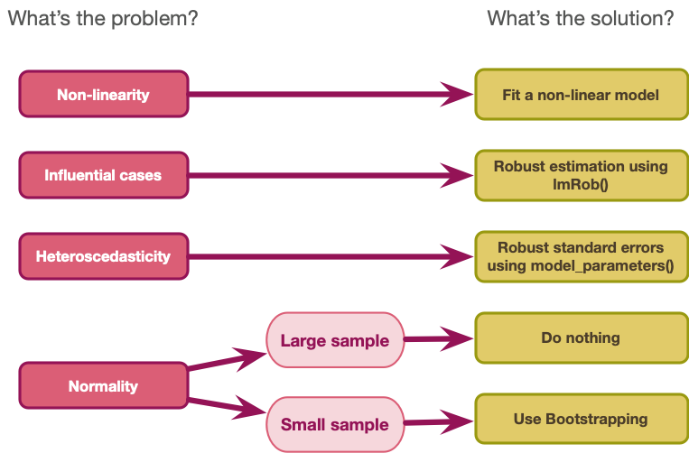

---- for slides ----

## {background-image="media/lone_knight.jpg" background-size="cover"}
## {background-video="media/zach_not_allowed_to_kill_dragons_caption.mp4" background-size="cover"}


::: notes
:::

::: fragment
:::

:::: columns
::: {.column width="45%"}
:::

::: {.column width="10%"}
:::

::: {.column width="45%"}
:::
::::

:::: columns
::: {.column width="50%"}
:::

::: {.column width="50%"}
:::
::::

::: {.r-fit-text}
:::

---code

```{r}
#| echo: TRUE
#| eval: FALSE
#| code-line-numbers: "1"
x <- 1:10
x
LETTERS[x]
```


---- for equations ----

::: center-h
::: txt_mulberry
::: txt_l
:::
:::
:::

---- for figures ----


{fig-align="center" height=600}

{fig-align="center" height=600}


{.absolute top=200 left=0 width="350" height="300"}
{.absolute top=50 right=50 width="450" height="250"}
{.absolute bottom=20 right=100 width="300" height="300"}


---- callouts ----

-- caution

use for THINKING/HYPOTHESES


::: {.callout-caution icon = false}
##  Think about it!

- xxxxx
:::

::: {.callout-caution icon = false}
##  Think about it!

Hypothesis

- xxxxx
:::


-- tip

::: {.callout-tip icon = false}
## `r cat_space()`: Tip

- Intervals that contain the 'true' population value of the parameter in 95% of samples.

:::

-- note

stats things

::: {.callout-note icon = false}
##  Statis-tip

- Intervals that contain the 'true' population value of the parameter in 95% of samples.

:::


-- list

:::{.callout-note icon=false}
##  All models have a S.P.I.N.E

::: incremental
- 

:::
:::


-- reportR

:::{.callout-important icon=false}
##  Report`r rproj()`


:::


-- warning

::: {.callout-warning icon = false}
##  The danger zone!

:::

--- have a go

::: {.callout-tip icon = false}
## `r robot()` : Have a go!

- Use project files!
- Posit cloud automatically uses them!

:::


--- EVIL

{.absolute top=0 left=800 height="80"}


## [L]{.txt_ong}oad and [L]{.txt_ong}ook

{.absolute top=0 left=800 height="80"}


## [V]{.txt_ong}isualize

{.absolute top=0 left=800 height="80"}


## [E]{.txt_ong}valuate

{.absolute top=0 left=800 height="80"}

## [I]{.txt_ong}nterpret parameter estimates, CIs and tests

{.absolute top=0 left=900 height="80"}


## Robust procedures

{fig-align="center" height=600}


--- data table

DT::datatable(data = gerlich_tib ,
              colnames = c('ID' = 1),
                caption = 'Table 1: Data simulated to match Gerlich (2025)',
                options = list(
                dom = 'tp',
                columnDefs = list(
                  list(className = 'dt-center', targets = 1:3)
                  ),
                pageLength = 5)
)

___ notes

abs = width="30%", left="85%", top="15%"

slides = 1050 x 700

{.absolute width=x left=prop*1050 top=prop*1050}
