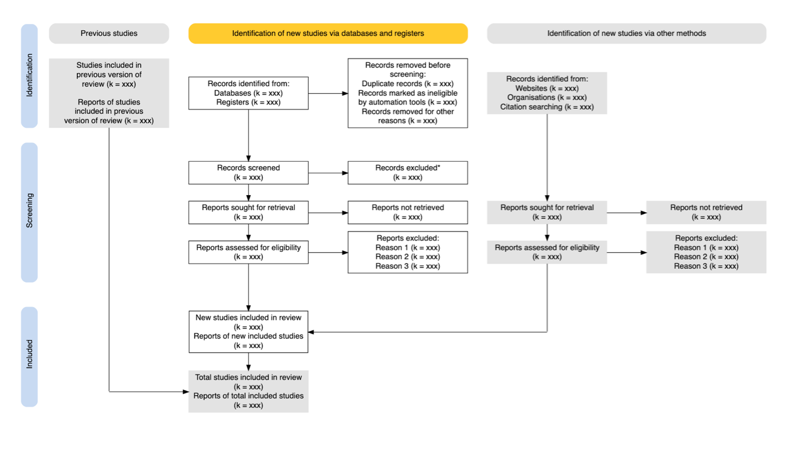

```{r}
library(DT)

here::here("helpers/discovr_helpers.R") |> source()

brewin_tib <- readr::read_csv("data/brewin_data.csv")
daly_tib <- readr::read_csv("data/daly_data.csv")
pearce_tib <- readr::read_csv("data/pearce_data.csv")


tbl_font_size <- "12pt"
```

## What is a meta-analysis?

::: {.callout-note icon="false"}
## Glass (1976)

*An "analysis of analyses"*
:::

### Aim

> Combine, summarize and interpret all available evidence pertaining to a clearly defined research field or research question

-   Estimate the 'true' effect (and uncertainty around it) by combining results from research that addresses the same question.
-   Estimate variability in effects across studies
-   Estimate predictors of effect sizes (so called *meta-regression*)

## Some pitfalls

::: fragment
-   Comparing apples and oranges
    -   Make sure the research question is clearly defined
    -   Have [consistent]{.hint} inclusion criteria
:::

::: fragment
-   Garbage in, Garbage out
    -   Have inclusion criteria that ensure quality
    -   Risk of bias tool <https://www.riskofbias.info/>
:::

::: fragment
-   The file-drawer problem
    -   Contact authors for null results
    -   Selection bias models
:::

::: fragment
-   Research agenda bias
    -   Have [objective]{.hint} inclusion criteria
:::

## Six steps in a meta-analysis 

::: incremental
1.  Identify a *clearly defined* research question
2.  Literature search
3.  Apply inclusion/exclusion criteria
4.  Extract data and calculate effect sizes
5.  Fit the model
6.  Write-it up
:::

## Six steps in a meta-analysis 

1.  Identify a *clearly defined* research question
2.  [Literature search]{.txt_red}
3.  Apply inclusion/exclusion criteria
4.  Extract data and calculate effect sizes
5.  Fit the model
6.  Write-it up

## Literature search

::: {.callout-important icon="false"}
## Sources of bias

-   File-drawer problem
-   Researcher bias
:::

::: incremental
-   Database search
    -   PubMed, PsycInfo, Web of Science and Scopus
    -   Search terms, logic (AND, OR) and wildcards (\*)
-   Websites
-   Citation searching
-   Contacting authors
-   Non-English studies
:::

##  

::: panel-tabset
### PRISMA flow chart

{width="700"}

### An example

](media/flack_prisma_flow.png){width="350"}
:::

## Six steps in a meta-analysis 

1.  Identify a *clearly defined* research question
2.  Literature search
3.  [Apply inclusion/exclusion criteria]{.txt_red}
4.  Extract data and calculate effect sizes
5.  Fit the model
6.  Write-it up

## Examples of inclusion/exclusion criteria 

::: {.callout-important icon="false"}
## Sources of bias

-   Comparing apples and oranges
-   GIGO
:::

::: incremental
-   Measures:
    -   What measures are considered methodologically credible/valid/reliable
-   Participants
    -   Specific populations or general?
-   Controls
    -   What is an appropriate control group
-   Study design
    -   What is the gold standard design - RCT?
:::

## Six steps in a meta-analysis 

1.  Identify a *clearly defined* research question
2.  Literature search
3.  Apply inclusion/exclusion criteria
4.  [Extract data and calculate effect sizes]{.txt_red}
5.  Fit the model
6.  Write-it up


## Effect sizes in meta-analysis 

::: {.callout-note icon="false"}
## What we need

To do a meta-analysis we need (from each paper)

-   An effect size
-   It's associated variance/standard error
:::

::: {.callout-tip icon="false"}
## Effect size

Standardized version of a model parameter
:::

### Common examples

::: incremental
-   Cohen's *d*
-   Pearson's *r*
-   Odds ratio
-   Standardized $\beta$
:::

## Cohens $\hat{d}$


:::::: columns
::: {.column width="50%"}

::: {.callout-note icon="false"}
## Cohens $\hat{d}$

Quantifies the difference between group means
:::


$$
\begin{aligned}
\hat{d} &= \frac{\overline{X}_1-\overline{X}_2}{s_p} \\
s_p &= \sqrt{\frac{(N_1-1)s^2_1 + (N_2-1)s^2_2}{N_1 + N_2 -2}}
\end{aligned}
$$
:::

:::: {.column width="50%"}
### Key points

::: incremental
-   Typically used to quantify differences between groups
    -   Experimental research
-   Sometimes reported in papers
    -   Also need $SE_d$
-   To calculate it you need to extract from papers
    -   Means of both groups ($\overline{X}_1$ and $\overline{X}_2$)
    -   SDs of both groups ($s^2_1$ and $s^2_2$)
    -   Sample size of both groups ($N_1$ and $N_2$)
-   Usually convert to Hedges $g$, which is unbiased
:::
::::
::::::

## Pearson's $r$ 

::: {.callout-note icon="false"}
## Pearson's $r$

Quantifies the association between two continuous variables
:::

$$
\begin{aligned}
r &= \frac{\sum(x- \overline{X})(y - \overline{Y})}{(N-1)s_xs_y} \\
\end{aligned}
$$

### Key points

::: incremental
-   Typically used to quantify associations between variables
    -   Observational/cross-sectional research
-   To calculate it you need to extract from papers
    -   Pearson's $r$ (because usually it's directly reported)
    -   Sample size ($N$) or the $SE_r$ (not usually reported)
:::

## Odds ratio (OR)

::: {.callout-note icon="false"}
## Odds ratio (OR)

Quantifies the association between two categorical variables
:::

::::: columns
::: {.column width="50%"}
```{r tbl8, echo = FALSE}
xmas_tbl <- tibble::tribble(
~` `, ~`Delivered`, ~`Not delivered`, ~`Total`,
"Christmas pudding","150","28","178",
"Mulled wine","100","122","222",
"Total","250","150","400"
) |> 
  knitr::kable(align = 'lccc') |> 
  kableExtra::row_spec(row = 3, color = red_dk) |> 
  kableExtra::column_spec(4, color = red_dk)

style_my_kable(xmas_tbl)
```
:::

::: {.column width="50%"}
::: txt_s
$$
\begin{aligned}
\text{odds}_\text{delivered after pudding} &= \frac{\text{Number delivered after pudding}}{\text{Number not delivered after pudding}} \\
&= \frac{150}{28} \\
&= 5.36 \\
\text{odds}_\text{delivered after wine} &= \frac{\text{Number delivered after wine}}{\text{Number not delivered after wine}} \\
&= \frac{100}{122} \\
&= 0.82 \\
\text{odds ratio} &= \frac{\text{odds}_\text{delivered after wine}}{\text{odds}_\text{delivered after pudding}} \\
&= \frac{0.82}{5.36} \\
&= 0.15
\end{aligned}
$$
:::
:::
:::::

## Odds ratio (OR)

### Key points

::: incremental
-   Typically used to quantify associations between categorical variables
    -   Studies with frequency data or dichotomous outcomes (e.g. recovered/not)
-   To calculate it you need to extract from papers
    -   Raw frequencies
    -   $SE_{OR}$ can be calculated from raw frequencies too
:::

##  

::::: panel-tabset
### Pearce & Field (2016)

::: {.callout-note icon="false"}
Pearce, L. J., & Field, A. P. (2016). The impact of 'scary' tv and film on children's internalizing emotions: A meta-analysis. Human Communication Research, 42, 98--121. [doi: doi.org/10.1111/hcre.12069](https://doi.org/10.1111/hcre.12069)
:::

::: incremental
::: txt_s
-   Pearson's *r*
    -   Quantifying quantity of exposure to scary TV and measures of internalising
-   Moderators
    -   Experimental or correlational
    -   Self-report of physiological outcome
    -   Responder (Child, Parent, Both)
    -   Outcome measure (Fear, PTSD, Sadness etc)
    -   Age (mean, and age \< 10)
    -   Media type (TV only or mixed media)
    -   Media Content (fact vs. fantasy)
    -   Violent content

:::
:::

### Searches

{width="300"}

### Inclusion Criteria
::: txt_s
1.  Outcomes were reported only for children aged 18 years and under, including self-report by the child, parent reports of child behaviour, and physiological measures in an experimental laboratory setting.If a study included an age range with an upper limit beyond 18 years, it was excluded.
2.  The primary outcomes included measures of internalizing behaviours such as fear, anxiety, worry, sadness, and depression. Studies which focused specifically on externalizing behaviours such as aggression and violence were excluded because the focus of this study was internalized emotions.
3.  Initially, studies were selected for inclusion if the outcome measures were clinically validated scales or physiological measures. However, due to the limited number of studies including such measures, inclusion criteria were broadened to include non validated self-report measures such as Likert and visual analogue measures of fear, anxiety, etc.
4.  Experimental studies must include a control group or condition, either a baseline measurement before exposure to television, or a group with no, or limited exposure to television. Correlational studies must have measured the quantity of exposure to warrant inclusion.
5.  There needed to be sufficient information to compute effect sizes.
:::

### Data

```{r}
pearce_tib |> 
  dplyr::select(-Design) |> 
  DT::datatable(caption = 'Table 1: Data from Pearce & Field (2016)',
                options = list(
                  autoWidth = TRUE,
                  scrollX = TRUE,
                  scrollY = "475px",
                  paginate = FALSE,
                  dom = 'tp',
                  columnDefs = list(
                    list(className = 'dt-center', targets = "_all"),
                    list(width = '450px', targets = c(2, 4, 16, 17, 19, 20, 28, 30, 40, 48)),
                    list(width = '350px', targets = 8:9),
                    list(width = '500px', targets = c(31, 33))
                    ),
                  initComplete = htmlwidgets::JS(
                    "function(settings, json) {",
                    paste0("$(this.api().table().container()).css({'font-size': '", tbl_font_size, "'});"),
                    "}")
                  )
                )
```
:::::

##  

::::: {.panel-tabset}
### Brewin & Field (2024)

::: {.callout-note icon="false"}
Brewin, C. & Field, A. P. (2024). Meta-analysis shows trauma memories in PTSD lack coherence: A response to Taylor et al. (2022). <https://osf.io/597hr/>
:::

::: incremental
-   Hedges's $g$
    -   Quantifying memory disorganization in those with PTSD vs not
-   Moderators
    -   Does study use FOA methodology
    -   Measure (organization vs disorganization)
    -   Age (Youth vs adult)
:::

### Data

```{r}

brewin_tib |> 
  DT::datatable(caption = 'Table 1: Data from Brewin & Field (2024)',
                options = list(
                  autoWidth = TRUE,
                  scrollX = TRUE,
                  scrollY = "475px",
                  paginate = FALSE,
                  dom = 'tp',
                  columnDefs = list(
                    list(className = 'dt-center', targets = "_all"),
                    list(width = '2000px', targets = ncol(brewin_tib)),
                    list(width = '450px', targets = c(1, 3, 6))
                    ),
                  initComplete = htmlwidgets::JS(
                    "function(settings, json) {",
                    paste0("$(this.api().table().container()).css({'font-size': '", tbl_font_size, "'});"),
                    "}")
                  )
                )
```
:::::


## Essential resources

-   Cochrane handbook (Higgins et al, 2023)
    -   <https://training.cochrane.org/handbook>
-   PRISMA reporting guidelines (Moher et al. 2009)
    -   <http://prisma-statement.org/>
-   MARS reporting guidelines (Appelbaum et al. 2018)
-   [Doing meta-analysis in R](https://bookdown.org/MathiasHarrer/Doing_Meta_Analysis_in_R/intro.html) (Harrer et al., 2023)
-   Online tool for prisma flowcharts
    -   [www.eshackathon.org/software/PRISMA2020.html](https://www.eshackathon.org/software/PRISMA2020.html)
