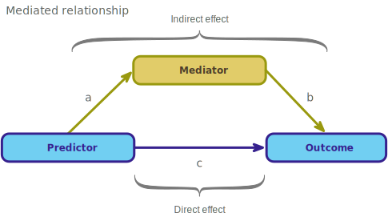
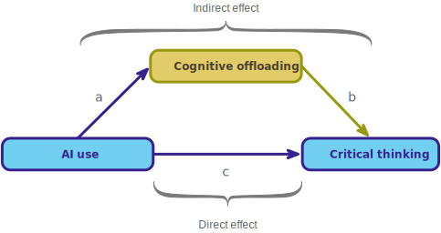
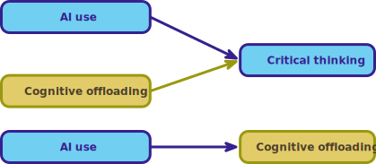
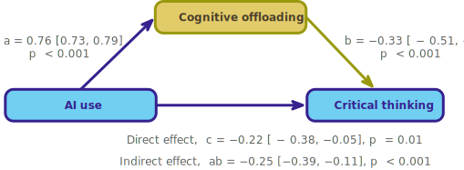
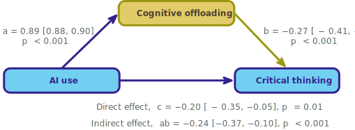
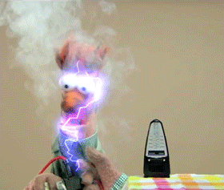

```{r}
# general
library(DT)
library(easystats)
library(GGally)
library(tidyverse)
# specific

source("../helpers/discovr_helpers.R")
source("../helpers/easystats_helpers.R")


gerlich_tib <- here::here("ds_05_mediation/data/gerlich_2025.rds") |> 
  read_rds()

greitemeyer_tib <- here::here("ds_05_mediation/data/greitemeyer_2024.rds") |> 
  read_rds() |> 
  dplyr::select(id, norms, intention, ai_use)
```


## {background-video="media/pirate_scene_r1_small.mp4" background-size="cover"}

::: notes
Use C to toggle pen/markup
Use backspace to delete markup
Use f to toggle fullscreen
:::

## {background-video="media/pirate_scene_r2_small.mp4" background-size="cover"}

## {background-video="media/pirate_scene_1_1_small.mp4" background-size="cover"}

## {background-video="media/pirate_academy_small.mp4" background-size="cover"}

## {background-video="media/pirate_scene_1_2_small.mp4" background-size="cover"}

## 

::: r-stack
{.fragment fig-align="center" width="1050" height="594"}

{.fragment fig-align="center" width="1050" height="594"}
:::


##

{fig-align="center" height=600}

## Does AI-use reduce critical thinking?^[Gerlich, M. (2025). AI tools in society: Impacts on cognitive offloading and the future of critical thinking. *Societies*, 15(1): 6. [doi.org/10.3390/soc15010006](https://doi.org/10.3390/soc15010006).]

- 669 participants (666 considered 'valid' `r emo::ji("devil")`)
- Measures
  - AI-tool usage (`ai`)
  - Cognitive offloading (`cog_off`): externalisation of cognitive processes, often involving tools or external agents, such as notes, calculators, or digital tools like AI, to reduce cognitive load.
  - Critical thinking (`crit_think`): the capacity to think clearly and rationally, understand logical connections between ideas, evaluate arguments, and identify inconsistencies in reasoning

::: fragment
::: {.callout-caution icon = false}
##  Think about it!

Hypotheses

- H~1~: Higher AI tool usage is associated with reduced critical thinking skills.
- H~2~: Cognitive offloading mediates the relationship between AI tool usage and critical thinking skills.

:::
:::

::: notes
The measures are a shitshow in this study, items have different response scales, some measure frequency others, likelihood (e.g. very likely), agreement, dependency, confidence. AI usage conflates usage with trust. Critical thinking conflates general critical thinking with critical thinking about AI.
:::

## Measures

- AI-tool usage 
  - 5 items (1 = not at all/strongly disagree, 6 = always/strongly agree)
  - *How often do you use AI tools*
  - *To what extent do you rely on AI tools for decision-making?*
  - *I often cross-check information provided by AI tools with other sources*
- Cognitive offloading
  - 5 items (1 = not at all/strongly disagree/unlikely, 6 = always/strongly agree)
  - *How often do you use search engines like Google to find information quickly?*
  - *When faced with a problem or question, how likely are you to search for the answer online rather than trying to figure it out yourself?*
- Critical thinking
  - 8 items (1 = not at all/strongly disagree, 6 = always/strongly agree)
  - *How often do you critically evaluate the sources of information you encounter?*
  - *I question the assumptions underlying the information provided by AI tools*


## Mediation: the conceptual model

{fig-align="center" height=100}


::: fragment
{fig-align="center" height=350}
:::


::: notes
The total effect is made up of both the direct effect of the predictor on an outcome and its indirect effect via a mediator.
:::


## Key points

:::: columns
::: {.column width="50%"}

> Mediation is when the relationship between a predictor and outcome can be explained by their relationship to a third variable.

:::

::: {.column width="50%"}
{fig-align="center" height=200}
:::
::::

::: fragment

- The [total effect]{.txt_mulberry} between a predictor and outcome can be broken down into:
  - The [direct effect]{.txt_mulberry}, which is the relationship between the predictor and outcome **adjusting for** the mediator (path *c*)
  - The [indirect effect]{.txt_mulberry}, which is the relationship between the predictor and outcome **via** for the mediator (path *ab*)
- The [indirect effect quantifies mediation]{.txt_mulberry}
  
:::

::: fragment
::: center-h
::: txt_mulberry
$$
\begin{aligned}
\text{Total effect} &= \text{Direct effect} + \text{Indirect effect} \\
\text{Total effect} &= c + (a \times b)
\end{aligned}
$$

:::
:::
:::

## Mediation in practice

{fig-align="center" height=500}

::: fragment
::: center-h
::: txt_mulberry
$$
\begin{aligned}
\text{Total effect} &= \text{Direct effect} + \text{Indirect effect} \\
\text{Total effect} &= c + (a \times b)
\end{aligned}
$$

:::
:::
:::


## [L]{.txt_ong}oad and [L]{.txt_ong}ook

{.absolute top=0 left=900 height="80"}

```{r}
DT::datatable(data = gerlich_tib ,
              colnames = c('ID' = 1),
                caption = 'Table 1: Data simulated to match Gerlich (2025)',
                options = list(
                dom = 'tp',
                columnDefs = list(
                  list(className = 'dt-center', targets = 1:3)
                  ),
                pageLength = 5)
)
```

::: fragment

```{r}
#| echo: true

describe_distribution(gerlich_tib) |> display()
```
:::

::: notes
All variables have similar ranges, means and SDs, which is why the standardized parameter estimates are very similar to the unstandardized ones.
:::

## [V]{.txt_ong}isualize

```{r}
#| echo: true

ggscatmat(data = gerlich_tib, alpha = 0.5) + theme_minimal()
```


{.absolute top=0 left=800 height="80"}

## How do we specify the model?

:::: columns
::: {.column width="50%"}

:::

::: {.column width="50%"}
::: txt_s
::: txt_mulberry
$$
\begin{aligned}
\\
\\
\widehat{\text{Critical thinking}}_i &= \hat{c}\text{AI Use}_i +\hat{b}\text{Cognitive offloading}_i \\
\\
\\
\widehat{\text{Cognitive offloading}}_i &= \hat{a}\text{AI Use}_i  \\
\end{aligned}
$$
:::
:::
:::
::::

::: fragment
::: {.callout-caution icon = false}
##  Think about it!

Can we fit a series of regular linear models?

- This gets us closer, because these models adjust the relationship between AI use and critical thinking for cognitive offloading, but ...
- ... the relationships between between AI use, cognitive offloading and critical thinking are treated as independent from the relationship between AI use and cognitive offloading
- The solution is to fit these models *simultaneously* using [**Structural Equation Modelling (SEM)**]{.alt}

:::
:::

## Path analysis

::: txt_xl
```{r}
#| echo: true
#| eval: false
#| code-line-numbers: 1|2|4|5

gerlich_mod <- 'crit_think ~ c*ai + b*cog_off
                cog_off ~ a*ai
       
                indirect_effect := a*b
                total_effect := c + (a*b)
                '
```
:::

::: center-h
::: txt_mulberry
$$
\begin{aligned}
\widehat{\text{Critical thinking}}_i &= \hat{c}\text{AI Use}_i +\hat{b}\text{Cognitive offloading}_i \\
\widehat{\text{Cognitive offloading}}_i &= \hat{a}\text{AI Use}_i  \\
\\
\text{Total effect} &= \text{Direct effect} + \text{Indirect effect} \\
\text{Total effect} &= c + (a \times b)
\end{aligned}
$$

:::
:::

## Fitting the model

::: txt_xl
```{r}
#| echo: true
#| eval: true
#| results: hide
#| code-line-numbers: 8|9|10|11

gerlich_mod <- 'crit_think ~ c*ai + b*cog_off
                cog_off ~ a*ai
       
                indirect_effect := a*b
                total_effect := c + (a*b)
                '

gerlich_fit <- lavaan::sem(model = gerlich_mod,
                           data = gerlich_tib,
                           missing = "FIML",
                           estimator = "MLR")
```
:::


## [E]{.txt_ong}valuate

::: txt_xl
::: {.callout-note icon = false}
##  Statis-tip

- As with other models, we can use `model_performance()` to get fit statistics, but these will always show perfect fit (we are fitting what's known as a [**saturated model**]{.alt}).
- We cannot use `check_model()` to get diagnostic plots.
- By using `estimator = "MLR"` we have fitted a robust model.

:::
:::

{.absolute top=0 left=800 height="80"}

## [I]{.txt_ong}nterpret parameter estimates, CIs and tests 

```{r}
#| echo: true
#| eval: false

model_parameters(gerlich_fit) |> 
  display()
```

\

::: tbl_s
```{r}
model_parameters(gerlich_fit, component = "regression") |> 
  format_table(title = "") |> 
  display()
```
\

```{r}
model_parameters(gerlich_fit, component = "defined") |> 
  format_table(title = "") |> 
  display()
```

:::

{.absolute top=0 left=900 height="80"}

## The fitted model

{fig-align="center" height=500}

## Standardized parameter estimates

```{r}
#| echo: true
#| eval: false

model_parameters(gerlich_fit, standardize = TRUE) |> 
  display()
```

\

::: tbl_s
```{r}
model_parameters(gerlich_fit, standardize = TRUE, component = "regression") |> 
  format_table(title = "") |> 
  display()
```
\

```{r}
model_parameters(gerlich_fit, standardize = TRUE, component = "defined") |> 
  format_table(title = "") |> 
  display()
```

:::

{.absolute top=0 left=900 height="80"}

## The fitted model

{fig-align="center" height=500}


## The squid of despair

> Do AI use and cognitive offloading [cause]{.alt} lower critical thinking?

{fig-align="center"}


::: txt_xl
::: {.callout-warning icon = false}
##  The danger zone!

 - [**NO!!!**]{.alt} You cannot infer causality from these model

:::
:::

## {background-video="media/pirate_scene_entry_small.mp4" background-size="cover"}

## {background-video="media/pirate_scene_2_1_small.mp4" background-size="cover"}

## {background-video="media/pirate_scene_2_2_small.mp4" background-size="cover"}

## {background-video="media/pirate_academy_end_small.mp4" background-size="cover"}


## Summary

- Mediation is when the relationship between a predictor and outcome can be explained by their relationship to a third variable.
- The [total effect]{.txt_mulberry} between a predictor and outcome can be broken down into:
  - The [direct effect]{.txt_mulberry}, which is the relationship between the predictor and outcome **adjusting for** the mediator
  - The [indirect effect]{.txt_mulberry}, which is the relationship between the predictor and outcome **via** for the mediator
- We cannot infer causality from these models.

