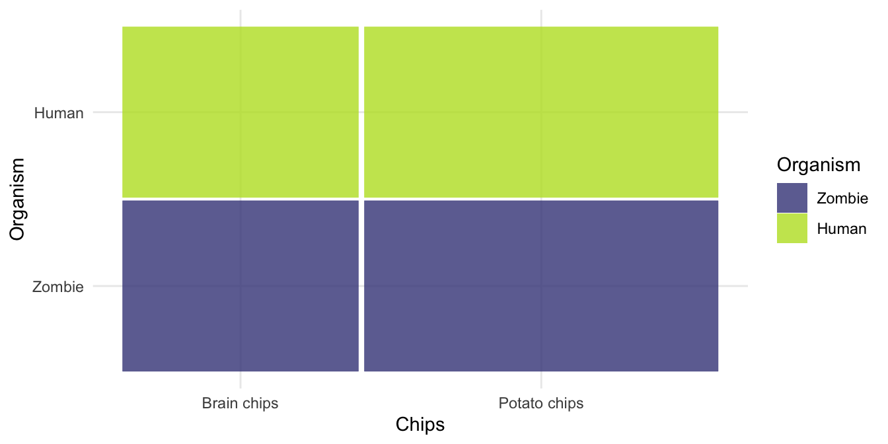
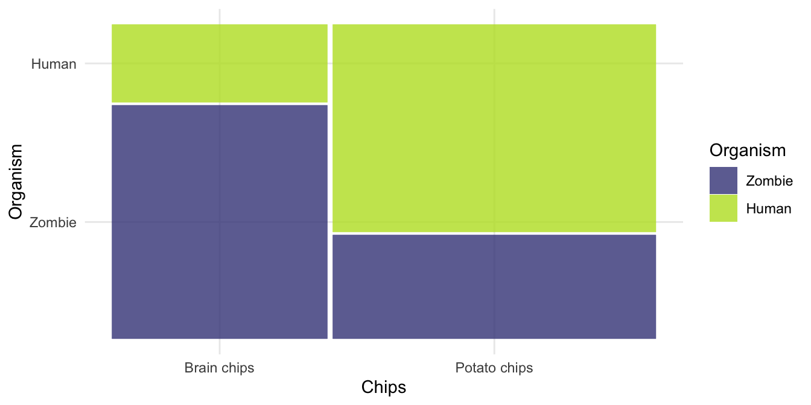
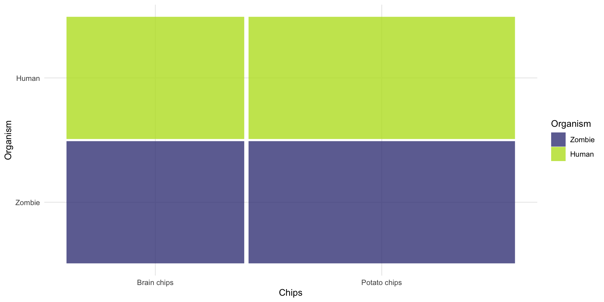
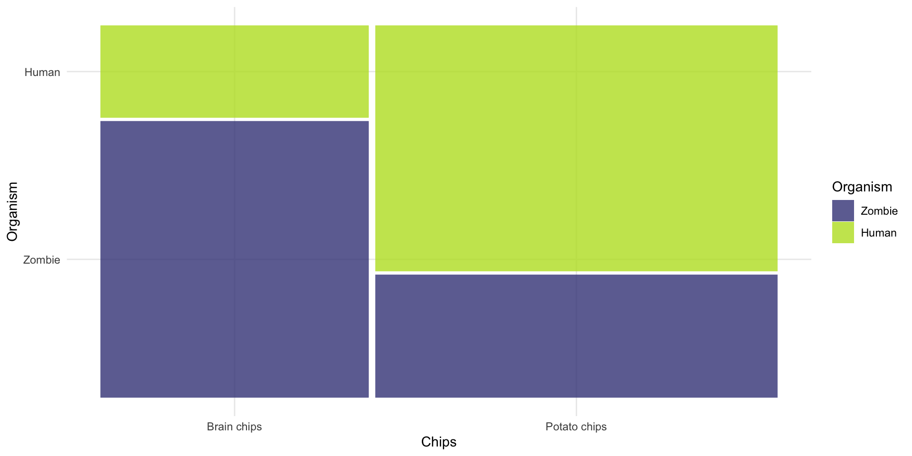
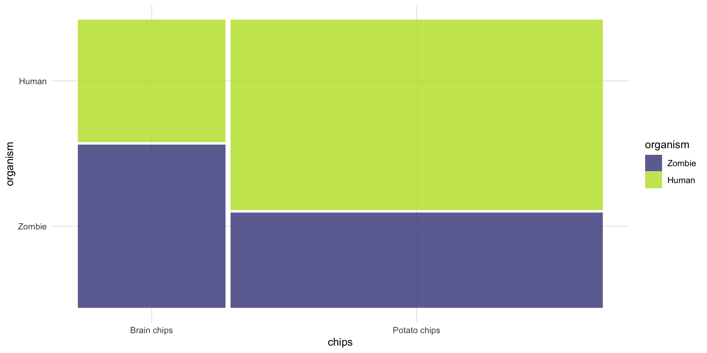
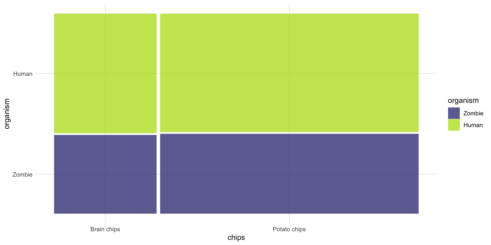
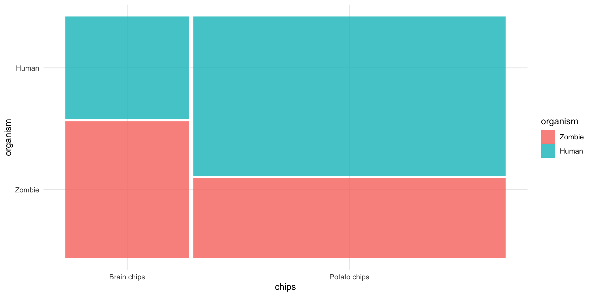

# The Chi Square test

Professor Andy Field, University of Sussex

Links: [bsky.app](https://bsky.app/profile/profandyfield.bsky.social) \| [youtube.com](https://www.youtube.com/user/ProfAndyField) \| [discoveringstatistics.com](https://www.discoveringstatistics.com) \| [discovr.rocks](https://www.discovr.rocks) \| [statisticsadventure.com](https://www.statisticsadventure.com)

## About this version

This is a plain-text version of the lecture slides. Each slide starts with a heading such as “Slide 5”, and the numbers match the slide numbers shown in the lecture. Content that appeared one piece at a time, in columns or in tabs is shown in reading order. Videos and interactive apps are given as links.

## Slide 2: tl;dw

> **Note: Statis-tip**
>
> Use a chi-square test to:
>
> - Test for an association between two categorical variables
>   - H<sub>1</sub>: There is an association between the variables.
>   - H<sub>0</sub>: There is **no** association between the variables.
> - Each observation must fall into only 1 combination of categories (independence)
> - Data are frequencies
> - A significant test statistic $`\chi^2`$
>   - The observed frequencies are **inconsistent** with the null hypothesis being true
>   - Conclude: the association between variables is not zero
> - A non-significant test statistic $`\chi^2`$
>   - The observed frequencies are **consistent** with the null hypothesis being true
>   - Conclude: the association between variables could be zero

## Slide 3: Do zombie’s like to eat brains?

- There is a common cultural belief that zombies like to eat brains
- If this is true we’d expect zombies to choose brains to eat more than other foods.
- We wouldn’t expect this preference in non-zombies.
- A researcher counted how many humans and zombies choose brain chips or potato chips to accompany their dinner at the university canteen

> **Caution: Hypothesis**
>
> - H<sub>1</sub>: There is an association between the type of organism and the type of chips eaten.
> - H<sub>0</sub>: There is **no** association between the type of organism and the type of chips eaten.

## Slide 4: The Data

- Data are counts/frequencies
- Imagine we observed 50 humans and 50 zombies
- If there is no association, how many observations would we expect in each cell?

| Organism | Brain chips | Potato chips | Total |
|----------|-------------|--------------|-------|
| Human    |             |              | 50    |
| Zombie   |             |              | 50    |
| Total    |             |              | 100   |

## Slide 5: Expected values

- What about if 40 had brain chips and 60 Potato chips?

| Organism | Brain chips | Potato chips | Total |
|----------|-------------|--------------|-------|
| Human    |             |              | 50    |
| Zombie   |             |              | 50    |
| Total    | 40          | 60           | 100   |

## Slide 6: Expected values (generally)

| Organism | Brain chips | Potato chips | Total |
|----|----|----|----|
| Human | $`\frac{\text{RT}_1 \times \text{CT}_1}{N}`$ | $`\frac{\text{RT}_2 \times \text{CT}_1}{N}`$ | RT<sub>1</sub> |
| Zombie | $`\frac{\text{RT}_1 \times \text{CT}_2}{N}`$ | $`\frac{\text{RT}_2 \times \text{CT}_2}{N}`$ | RT<sub>2</sub> |
| Total | CT<sub>1</sub> | CT<sub>2</sub> | $`N`$ |

## Slide 7: Model (expected) values

- The expected values when there’s no association (i.e. the null is true)

| Organism | Brain chips | Potato chips | Total |
|----------|-------------|--------------|-------|
| Human    | 20          | 30           | 50    |
| Zombie   | 20          | 30           | 50    |
| Total    | 40          | 60           | 100   |



## Slide 8: Observed values

| Organism | Brain chips | Potato chips | Total |
|----------|-------------|--------------|-------|
| Human    | 10          | 40           | 50    |
| Zombie   | 30          | 20           | 50    |
| Total    | 40          | 60           | 100   |



## Slide 9: The Chi-square test

``` math
 \chi^2 = \sum\frac{\left(\text{observed}_{ij} - \text{model}_{ij}\right)^2}{\text{model}_{ij}} 
```

### Model

| Organism | Brain chips | Potato chips | Total |
|----------|-------------|--------------|-------|
| Human    | 20          | 30           | 50    |
| Zombie   | 20          | 30           | 50    |
| Total    | 40          | 60           | 100   |



### Observed

| Organism | Brain chips | Potato chips | Total |
|----------|-------------|--------------|-------|
| Human    | 10          | 40           | 50    |
| Zombie   | 30          | 20           | 50    |
| Total    | 40          | 60           | 100   |



## Slide 10: In reality

| Organism | Brain chips | Potato chips | Total |
|----------|-------------|--------------|-------|
| Human    | 27          | 106          | 133   |
| Zombie   | 36          | 53           | 89    |
| Total    | 63          | 159          | 222   |

## Slide 11: In reality

``` math
 \chi^2 = \sum\frac{\left(\text{observed}_{ij} - \text{model}_{ij}\right)^2}{\text{model}_{ij}} 
```

### Observed

<table>
<colgroup>
<col style="width: 100%" />
</colgroup>
<tbody>
<tr>
<td><table>
<thead>
<tr>
<th>organism</th>
<th>Brain chips</th>
<th>Potato chips</th>
</tr>
</thead>
<tbody>
<tr>
<td>Human</td>
<td>27</td>
<td>106</td>
</tr>
<tr>
<td>Zombie</td>
<td>36</td>
<td>53</td>
</tr>
</tbody>
</table></td>
</tr>
</tbody>
</table>



### Model

<table>
<colgroup>
<col style="width: 100%" />
</colgroup>
<tbody>
<tr>
<td><table>
<thead>
<tr>
<th>organism</th>
<th>Brain chips</th>
<th>Potato chips</th>
</tr>
</thead>
<tbody>
<tr>
<td>Human</td>
<td>38</td>
<td>95</td>
</tr>
<tr>
<td>Zombie</td>
<td>25</td>
<td>64</td>
</tr>
</tbody>
</table></td>
</tr>
</tbody>
</table>



## Slide 12 (new section): The chi-square test using R

## Slide 13: Fitting models is E.V.I.L.

- **L**ook and **L**oad: get the data into R, process it, summarize it (look)
- **V**isualise: plot relevant information to understand the data/model
- **E**valuate: is the model any good? Are its assumptions met? Does it ‘fit’ the data?
- **I**nterpret: use the model to answer your question

## Slide 14: Load and Look

|     | organism | chips        |
|-----|----------|--------------|
| 1   | Human    | Brain chips  |
| 2   | Human    | Brain chips  |
| 3   | Human    | Brain chips  |
| 4   | Human    | Brain chips  |
| 5   | Human    | Brain chips  |
| 6   | Human    | Brain chips  |
| 7   | Human    | Brain chips  |
| 8   | Human    | Brain chips  |
| 9   | Human    | Brain chips  |
| 10  | Human    | Brain chips  |
| 11  | Human    | Brain chips  |
| 12  | Human    | Brain chips  |
| 13  | Human    | Brain chips  |
| 14  | Human    | Brain chips  |
| 15  | Human    | Brain chips  |
| 16  | Human    | Brain chips  |
| 17  | Human    | Brain chips  |
| 18  | Human    | Brain chips  |
| 19  | Human    | Brain chips  |
| 20  | Human    | Brain chips  |
| 21  | Human    | Brain chips  |
| 22  | Human    | Brain chips  |
| 23  | Human    | Brain chips  |
| 24  | Human    | Brain chips  |
| 25  | Human    | Brain chips  |
| 26  | Human    | Brain chips  |
| 27  | Human    | Brain chips  |
| 28  | Human    | Potato chips |
| 29  | Human    | Potato chips |
| 30  | Human    | Potato chips |
| 31  | Human    | Potato chips |
| 32  | Human    | Potato chips |
| 33  | Human    | Potato chips |
| 34  | Human    | Potato chips |
| 35  | Human    | Potato chips |
| 36  | Human    | Potato chips |
| 37  | Human    | Potato chips |
| 38  | Human    | Potato chips |
| 39  | Human    | Potato chips |
| 40  | Human    | Potato chips |
| 41  | Human    | Potato chips |
| 42  | Human    | Potato chips |
| 43  | Human    | Potato chips |
| 44  | Human    | Potato chips |
| 45  | Human    | Potato chips |
| 46  | Human    | Potato chips |
| 47  | Human    | Potato chips |
| 48  | Human    | Potato chips |
| 49  | Human    | Potato chips |
| 50  | Human    | Potato chips |

Table 1: Zombie data (first 50 of 222 rows)


## Slide 15: Load and Look

``` r
# create the table
brain_xtbl <- brain_tib |>
  data_tabulate(select = "organism", by = "chips", remove_na = TRUE)

# format for rendering
display(brain_xtbl)
```

| organism | Brain chips | Potato chips | Total |
|----------|-------------|--------------|-------|
| Zombie   | 36          | 53           | 89    |
| Human    | 27          | 106          | 133   |
|          |             |              |       |
| Total    | 63          | 159          | 222   |


## Slide 16: Visualize

``` r
ggplot(data = brain_tib) +
  geom_mosaic(aes(x = product(organism, chips), fill = organism)) + 
  theme_minimal()
```




## Slide 17: Interpret

``` r
# fit model
brain_chi <- brain_xtbl |> 
  as.table(simplify = TRUE) |> 
  chisq.test()

# show results
model_parameters(brain_chi) |> 
  display()
```

| Chi2(1) | p     |
|---------|-------|
| 9.68    | 0.002 |

Pearson’s Chi-squared test with Yates’ continuity correction


## Slide 18: Interpret

``` r
get_residuals(brain_chi)  |> 
  display()
```

|        | Brain chips | Potato chips |
|--------|-------------|--------------|
| Zombie | 2.14        | -1.35        |
| Human  | -1.75       | 1.10         |


## Slide 19: Interpret

``` r
brain_xtbl |>
  as.table(simplify = TRUE) |> 
  oddsratio() |> 
  display()
```

| Odds ratio | 95% CI         |
|------------|----------------|
| 2.67       | \[1.47, 4.85\] |


## Slide 20: Evaluate assumptions

``` r
get_predicted(brain_chi)  |> 
  display()
```

|        | Brain chips | Potato chips |
|--------|-------------|--------------|
| Zombie | 25.26       | 63.74        |
| Human  | 37.74       | 95.26        |


## Slide 21 (new section): The Odds Ratio

## Slide 22: tl;dw

> **Note: Statis-tip**
>
> The odds ratio:
>
> - The odds of an event in one group relative to a comparison group
>   - The odds of recovery in those receiving surgery compared to those not receiving surgery
>   - The odds of getting a six pack in those doing Tai-Chi walking compared to those that don’t
> - OR \> 1: the odds of an event occurring are **greater** in the group of interest than in the comparison group.
> - OR \< 1: the odds of an event occurring are **smaller** in the group of interest than in the comparison group.

## Slide 23: The Data

- There is a common cultural belief that zombies like to eat brains
- If this is true we’d expect zombies to choose brains to eat more than other foods.
- A researcher counted how many humans and zombies choose brain chips or potato chips to accompany their dinner at the university canteen
- Data are counts/frequencies

## Slide 24: The odds of eating brain

| Organism | Brain chips | Potato chips | Total |
|----------|-------------|--------------|-------|
| Human    | 27          | 106          | 133   |
| Zombie   | 36          | 53           | 89    |
| Total    | 63          | 159          | 222   |

``` math
 \begin{aligned} \text{odds}_\text{human eating brain} &= \frac{\text{Number eating brain}}{\text{Number eating potato}} \\ &= \frac{27}{106} \\ &= 0.255 \end{aligned} 
```

``` math
 \begin{aligned} \text{odds}_\text{zombie eating brain} &= \frac{\text{Number eating brain}}{\text{Number eating potato}} \\ &= \frac{36}{53} \\ &= 0.679 \end{aligned} 
```

## Slide 25: The odds ratio

``` math
 \begin{aligned} \text{odds ratio} &= \frac{\text{odds}_\text{human eating brain}}{\text{odds}_\text{zombie eating brain}} \\ &= \frac{0.255}{0.679} \\ &= 0.38 \end{aligned} 
```

> **Note: Statis-tip**
>
> - The odds of a human eating brains are 0.38 times those of a zombie eating brains

``` math
 \begin{aligned} \text{odds ratio} &= \frac{\text{odds}_\text{zombie eating brain}}{\text{odds}_\text{human eating brain}} \\ &= \frac{0.679}{0.255} \\ &= 2.66 \end{aligned} 
```

> **Note: Statis-tip**
>
> - The odds of a zombie eating brains are 2.66 times greater than the odds of a human eating brains
