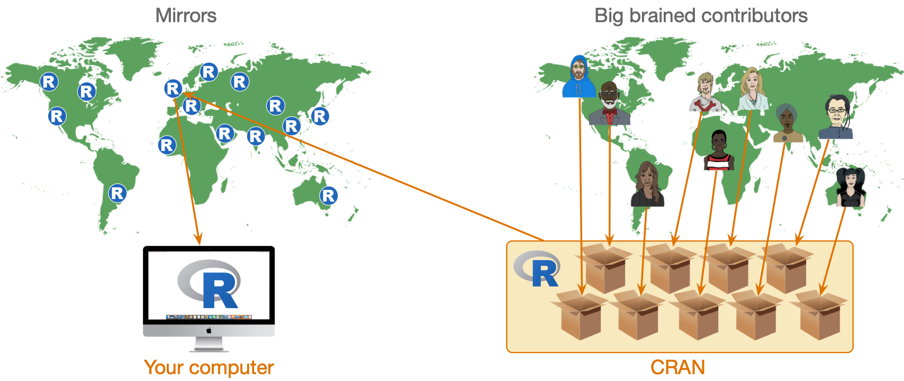
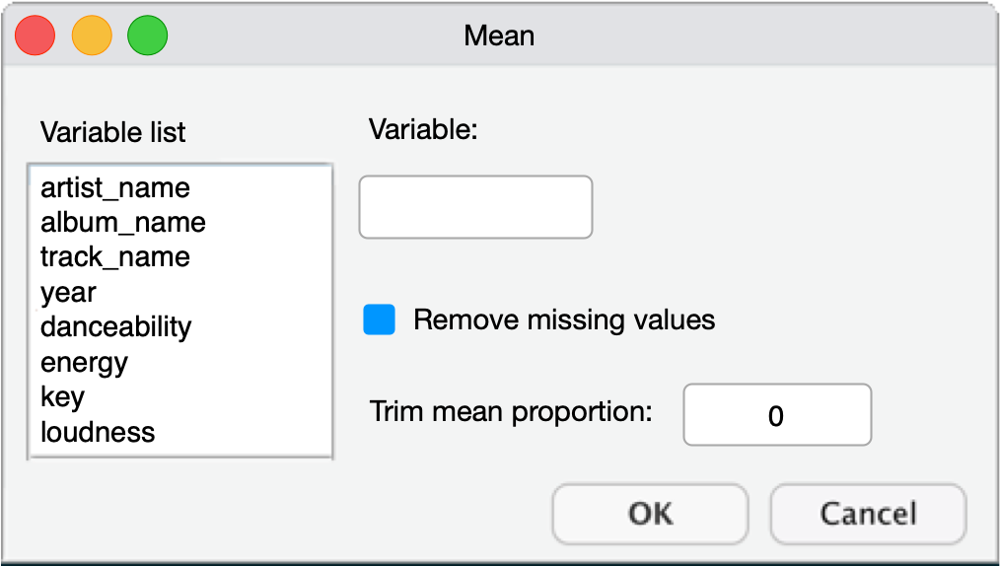
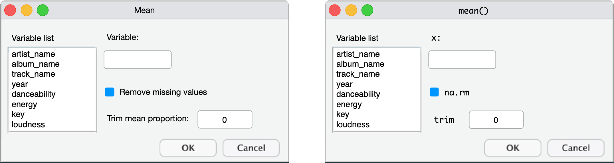
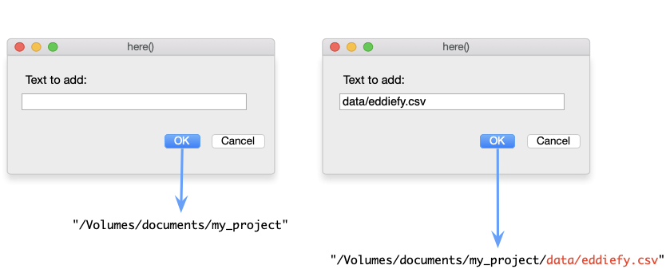
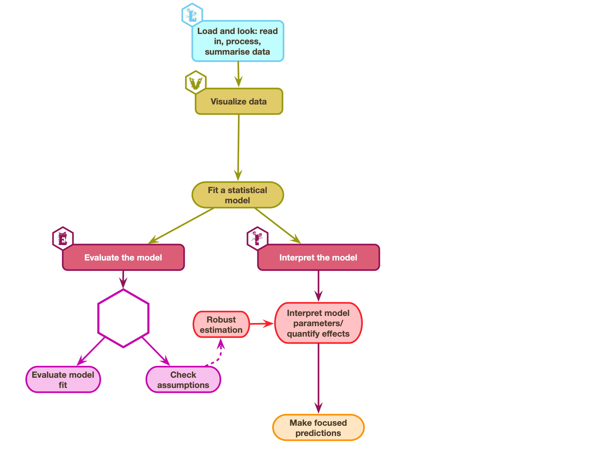
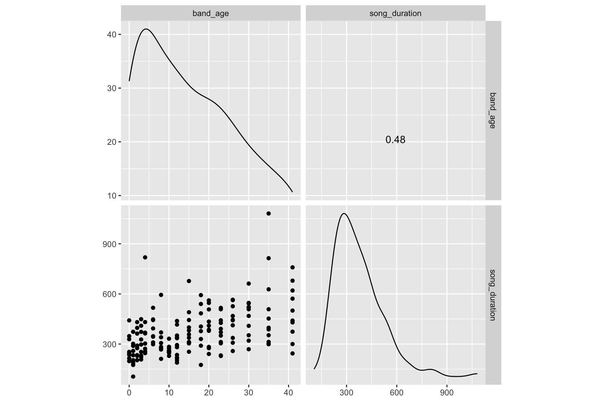
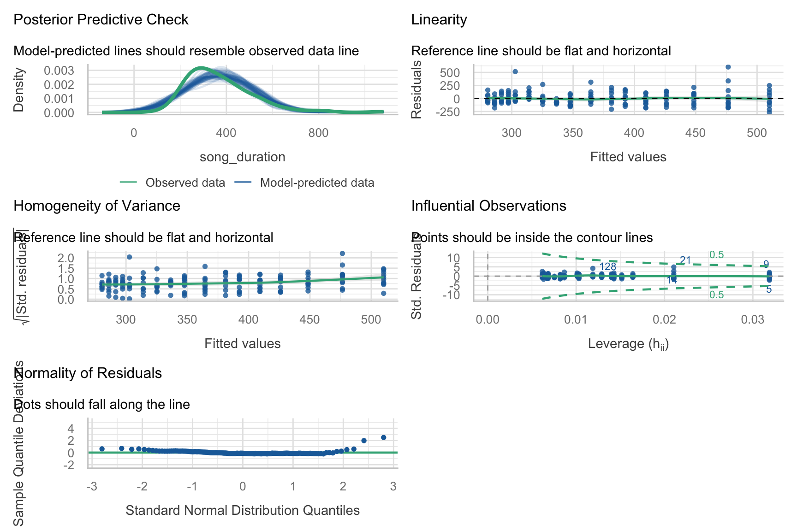
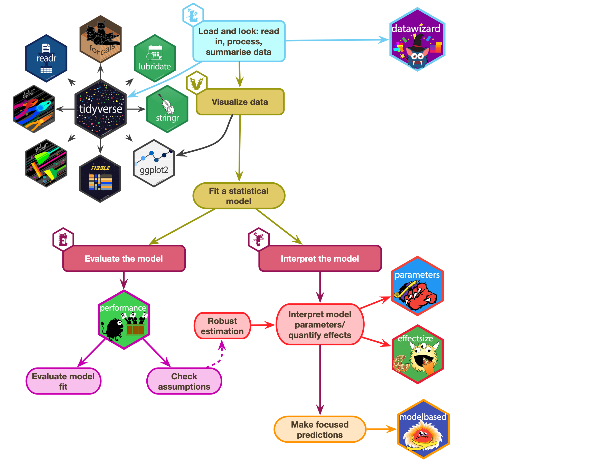

# R Essentials

Professor Andy Field, University of Sussex

Links: [bsky.app](https://bsky.app/profile/profandyfield.bsky.social) \| [youtube.com](https://www.youtube.com/user/ProfAndyField) \| [discoveringstatistics.com](https://www.discoveringstatistics.com) \| [discovr.rocks](https://www.discovr.rocks) \| [statisticsadventure.com](https://www.statisticsadventure.com)

## About this version

This is a plain-text version of the lecture slides. Each slide starts with a heading such as “Slide 5”, and the numbers match the slide numbers shown in the lecture. Content that appeared one piece at a time, in columns or in tabs is shown in reading order. Videos and interactive apps are given as links.

## Slide 2 (new section): Packages and Functions

## Slide 3: Functions

- We use functions to do things
  - Inputs: What we put into the function
  - Outputs: what we get out of the function
- Functions look like this (prints the output)

``` r
name_of_function(inputs/arguments/options)
```

> **Tip: Have a go!**
>
> - In a code chunk execute
>
> ``` r
> randomNames(n = 5)
> ```


## Slide 4: Packages

- We can’t use `randomNames()` because we haven’t installed the package from which it comes!
- Installing a package gives you access to functions within it



## Slide 5: Installing and loading packages

- You need to install the package into R’s repository of packages on your computer.
- Every time you update or re-install R you need to re-install packages to use them.

``` r
install.packages("package_name")
```

> **Tip**
>
> - **Do NOT include `install.packages()` in Quarto files** or the package will be installed every time you render the document!
>   - Use the console and command line to execute `install.packages()` commands

> **Tip: Have a go!**
>
> - Install the package `randomNames` from which the function `randomNames()` comes.
>
> ``` r
> install.packages("randomNames")
> ```
>
> In your code chunk execute:
>
> ``` r
> randomNames(n = 5)
> ```


## Slide 6: Loading packages

- That also didn’t work 🤔
- To use a particular package in a current session you need to load it from the repository on your machine

### Concise code

- Load packages at the start of your document using `library()`.

``` r
library(randomNames)
randomNames()
```

- Problematic for function name clashes
- Easy to load packages you don’t actually use

### Explicit code

- Refer to functions using the `package::function()` format.

``` r
randomNames::randomNames()
```

- Problematic for some packages (e.g. `dplyr`, `ggplot2`)
- Less readable
- Longer to type!

## Slide 7: Which to use

I use a mix:

- Concise code for umbrella packages that we (nearly) always use
  - `easystats`, which includes `datawizard`, `effectsize`, `modelbased`, `parameters`, `performance` …
  - `tidyverse`, which includes `dplyr`, `ggplot2`, `readr`, `stringr`, `tibble`, `tidyr` …
- Explicit code style for other packages
  - Helps to remember from where functions come

## Slide 8: Referencing packages

### Concise code style

> **Tip: Have a go!**
>
> - In your setup code chunk
>
> ``` r
> library(easystats)
> library(tidyverse)
> library(randomNames)
> ```
>
> - When you use the function:
>
> ``` r
> randomNames(n = 5)
> ```


### Explicit code style

> **Tip: Have a go!**
>
> - In your setup code chunk
>
> ``` r
> library(easystats)
> library(tidyverse)
> ```
>
> - When you use the function
>
> ``` r
> randomNames::randomNames(n = 5)
> ```

## Slide 9 (new section): Creating objects in R

## Slide 10: Creating objects


## Slide 11: The eddiefy data 🧟

``` r
eddie_tib <- discovr::eddiefy
```

| ID | artist_name | album_name | track_name | year | danceability | energy | key | loudness | mode | speechiness | acousticness | instrumentalness | liveness | valence | tempo | time_signature | song_ms |
|----|----|----|----|----|----|----|----|----|----|----|----|----|----|----|----|----|----|
| 1 | Iron Maiden | Senjutsu | Senjutsu | 2021 | 0.347 | 0.885 | 9 | -6.121 | 0 | 0.0615 | 0.000171 | 0.0892 | 0.217 | 0.466 | 180.172 | 3 | 500170 |
| 2 | Iron Maiden | Senjutsu | Stratego | 2021 | 0.473 | 0.968 | 4 | -7.297 | 0 | 0.0642 | 0.000144 | 0.0347 | 0.612 | 0.465 | 138.054 | 4 | 299946 |
| 3 | Iron Maiden | Senjutsu | The Writing On The Wall | 2021 | 0.402 | 0.912 | 2 | -5.447 | 0 | 0.0442 | 0.00158 | 0.000179 | 0.0923 | 0.566 | 90.045 | 4 | 373898 |
| 4 | Iron Maiden | Senjutsu | Lost In A Lost World | 2021 | 0.251 | 0.871 | 4 | -6.414 | 0 | 0.0871 | 0.00407 | 0.00751 | 0.108 | 0.206 | 92.975 | 4 | 571584 |
| 5 | Iron Maiden | Senjutsu | Days Of Future Past | 2021 | 0.433 | 0.92 | 4 | -4.738 | 0 | 0.0409 | 0.000576 | 5.5e-05 | 0.123 | 0.476 | 92.466 | 4 | 243754 |
| 6 | Iron Maiden | Senjutsu | The Time Machine | 2021 | 0.297 | 0.889 | 9 | -5.287 | 0 | 0.0607 | 0.00654 | 0.000211 | 0.118 | 0.316 | 116.65 | 4 | 429443 |
| 7 | Iron Maiden | Senjutsu | Darkest Hour | 2021 | 0.222 | 0.925 | 4 | -5.939 | 0 | 0.24 | 0.0542 | 0.0863 | 0.395 | 0.162 | 133.772 | 4 | 440464 |
| 8 | Iron Maiden | Senjutsu | Death Of The Celts | 2021 | 0.291 | 0.804 | 2 | -5.807 | 1 | 0.0414 | 0.00711 | 0.21 | 0.12 | 0.26 | 134.561 | 4 | 620403 |
| 9 | Iron Maiden | Senjutsu | The Parchment | 2021 | 0.149 | 0.924 | 4 | -5.345 | 0 | 0.0933 | 0.0141 | 0.219 | 0.107 | 0.212 | 80.234 | 4 | 758990 |
| 10 | Iron Maiden | Senjutsu | Hell On Earth | 2021 | 0.298 | 0.842 | 4 | -6.692 | 0 | 0.0563 | 0.00952 | 0.0299 | 0.0846 | 0.0628 | 132.65 | 4 | 679134 |
| 11 | Iron Maiden | The Book of Souls | If Eternity Should Fail | 2015 | 0.291 | 0.868 | 7 | -6.499 | 1 | 0.0611 | 0.00679 | 0.000413 | 0.118 | 0.149 | 117.931 | 4 | 508207 |
| 12 | Iron Maiden | The Book of Souls | Speed Of Light | 2015 | 0.176 | 0.974 | 7 | -5.778 | 0 | 0.132 | 0.000419 | 2.62e-05 | 0.107 | 0.334 | 185.491 | 4 | 301745 |
| 13 | Iron Maiden | The Book of Souls | The Great Unknown | 2015 | 0.211 | 0.897 | 2 | -6.629 | 1 | 0.201 | 0.0195 | 0.000189 | 0.108 | 0.0702 | 92.082 | 4 | 397655 |
| 14 | Iron Maiden | The Book of Souls | The Red And The Black | 2015 | 0.275 | 0.932 | 4 | -5.54 | 0 | 0.0865 | 0.00176 | 0.109 | 0.116 | 0.377 | 114.008 | 4 | 813713 |
| 15 | Iron Maiden | The Book of Souls | When The River Runs Deep | 2015 | 0.271 | 0.947 | 9 | -5.424 | 1 | 0.0749 | 0.00252 | 3.21e-05 | 0.119 | 0.393 | 128.747 | 4 | 352882 |
| 16 | Iron Maiden | The Book of Souls | The Book Of Souls | 2015 | 0.198 | 0.935 | 4 | -5.505 | 0 | 0.0968 | 0.00383 | 8.16e-05 | 0.102 | 0.359 | 80.875 | 4 | 627626 |
| 17 | Iron Maiden | The Book of Souls | Death Or Glory | 2015 | 0.181 | 0.974 | 9 | -5.493 | 1 | 0.162 | 0.000365 | 3.47e-05 | 0.364 | 0.316 | 176.088 | 4 | 312867 |
| 18 | Iron Maiden | The Book of Souls | Shadows Of The Valley | 2015 | 0.231 | 0.977 | 4 | -4.918 | 0 | 0.11 | 0.00174 | 3.84e-05 | 0.111 | 0.284 | 149.675 | 4 | 452478 |
| 19 | Iron Maiden | The Book of Souls | Tears Of A Clown | 2015 | 0.311 | 0.874 | 9 | -5.327 | 0 | 0.0449 | 0.00696 | 1.17e-05 | 0.0861 | 0.503 | 95.194 | 4 | 298886 |
| 20 | Iron Maiden | The Book of Souls | The Man Of Sorrows | 2015 | 0.441 | 0.78 | 2 | -5.488 | 0 | 0.0418 | 0.0242 | 6.34e-05 | 0.23 | 0.291 | 110.18 | 4 | 387542 |
| 21 | Iron Maiden | The Book of Souls | Empire Of The Clouds | 2015 | 0.249 | 0.789 | 4 | -6.15 | 0 | 0.0496 | 0.0165 | 0.00239 | 0.104 | 0.19 | 76.293 | 4 | 1081316 |
| 22 | Iron Maiden | The Final Frontier | Satellite 15 | 2010 | 0.265 | 0.873 | 9 | -6.411 | 1 | 0.0682 | 0.000584 | 0.00148 | 0.113 | 0.435 | 133.376 | 4 | 520946 |
| 23 | Iron Maiden | The Final Frontier | El Dorado | 2010 | 0.265 | 0.92 | 11 | -7.012 | 1 | 0.0965 | 4.59e-05 | 0.00305 | 0.117 | 0.436 | 155.14 | 4 | 408786 |
| 24 | Iron Maiden | The Final Frontier | Mother Of Mercy | 2010 | 0.309 | 0.9 | 2 | -6.839 | 1 | 0.0625 | 0.00296 | 0.00012 | 0.0486 | 0.364 | 106.055 | 4 | 320133 |
| 25 | Iron Maiden | The Final Frontier | Coming Home | 2010 | 0.332 | 0.887 | 4 | -6.655 | 0 | 0.0537 | 0.00018 | 5.79e-05 | 0.278 | 0.467 | 79.761 | 4 | 352440 |
| 26 | Iron Maiden | The Final Frontier | The Alchemist | 2010 | 0.341 | 0.955 | 2 | -6.104 | 1 | 0.0654 | 0.000166 | 1.92e-05 | 0.345 | 0.64 | 124.023 | 4 | 268986 |
| 27 | Iron Maiden | The Final Frontier | Isle Of Avalon | 2010 | 0.291 | 0.902 | 9 | -7.217 | 1 | 0.0499 | 0.0103 | 0.00471 | 0.145 | 0.0739 | 151.904 | 3 | 546026 |
| 28 | Iron Maiden | The Final Frontier | Starblind | 2010 | 0.197 | 0.871 | 0 | -6.788 | 1 | 0.0548 | 0.00476 | 0.00283 | 0.0875 | 0.217 | 81.904 | 4 | 468360 |
| 29 | Iron Maiden | The Final Frontier | The Talisman | 2010 | 0.216 | 0.834 | 2 | -7.307 | 0 | 0.0763 | 0.00189 | 6.49e-06 | 0.0738 | 0.16 | 81.197 | 4 | 543106 |
| 30 | Iron Maiden | The Final Frontier | The Man Who Would Be King | 2010 | 0.212 | 0.828 | 11 | -7.453 | 0 | 0.0559 | 0.00288 | 0.0228 | 0.12 | 0.273 | 86.628 | 4 | 508173 |
| 31 | Iron Maiden | The Final Frontier | When The Wild Wind Blows | 2010 | 0.305 | 0.759 | 4 | -8.52 | 0 | 0.0462 | 0.00392 | 0.398 | 0.31 | 0.228 | 96.889 | 4 | 661760 |
| 32 | Iron Maiden | The Final Frontier | Satellite 15.....The Final Frontier | 2010 | 0.263 | 0.882 | 9 | -5.871 | 1 | 0.0681 | 0.000654 | 0.00111 | 0.113 | 0.411 | 133.801 | 4 | 520293 |
| 33 | Iron Maiden | A Matter of Life and Death | Different World | 2006 | 0.406 | 0.975 | 4 | -4.285 | 0 | 0.0937 | 0.000325 | 0.00018 | 0.613 | 0.602 | 91.826 | 4 | 258186 |
| 34 | Iron Maiden | A Matter of Life and Death | These Colours Don't Run | 2006 | 0.317 | 0.94 | 4 | -5.33 | 0 | 0.114 | 0.00573 | 0.0033 | 0.112 | 0.228 | 103.396 | 4 | 412213 |
| 35 | Iron Maiden | A Matter of Life and Death | Brighter Than A Thousand Suns | 2006 | 0.294 | 0.949 | 0 | -5.655 | 1 | 0.0851 | 0.00161 | 2.79e-05 | 0.101 | 0.266 | 125.892 | 4 | 526106 |
| 36 | Iron Maiden | A Matter of Life and Death | The Pilgrim | 2006 | 0.308 | 0.934 | 9 | -4.145 | 0 | 0.0606 | 0.000306 | 0.0313 | 0.0863 | 0.541 | 97.848 | 4 | 307866 |
| 37 | Iron Maiden | A Matter of Life and Death | The Longest Day | 2006 | 0.259 | 0.925 | 4 | -5.706 | 0 | 0.0713 | 0.00133 | 0.00289 | 0.128 | 0.337 | 101.244 | 4 | 468093 |
| 38 | Iron Maiden | A Matter of Life and Death | Out Of The Shadows | 2006 | 0.213 | 0.839 | 4 | -5.109 | 0 | 0.0406 | 0.00285 | 0.00195 | 0.279 | 0.288 | 81.402 | 4 | 336640 |
| 39 | Iron Maiden | A Matter of Life and Death | The Reincarnation Of Benjamin Breeg | 2006 | 0.353 | 0.837 | 4 | -5.551 | 0 | 0.0356 | 0.00268 | 0.000533 | 0.11 | 0.144 | 110.999 | 4 | 442053 |
| 40 | Iron Maiden | A Matter of Life and Death | For The Greater Good Of God | 2006 | 0.316 | 0.908 | 4 | -5.455 | 0 | 0.0779 | 0.00194 | 0.0578 | 0.111 | 0.3 | 107.743 | 4 | 565026 |
| 41 | Iron Maiden | A Matter of Life and Death | Lord Of Light | 2006 | 0.281 | 0.901 | 4 | -6.083 | 0 | 0.0739 | 0.00445 | 0.0044 | 0.166 | 0.0485 | 93.542 | 4 | 444653 |
| 42 | Iron Maiden | A Matter of Life and Death | The Legacy | 2006 | 0.328 | 0.928 | 2 | -5.839 | 0 | 0.131 | 0.0471 | 0.000681 | 0.179 | 0.15 | 148.276 | 4 | 562946 |
| 43 | Iron Maiden | Dance of Death | Wildest Dreams | 2003 | 0.302 | 0.923 | 9 | -4.621 | 1 | 0.0829 | 0.000616 | 8.28e-06 | 0.078 | 0.57 | 103.8 | 4 | 232106 |
| 44 | Iron Maiden | Dance of Death | Rainmaker | 2003 | 0.35 | 0.952 | 5 | -4.485 | 1 | 0.14 | 0.00122 | 0 | 0.262 | 0.539 | 86.146 | 4 | 228493 |
| 45 | Iron Maiden | Dance of Death | No More Lies | 2003 | 0.176 | 0.845 | 5 | -5.732 | 1 | 0.092 | 0.00546 | 0.00311 | 0.123 | 0.214 | 190.867 | 4 | 441786 |
| 46 | Iron Maiden | Dance of Death | Montségur | 2003 | 0.285 | 0.99 | 9 | -3.512 | 1 | 0.201 | 7.09e-05 | 0.00021 | 0.118 | 0.215 | 78.537 | 4 | 350373 |
| 47 | Iron Maiden | Dance of Death | Dance Of Death | 2003 | 0.311 | 0.876 | 4 | -5.115 | 0 | 0.0936 | 0.0466 | 0.00442 | 0.134 | 0.296 | 124.584 | 4 | 516426 |
| 48 | Iron Maiden | Dance of Death | Gates Of Tomorrow | 2003 | 0.245 | 0.963 | 7 | -4.532 | 0 | 0.209 | 0.000443 | 6.2e-05 | 0.367 | 0.336 | 95.677 | 4 | 312120 |
| 49 | Iron Maiden | Dance of Death | New Frontier | 2003 | 0.316 | 0.967 | 2 | -3.9 | 0 | 0.0884 | 0.000177 | 0 | 0.0685 | 0.521 | 104.3 | 4 | 304280 |
| 50 | Iron Maiden | Dance of Death | Paschendale | 2003 | 0.168 | 0.941 | 6 | -5.303 | 0 | 0.0938 | 0.0119 | 2.04e-05 | 0.069 | 0.188 | 89.221 | 4 | 508200 |

Table 1: Spotify data for Iron Maiden (first 50 of 163 rows)

## Slide 12: Accessing variables (\$)

``` r
tibble$variable
```

``` r
eddie_tib$energy
```

      [1] 0.885 0.968 0.912 0.871 0.920 0.889 0.925 0.804 0.924 0.842 0.868 0.974
     [13] 0.897 0.932 0.947 0.935 0.974 0.977 0.874 0.780 0.789 0.873 0.920 0.900
     [25] 0.887 0.955 0.902 0.871 0.834 0.828 0.759 0.882 0.975 0.940 0.949 0.934
     [37] 0.925 0.839 0.837 0.908 0.901 0.928 0.923 0.952 0.845 0.990 0.876 0.963
     [49] 0.967 0.941 0.971 0.932 0.628 0.980 0.942 0.872 0.809 0.939 0.764 0.985
     [61] 0.915 0.932 0.955 0.990 0.822 0.959 0.683 0.908 0.894 0.788 0.665 0.824
     [73] 0.863 0.970 0.624 0.637 0.679 0.949 0.841 0.774 0.621 0.902 0.965 0.942
     [85] 0.817 0.928 0.943 0.667 0.942 0.968 0.929 0.957 0.938 0.866 0.946 0.983
     [97] 0.925 0.974 0.983 0.967 0.914 0.950 0.916 0.859 0.960 0.962 0.981 0.977
    [109] 0.872 0.828 0.944 0.975 0.987 0.959 0.985 0.982 0.991 0.913 0.981 0.944
    [121] 0.936 0.970 0.980 0.963 0.971 0.980 0.974 0.932 0.965 0.845 0.917 0.947
    [133] 0.908 0.827 0.894 0.921 0.864 0.937 0.775 0.880 0.907 0.890 0.943 0.939
    [145] 0.882 0.744 0.930 0.925 0.959 0.894 0.937 0.939 0.685 0.965 0.974 0.934
    [157] 0.712 0.823 0.952 0.983 0.538 0.958 0.988

## Slide 13 (new section): Functions

## Slide 14

## Slide 15: What are functions?

- We use functions to do things
- **Inputs**: what we put into the function
- **Outputs**: what we get out of the function
  - A dataframe or tibble
  - One or more values
  - A statistical model
  - A plot
  - A table
  - Multiple things
- Functions look like this (prints the output)

``` r
name_of_function(inputs/arguments/options)
```

- We can use `<-` to store the outputs

``` r
stuff_I_want_to_store <- name_of_function(inputs/arguments/options)
```

## Slide 16: Functions as dialog boxes

``` r
the_mean <- mean(x = name_of_variable, na.rm = FALSE, trim = 0)
```

Arguments are like inputs in a dialog box



## Slide 17: The mean() function if it were a dialog box



## Slide 18: The mean() function if it were a dialog box


## Slide 19: The mean() function if it were a dialog box


## Slide 20: Accessing variables (\$)

``` r
tibble$variable
```

``` r
eddie_tib$energy
```

      [1] 0.885 0.968 0.912 0.871 0.920 0.889 0.925 0.804 0.924 0.842 0.868 0.974
     [13] 0.897 0.932 0.947 0.935 0.974 0.977 0.874 0.780 0.789 0.873 0.920 0.900
     [25] 0.887 0.955 0.902 0.871 0.834 0.828 0.759 0.882 0.975 0.940 0.949 0.934
     [37] 0.925 0.839 0.837 0.908 0.901 0.928 0.923 0.952 0.845 0.990 0.876 0.963
     [49] 0.967 0.941 0.971 0.932 0.628 0.980 0.942 0.872 0.809 0.939 0.764 0.985
     [61] 0.915 0.932 0.955 0.990 0.822 0.959 0.683 0.908 0.894 0.788 0.665 0.824
     [73] 0.863 0.970 0.624 0.637 0.679 0.949 0.841 0.774 0.621 0.902 0.965 0.942
     [85] 0.817 0.928 0.943 0.667 0.942 0.968 0.929 0.957 0.938 0.866 0.946 0.983
     [97] 0.925 0.974 0.983 0.967 0.914 0.950 0.916 0.859 0.960 0.962 0.981 0.977
    [109] 0.872 0.828 0.944 0.975 0.987 0.959 0.985 0.982 0.991 0.913 0.981 0.944
    [121] 0.936 0.970 0.980 0.963 0.971 0.980 0.974 0.932 0.965 0.845 0.917 0.947
    [133] 0.908 0.827 0.894 0.921 0.864 0.937 0.775 0.880 0.907 0.890 0.943 0.939
    [145] 0.882 0.744 0.930 0.925 0.959 0.894 0.937 0.939 0.685 0.965 0.974 0.934
    [157] 0.712 0.823 0.952 0.983 0.538 0.958 0.988

## Slide 21: Have a go!

> **Tip: Have a go!**
>
> - In a code chunk execute
>
> ``` r
> mean(x = eddie_tib$energy, na.rm = FALSE, trim = 0)
> mean(x = eddie_tib$energy)
> mean(x = eddie_tib$energy, trim = 0.2)
> ```

## Slide 22: Storing results

- Sometimes we want to store the results to use later
- We can do this using the assignment operator (`<-`)

> **Tip: Have a go!**
>
> 
>
> - In a code chunk type the code below
> - Click  to execute the code in the code chunk.
>
> ``` r
> mean_energy <- mean(eddie_tib$energy)
> mean_energy
> ```

## Slide 23 (new section): Using functions and the pipe operator, \|\>

## Slide 24: The eddiefy data 🧟

``` r
eddie_tib <- discovr::eddiefy
```

| ID | artist_name | album_name | track_name | year | danceability | energy | key | loudness | mode | speechiness | acousticness | instrumentalness | liveness | valence | tempo | time_signature | song_ms |
|----|----|----|----|----|----|----|----|----|----|----|----|----|----|----|----|----|----|
| 1 | Iron Maiden | Senjutsu | Senjutsu | 2021 | 0.347 | 0.885 | 9 | -6.121 | 0 | 0.0615 | 0.000171 | 0.0892 | 0.217 | 0.466 | 180.172 | 3 | 500170 |
| 2 | Iron Maiden | Senjutsu | Stratego | 2021 | 0.473 | 0.968 | 4 | -7.297 | 0 | 0.0642 | 0.000144 | 0.0347 | 0.612 | 0.465 | 138.054 | 4 | 299946 |
| 3 | Iron Maiden | Senjutsu | The Writing On The Wall | 2021 | 0.402 | 0.912 | 2 | -5.447 | 0 | 0.0442 | 0.00158 | 0.000179 | 0.0923 | 0.566 | 90.045 | 4 | 373898 |
| 4 | Iron Maiden | Senjutsu | Lost In A Lost World | 2021 | 0.251 | 0.871 | 4 | -6.414 | 0 | 0.0871 | 0.00407 | 0.00751 | 0.108 | 0.206 | 92.975 | 4 | 571584 |
| 5 | Iron Maiden | Senjutsu | Days Of Future Past | 2021 | 0.433 | 0.92 | 4 | -4.738 | 0 | 0.0409 | 0.000576 | 5.5e-05 | 0.123 | 0.476 | 92.466 | 4 | 243754 |
| 6 | Iron Maiden | Senjutsu | The Time Machine | 2021 | 0.297 | 0.889 | 9 | -5.287 | 0 | 0.0607 | 0.00654 | 0.000211 | 0.118 | 0.316 | 116.65 | 4 | 429443 |
| 7 | Iron Maiden | Senjutsu | Darkest Hour | 2021 | 0.222 | 0.925 | 4 | -5.939 | 0 | 0.24 | 0.0542 | 0.0863 | 0.395 | 0.162 | 133.772 | 4 | 440464 |
| 8 | Iron Maiden | Senjutsu | Death Of The Celts | 2021 | 0.291 | 0.804 | 2 | -5.807 | 1 | 0.0414 | 0.00711 | 0.21 | 0.12 | 0.26 | 134.561 | 4 | 620403 |
| 9 | Iron Maiden | Senjutsu | The Parchment | 2021 | 0.149 | 0.924 | 4 | -5.345 | 0 | 0.0933 | 0.0141 | 0.219 | 0.107 | 0.212 | 80.234 | 4 | 758990 |
| 10 | Iron Maiden | Senjutsu | Hell On Earth | 2021 | 0.298 | 0.842 | 4 | -6.692 | 0 | 0.0563 | 0.00952 | 0.0299 | 0.0846 | 0.0628 | 132.65 | 4 | 679134 |
| 11 | Iron Maiden | The Book of Souls | If Eternity Should Fail | 2015 | 0.291 | 0.868 | 7 | -6.499 | 1 | 0.0611 | 0.00679 | 0.000413 | 0.118 | 0.149 | 117.931 | 4 | 508207 |
| 12 | Iron Maiden | The Book of Souls | Speed Of Light | 2015 | 0.176 | 0.974 | 7 | -5.778 | 0 | 0.132 | 0.000419 | 2.62e-05 | 0.107 | 0.334 | 185.491 | 4 | 301745 |
| 13 | Iron Maiden | The Book of Souls | The Great Unknown | 2015 | 0.211 | 0.897 | 2 | -6.629 | 1 | 0.201 | 0.0195 | 0.000189 | 0.108 | 0.0702 | 92.082 | 4 | 397655 |
| 14 | Iron Maiden | The Book of Souls | The Red And The Black | 2015 | 0.275 | 0.932 | 4 | -5.54 | 0 | 0.0865 | 0.00176 | 0.109 | 0.116 | 0.377 | 114.008 | 4 | 813713 |
| 15 | Iron Maiden | The Book of Souls | When The River Runs Deep | 2015 | 0.271 | 0.947 | 9 | -5.424 | 1 | 0.0749 | 0.00252 | 3.21e-05 | 0.119 | 0.393 | 128.747 | 4 | 352882 |
| 16 | Iron Maiden | The Book of Souls | The Book Of Souls | 2015 | 0.198 | 0.935 | 4 | -5.505 | 0 | 0.0968 | 0.00383 | 8.16e-05 | 0.102 | 0.359 | 80.875 | 4 | 627626 |
| 17 | Iron Maiden | The Book of Souls | Death Or Glory | 2015 | 0.181 | 0.974 | 9 | -5.493 | 1 | 0.162 | 0.000365 | 3.47e-05 | 0.364 | 0.316 | 176.088 | 4 | 312867 |
| 18 | Iron Maiden | The Book of Souls | Shadows Of The Valley | 2015 | 0.231 | 0.977 | 4 | -4.918 | 0 | 0.11 | 0.00174 | 3.84e-05 | 0.111 | 0.284 | 149.675 | 4 | 452478 |
| 19 | Iron Maiden | The Book of Souls | Tears Of A Clown | 2015 | 0.311 | 0.874 | 9 | -5.327 | 0 | 0.0449 | 0.00696 | 1.17e-05 | 0.0861 | 0.503 | 95.194 | 4 | 298886 |
| 20 | Iron Maiden | The Book of Souls | The Man Of Sorrows | 2015 | 0.441 | 0.78 | 2 | -5.488 | 0 | 0.0418 | 0.0242 | 6.34e-05 | 0.23 | 0.291 | 110.18 | 4 | 387542 |
| 21 | Iron Maiden | The Book of Souls | Empire Of The Clouds | 2015 | 0.249 | 0.789 | 4 | -6.15 | 0 | 0.0496 | 0.0165 | 0.00239 | 0.104 | 0.19 | 76.293 | 4 | 1081316 |
| 22 | Iron Maiden | The Final Frontier | Satellite 15 | 2010 | 0.265 | 0.873 | 9 | -6.411 | 1 | 0.0682 | 0.000584 | 0.00148 | 0.113 | 0.435 | 133.376 | 4 | 520946 |
| 23 | Iron Maiden | The Final Frontier | El Dorado | 2010 | 0.265 | 0.92 | 11 | -7.012 | 1 | 0.0965 | 4.59e-05 | 0.00305 | 0.117 | 0.436 | 155.14 | 4 | 408786 |
| 24 | Iron Maiden | The Final Frontier | Mother Of Mercy | 2010 | 0.309 | 0.9 | 2 | -6.839 | 1 | 0.0625 | 0.00296 | 0.00012 | 0.0486 | 0.364 | 106.055 | 4 | 320133 |
| 25 | Iron Maiden | The Final Frontier | Coming Home | 2010 | 0.332 | 0.887 | 4 | -6.655 | 0 | 0.0537 | 0.00018 | 5.79e-05 | 0.278 | 0.467 | 79.761 | 4 | 352440 |
| 26 | Iron Maiden | The Final Frontier | The Alchemist | 2010 | 0.341 | 0.955 | 2 | -6.104 | 1 | 0.0654 | 0.000166 | 1.92e-05 | 0.345 | 0.64 | 124.023 | 4 | 268986 |
| 27 | Iron Maiden | The Final Frontier | Isle Of Avalon | 2010 | 0.291 | 0.902 | 9 | -7.217 | 1 | 0.0499 | 0.0103 | 0.00471 | 0.145 | 0.0739 | 151.904 | 3 | 546026 |
| 28 | Iron Maiden | The Final Frontier | Starblind | 2010 | 0.197 | 0.871 | 0 | -6.788 | 1 | 0.0548 | 0.00476 | 0.00283 | 0.0875 | 0.217 | 81.904 | 4 | 468360 |
| 29 | Iron Maiden | The Final Frontier | The Talisman | 2010 | 0.216 | 0.834 | 2 | -7.307 | 0 | 0.0763 | 0.00189 | 6.49e-06 | 0.0738 | 0.16 | 81.197 | 4 | 543106 |
| 30 | Iron Maiden | The Final Frontier | The Man Who Would Be King | 2010 | 0.212 | 0.828 | 11 | -7.453 | 0 | 0.0559 | 0.00288 | 0.0228 | 0.12 | 0.273 | 86.628 | 4 | 508173 |
| 31 | Iron Maiden | The Final Frontier | When The Wild Wind Blows | 2010 | 0.305 | 0.759 | 4 | -8.52 | 0 | 0.0462 | 0.00392 | 0.398 | 0.31 | 0.228 | 96.889 | 4 | 661760 |
| 32 | Iron Maiden | The Final Frontier | Satellite 15.....The Final Frontier | 2010 | 0.263 | 0.882 | 9 | -5.871 | 1 | 0.0681 | 0.000654 | 0.00111 | 0.113 | 0.411 | 133.801 | 4 | 520293 |
| 33 | Iron Maiden | A Matter of Life and Death | Different World | 2006 | 0.406 | 0.975 | 4 | -4.285 | 0 | 0.0937 | 0.000325 | 0.00018 | 0.613 | 0.602 | 91.826 | 4 | 258186 |
| 34 | Iron Maiden | A Matter of Life and Death | These Colours Don't Run | 2006 | 0.317 | 0.94 | 4 | -5.33 | 0 | 0.114 | 0.00573 | 0.0033 | 0.112 | 0.228 | 103.396 | 4 | 412213 |
| 35 | Iron Maiden | A Matter of Life and Death | Brighter Than A Thousand Suns | 2006 | 0.294 | 0.949 | 0 | -5.655 | 1 | 0.0851 | 0.00161 | 2.79e-05 | 0.101 | 0.266 | 125.892 | 4 | 526106 |
| 36 | Iron Maiden | A Matter of Life and Death | The Pilgrim | 2006 | 0.308 | 0.934 | 9 | -4.145 | 0 | 0.0606 | 0.000306 | 0.0313 | 0.0863 | 0.541 | 97.848 | 4 | 307866 |
| 37 | Iron Maiden | A Matter of Life and Death | The Longest Day | 2006 | 0.259 | 0.925 | 4 | -5.706 | 0 | 0.0713 | 0.00133 | 0.00289 | 0.128 | 0.337 | 101.244 | 4 | 468093 |
| 38 | Iron Maiden | A Matter of Life and Death | Out Of The Shadows | 2006 | 0.213 | 0.839 | 4 | -5.109 | 0 | 0.0406 | 0.00285 | 0.00195 | 0.279 | 0.288 | 81.402 | 4 | 336640 |
| 39 | Iron Maiden | A Matter of Life and Death | The Reincarnation Of Benjamin Breeg | 2006 | 0.353 | 0.837 | 4 | -5.551 | 0 | 0.0356 | 0.00268 | 0.000533 | 0.11 | 0.144 | 110.999 | 4 | 442053 |
| 40 | Iron Maiden | A Matter of Life and Death | For The Greater Good Of God | 2006 | 0.316 | 0.908 | 4 | -5.455 | 0 | 0.0779 | 0.00194 | 0.0578 | 0.111 | 0.3 | 107.743 | 4 | 565026 |
| 41 | Iron Maiden | A Matter of Life and Death | Lord Of Light | 2006 | 0.281 | 0.901 | 4 | -6.083 | 0 | 0.0739 | 0.00445 | 0.0044 | 0.166 | 0.0485 | 93.542 | 4 | 444653 |
| 42 | Iron Maiden | A Matter of Life and Death | The Legacy | 2006 | 0.328 | 0.928 | 2 | -5.839 | 0 | 0.131 | 0.0471 | 0.000681 | 0.179 | 0.15 | 148.276 | 4 | 562946 |
| 43 | Iron Maiden | Dance of Death | Wildest Dreams | 2003 | 0.302 | 0.923 | 9 | -4.621 | 1 | 0.0829 | 0.000616 | 8.28e-06 | 0.078 | 0.57 | 103.8 | 4 | 232106 |
| 44 | Iron Maiden | Dance of Death | Rainmaker | 2003 | 0.35 | 0.952 | 5 | -4.485 | 1 | 0.14 | 0.00122 | 0 | 0.262 | 0.539 | 86.146 | 4 | 228493 |
| 45 | Iron Maiden | Dance of Death | No More Lies | 2003 | 0.176 | 0.845 | 5 | -5.732 | 1 | 0.092 | 0.00546 | 0.00311 | 0.123 | 0.214 | 190.867 | 4 | 441786 |
| 46 | Iron Maiden | Dance of Death | Montségur | 2003 | 0.285 | 0.99 | 9 | -3.512 | 1 | 0.201 | 7.09e-05 | 0.00021 | 0.118 | 0.215 | 78.537 | 4 | 350373 |
| 47 | Iron Maiden | Dance of Death | Dance Of Death | 2003 | 0.311 | 0.876 | 4 | -5.115 | 0 | 0.0936 | 0.0466 | 0.00442 | 0.134 | 0.296 | 124.584 | 4 | 516426 |
| 48 | Iron Maiden | Dance of Death | Gates Of Tomorrow | 2003 | 0.245 | 0.963 | 7 | -4.532 | 0 | 0.209 | 0.000443 | 6.2e-05 | 0.367 | 0.336 | 95.677 | 4 | 312120 |
| 49 | Iron Maiden | Dance of Death | New Frontier | 2003 | 0.316 | 0.967 | 2 | -3.9 | 0 | 0.0884 | 0.000177 | 0 | 0.0685 | 0.521 | 104.3 | 4 | 304280 |
| 50 | Iron Maiden | Dance of Death | Paschendale | 2003 | 0.168 | 0.941 | 6 | -5.303 | 0 | 0.0938 | 0.0119 | 2.04e-05 | 0.069 | 0.188 | 89.221 | 4 | 508200 |

Table 1: Spotify data for Iron Maiden (first 50 of 163 rows)

## Slide 25: Using functions

Let’s say we want to

- Retain only the variables `album_name`, `track_name`, `year` and `energy`
- Retain only albums before the year 1990

We can use the `dplyr` functions

- `select()` to choose variables
- `filter()` to retain rows that match a condition

``` r
energy_tib <-  select(.data = eddie_tib, album_name, track_name, year, energy)
classic_tib <- filter(.data = energy_tib, year < 1990)
```

| ID | album_name | track_name | year | energy |
|----|----|----|----|----|
| 1 | Seventh Son of a Seventh Son | Moonchild | 1988 | 0.96 |
| 2 | Seventh Son of a Seventh Son | Infinite Dreams | 1988 | 0.962 |
| 3 | Seventh Son of a Seventh Son | Can I Play With Madness | 1988 | 0.981 |
| 4 | Seventh Son of a Seventh Son | The Evil That Men Do | 1988 | 0.977 |
| 5 | Seventh Son of a Seventh Son | Seventh Son Of A Seventh Son | 1988 | 0.872 |
| 6 | Seventh Son of a Seventh Son | The Prophecy | 1988 | 0.828 |
| 7 | Seventh Son of a Seventh Son | The Clairvoyant | 1988 | 0.944 |
| 8 | Seventh Son of a Seventh Son | Only The Good Die Young | 1988 | 0.975 |
| 9 | Somewhere in Time | Caught Somewhere In Time | 1986 | 0.987 |
| 10 | Somewhere in Time | Wasted Years | 1986 | 0.959 |
| 11 | Somewhere in Time | Sea Of Madness | 1986 | 0.985 |
| 12 | Somewhere in Time | Heaven Can Wait | 1986 | 0.982 |
| 13 | Somewhere in Time | The Loneliness Of The Long Distance Runner | 1986 | 0.991 |
| 14 | Somewhere in Time | Stranger In A Strange Land | 1986 | 0.913 |
| 15 | Somewhere in Time | Deja Vu | 1986 | 0.981 |
| 16 | Somewhere in Time | Alexander The Great (356-323 B.c.) | 1986 | 0.944 |
| 17 | Powerslave | Aces High | 1984 | 0.936 |
| 18 | Powerslave | 2 Minutes To Midnight | 1984 | 0.97 |
| 19 | Powerslave | Losfer Words (Big 'Orra) | 1984 | 0.98 |
| 20 | Powerslave | Flash Of The Blade | 1984 | 0.963 |
| 21 | Powerslave | The Duellists | 1984 | 0.971 |
| 22 | Powerslave | Back In The Village | 1984 | 0.98 |
| 23 | Powerslave | Powerslave | 1984 | 0.974 |
| 24 | Powerslave | Rime Of The Ancient Mariner | 1984 | 0.932 |
| 25 | Piece of Mind | Where Eagles Dare | 1983 | 0.965 |
| 26 | Piece of Mind | Revelations | 1983 | 0.845 |
| 27 | Piece of Mind | Flight Of Icarus | 1983 | 0.917 |
| 28 | Piece of Mind | Die With Your Boots On | 1983 | 0.947 |
| 29 | Piece of Mind | The Trooper | 1983 | 0.908 |
| 30 | Piece of Mind | Still Life | 1983 | 0.827 |
| 31 | Piece of Mind | Quest For Fire | 1983 | 0.894 |
| 32 | Piece of Mind | Sun And Steel | 1983 | 0.921 |
| 33 | Piece of Mind | To Tame A Land | 1983 | 0.864 |
| 34 | The Number of the Beast | Invaders | 1982 | 0.937 |
| 35 | The Number of the Beast | Children Of The Damned | 1982 | 0.775 |
| 36 | The Number of the Beast | The Prisoner | 1982 | 0.88 |
| 37 | The Number of the Beast | 22 Acacia Avenue | 1982 | 0.907 |
| 38 | The Number of the Beast | The Number Of The Beast | 1982 | 0.89 |
| 39 | The Number of the Beast | Run To The Hills | 1982 | 0.943 |
| 40 | The Number of the Beast | Gangland | 1982 | 0.939 |
| 41 | The Number of the Beast | Hallowed Be Thy Name | 1982 | 0.882 |
| 42 | Killers | The Ides Of March | 1981 | 0.744 |
| 43 | Killers | Wrathchild | 1981 | 0.93 |
| 44 | Killers | Murders In The Rue Morgue | 1981 | 0.925 |
| 45 | Killers | Another Life | 1981 | 0.959 |
| 46 | Killers | Genghis Khan | 1981 | 0.894 |
| 47 | Killers | Innocent Exile | 1981 | 0.937 |
| 48 | Killers | Killers | 1981 | 0.939 |
| 49 | Killers | Prodigal Son | 1981 | 0.685 |
| 50 | Killers | Purgatory | 1981 | 0.965 |

(first 50 of 59 rows)

## Slide 26: The pipe operator (\|\>)1


``` r
eddie_tib |> 
  select(album_name, track_name, year, energy) |> 
  filter(year < 1990)
```

*Footnotes*

1.  Older code uses `%>%`, treat the two pipe symbols as interchangeable

## Slide 27: Try your first pipe

> **Tip: Have a go!**
>
> 
>
> - The pipe operator allows you to combine functions
> - Makes code more readable
> - Create a new code chunk
>
> ``` r
> energy_tib <- eddie_tib |> 
>   select(album_name, track_name, year, energy) |> 
>   filter(year < 1990)
> ```

## Slide 28 (new section): Getting data into R

## Slide 29: Reading a CSV file into R

We use two functions:

- `here()` from the `here` package
  - Gets the location of the CSV file on your computer
- `read_csv()` from the `readr` package, which is part of `tidyverse`
  - Imports the CSV file into R
- We connect them with the pipe (`|>`)

## Slide 30: Getting data into R

### The `here()` function

``` r
here::here(text_to_add)
```



### The `readr` package

- The `read_csv(file = "filepath")` function reads CSV files.

## Slide 31: Getting data into R

> **Tip: Have a go!**
>
> - In your code chunk execute
>
> ``` r
> eddie_tib <- here::here("data/eddiefy.csv") |> 
>   read_csv()
>
> eddie_tib
> ```


| ID | artist_name | album_name | track_name | year | danceability | energy | key | loudness | mode | speechiness | acousticness | instrumentalness | liveness | valence | tempo | time_signature | song_ms |
|----|----|----|----|----|----|----|----|----|----|----|----|----|----|----|----|----|----|
| 1 | Iron Maiden | Senjutsu | Senjutsu | 2021 | 0.347 | 0.885 | 9 | -6.121 | 0 | 0.0615 | 0.000171 | 0.0892 | 0.217 | 0.466 | 180.172 | 3 | 500170 |
| 2 | Iron Maiden | Senjutsu | Stratego | 2021 | 0.473 | 0.968 | 4 | -7.297 | 0 | 0.0642 | 0.000144 | 0.0347 | 0.612 | 0.465 | 138.054 | 4 | 299946 |
| 3 | Iron Maiden | Senjutsu | The Writing On The Wall | 2021 | 0.402 | 0.912 | 2 | -5.447 | 0 | 0.0442 | 0.00158 | 0.000179 | 0.0923 | 0.566 | 90.045 | 4 | 373898 |
| 4 | Iron Maiden | Senjutsu | Lost In A Lost World | 2021 | 0.251 | 0.871 | 4 | -6.414 | 0 | 0.0871 | 0.00407 | 0.00751 | 0.108 | 0.206 | 92.975 | 4 | 571584 |
| 5 | Iron Maiden | Senjutsu | Days Of Future Past | 2021 | 0.433 | 0.92 | 4 | -4.738 | 0 | 0.0409 | 0.000576 | 5.5e-05 | 0.123 | 0.476 | 92.466 | 4 | 243754 |
| 6 | Iron Maiden | Senjutsu | The Time Machine | 2021 | 0.297 | 0.889 | 9 | -5.287 | 0 | 0.0607 | 0.00654 | 0.000211 | 0.118 | 0.316 | 116.65 | 4 | 429443 |
| 7 | Iron Maiden | Senjutsu | Darkest Hour | 2021 | 0.222 | 0.925 | 4 | -5.939 | 0 | 0.24 | 0.0542 | 0.0863 | 0.395 | 0.162 | 133.772 | 4 | 440464 |
| 8 | Iron Maiden | Senjutsu | Death Of The Celts | 2021 | 0.291 | 0.804 | 2 | -5.807 | 1 | 0.0414 | 0.00711 | 0.21 | 0.12 | 0.26 | 134.561 | 4 | 620403 |
| 9 | Iron Maiden | Senjutsu | The Parchment | 2021 | 0.149 | 0.924 | 4 | -5.345 | 0 | 0.0933 | 0.0141 | 0.219 | 0.107 | 0.212 | 80.234 | 4 | 758990 |
| 10 | Iron Maiden | Senjutsu | Hell On Earth | 2021 | 0.298 | 0.842 | 4 | -6.692 | 0 | 0.0563 | 0.00952 | 0.0299 | 0.0846 | 0.0628 | 132.65 | 4 | 679134 |
| 11 | Iron Maiden | The Book of Souls | If Eternity Should Fail | 2015 | 0.291 | 0.868 | 7 | -6.499 | 1 | 0.0611 | 0.00679 | 0.000413 | 0.118 | 0.149 | 117.931 | 4 | 508207 |
| 12 | Iron Maiden | The Book of Souls | Speed Of Light | 2015 | 0.176 | 0.974 | 7 | -5.778 | 0 | 0.132 | 0.000419 | 2.62e-05 | 0.107 | 0.334 | 185.491 | 4 | 301745 |
| 13 | Iron Maiden | The Book of Souls | The Great Unknown | 2015 | 0.211 | 0.897 | 2 | -6.629 | 1 | 0.201 | 0.0195 | 0.000189 | 0.108 | 0.0702 | 92.082 | 4 | 397655 |
| 14 | Iron Maiden | The Book of Souls | The Red And The Black | 2015 | 0.275 | 0.932 | 4 | -5.54 | 0 | 0.0865 | 0.00176 | 0.109 | 0.116 | 0.377 | 114.008 | 4 | 813713 |
| 15 | Iron Maiden | The Book of Souls | When The River Runs Deep | 2015 | 0.271 | 0.947 | 9 | -5.424 | 1 | 0.0749 | 0.00252 | 3.21e-05 | 0.119 | 0.393 | 128.747 | 4 | 352882 |
| 16 | Iron Maiden | The Book of Souls | The Book Of Souls | 2015 | 0.198 | 0.935 | 4 | -5.505 | 0 | 0.0968 | 0.00383 | 8.16e-05 | 0.102 | 0.359 | 80.875 | 4 | 627626 |
| 17 | Iron Maiden | The Book of Souls | Death Or Glory | 2015 | 0.181 | 0.974 | 9 | -5.493 | 1 | 0.162 | 0.000365 | 3.47e-05 | 0.364 | 0.316 | 176.088 | 4 | 312867 |
| 18 | Iron Maiden | The Book of Souls | Shadows Of The Valley | 2015 | 0.231 | 0.977 | 4 | -4.918 | 0 | 0.11 | 0.00174 | 3.84e-05 | 0.111 | 0.284 | 149.675 | 4 | 452478 |
| 19 | Iron Maiden | The Book of Souls | Tears Of A Clown | 2015 | 0.311 | 0.874 | 9 | -5.327 | 0 | 0.0449 | 0.00696 | 1.17e-05 | 0.0861 | 0.503 | 95.194 | 4 | 298886 |
| 20 | Iron Maiden | The Book of Souls | The Man Of Sorrows | 2015 | 0.441 | 0.78 | 2 | -5.488 | 0 | 0.0418 | 0.0242 | 6.34e-05 | 0.23 | 0.291 | 110.18 | 4 | 387542 |
| 21 | Iron Maiden | The Book of Souls | Empire Of The Clouds | 2015 | 0.249 | 0.789 | 4 | -6.15 | 0 | 0.0496 | 0.0165 | 0.00239 | 0.104 | 0.19 | 76.293 | 4 | 1081316 |
| 22 | Iron Maiden | The Final Frontier | Satellite 15 | 2010 | 0.265 | 0.873 | 9 | -6.411 | 1 | 0.0682 | 0.000584 | 0.00148 | 0.113 | 0.435 | 133.376 | 4 | 520946 |
| 23 | Iron Maiden | The Final Frontier | El Dorado | 2010 | 0.265 | 0.92 | 11 | -7.012 | 1 | 0.0965 | 4.59e-05 | 0.00305 | 0.117 | 0.436 | 155.14 | 4 | 408786 |
| 24 | Iron Maiden | The Final Frontier | Mother Of Mercy | 2010 | 0.309 | 0.9 | 2 | -6.839 | 1 | 0.0625 | 0.00296 | 0.00012 | 0.0486 | 0.364 | 106.055 | 4 | 320133 |
| 25 | Iron Maiden | The Final Frontier | Coming Home | 2010 | 0.332 | 0.887 | 4 | -6.655 | 0 | 0.0537 | 0.00018 | 5.79e-05 | 0.278 | 0.467 | 79.761 | 4 | 352440 |
| 26 | Iron Maiden | The Final Frontier | The Alchemist | 2010 | 0.341 | 0.955 | 2 | -6.104 | 1 | 0.0654 | 0.000166 | 1.92e-05 | 0.345 | 0.64 | 124.023 | 4 | 268986 |
| 27 | Iron Maiden | The Final Frontier | Isle Of Avalon | 2010 | 0.291 | 0.902 | 9 | -7.217 | 1 | 0.0499 | 0.0103 | 0.00471 | 0.145 | 0.0739 | 151.904 | 3 | 546026 |
| 28 | Iron Maiden | The Final Frontier | Starblind | 2010 | 0.197 | 0.871 | 0 | -6.788 | 1 | 0.0548 | 0.00476 | 0.00283 | 0.0875 | 0.217 | 81.904 | 4 | 468360 |
| 29 | Iron Maiden | The Final Frontier | The Talisman | 2010 | 0.216 | 0.834 | 2 | -7.307 | 0 | 0.0763 | 0.00189 | 6.49e-06 | 0.0738 | 0.16 | 81.197 | 4 | 543106 |
| 30 | Iron Maiden | The Final Frontier | The Man Who Would Be King | 2010 | 0.212 | 0.828 | 11 | -7.453 | 0 | 0.0559 | 0.00288 | 0.0228 | 0.12 | 0.273 | 86.628 | 4 | 508173 |
| 31 | Iron Maiden | The Final Frontier | When The Wild Wind Blows | 2010 | 0.305 | 0.759 | 4 | -8.52 | 0 | 0.0462 | 0.00392 | 0.398 | 0.31 | 0.228 | 96.889 | 4 | 661760 |
| 32 | Iron Maiden | The Final Frontier | Satellite 15.....The Final Frontier | 2010 | 0.263 | 0.882 | 9 | -5.871 | 1 | 0.0681 | 0.000654 | 0.00111 | 0.113 | 0.411 | 133.801 | 4 | 520293 |
| 33 | Iron Maiden | A Matter of Life and Death | Different World | 2006 | 0.406 | 0.975 | 4 | -4.285 | 0 | 0.0937 | 0.000325 | 0.00018 | 0.613 | 0.602 | 91.826 | 4 | 258186 |
| 34 | Iron Maiden | A Matter of Life and Death | These Colours Don't Run | 2006 | 0.317 | 0.94 | 4 | -5.33 | 0 | 0.114 | 0.00573 | 0.0033 | 0.112 | 0.228 | 103.396 | 4 | 412213 |
| 35 | Iron Maiden | A Matter of Life and Death | Brighter Than A Thousand Suns | 2006 | 0.294 | 0.949 | 0 | -5.655 | 1 | 0.0851 | 0.00161 | 2.79e-05 | 0.101 | 0.266 | 125.892 | 4 | 526106 |
| 36 | Iron Maiden | A Matter of Life and Death | The Pilgrim | 2006 | 0.308 | 0.934 | 9 | -4.145 | 0 | 0.0606 | 0.000306 | 0.0313 | 0.0863 | 0.541 | 97.848 | 4 | 307866 |
| 37 | Iron Maiden | A Matter of Life and Death | The Longest Day | 2006 | 0.259 | 0.925 | 4 | -5.706 | 0 | 0.0713 | 0.00133 | 0.00289 | 0.128 | 0.337 | 101.244 | 4 | 468093 |
| 38 | Iron Maiden | A Matter of Life and Death | Out Of The Shadows | 2006 | 0.213 | 0.839 | 4 | -5.109 | 0 | 0.0406 | 0.00285 | 0.00195 | 0.279 | 0.288 | 81.402 | 4 | 336640 |
| 39 | Iron Maiden | A Matter of Life and Death | The Reincarnation Of Benjamin Breeg | 2006 | 0.353 | 0.837 | 4 | -5.551 | 0 | 0.0356 | 0.00268 | 0.000533 | 0.11 | 0.144 | 110.999 | 4 | 442053 |
| 40 | Iron Maiden | A Matter of Life and Death | For The Greater Good Of God | 2006 | 0.316 | 0.908 | 4 | -5.455 | 0 | 0.0779 | 0.00194 | 0.0578 | 0.111 | 0.3 | 107.743 | 4 | 565026 |
| 41 | Iron Maiden | A Matter of Life and Death | Lord Of Light | 2006 | 0.281 | 0.901 | 4 | -6.083 | 0 | 0.0739 | 0.00445 | 0.0044 | 0.166 | 0.0485 | 93.542 | 4 | 444653 |
| 42 | Iron Maiden | A Matter of Life and Death | The Legacy | 2006 | 0.328 | 0.928 | 2 | -5.839 | 0 | 0.131 | 0.0471 | 0.000681 | 0.179 | 0.15 | 148.276 | 4 | 562946 |
| 43 | Iron Maiden | Dance of Death | Wildest Dreams | 2003 | 0.302 | 0.923 | 9 | -4.621 | 1 | 0.0829 | 0.000616 | 8.28e-06 | 0.078 | 0.57 | 103.8 | 4 | 232106 |
| 44 | Iron Maiden | Dance of Death | Rainmaker | 2003 | 0.35 | 0.952 | 5 | -4.485 | 1 | 0.14 | 0.00122 | 0 | 0.262 | 0.539 | 86.146 | 4 | 228493 |
| 45 | Iron Maiden | Dance of Death | No More Lies | 2003 | 0.176 | 0.845 | 5 | -5.732 | 1 | 0.092 | 0.00546 | 0.00311 | 0.123 | 0.214 | 190.867 | 4 | 441786 |
| 46 | Iron Maiden | Dance of Death | Montségur | 2003 | 0.285 | 0.99 | 9 | -3.512 | 1 | 0.201 | 7.09e-05 | 0.00021 | 0.118 | 0.215 | 78.537 | 4 | 350373 |
| 47 | Iron Maiden | Dance of Death | Dance Of Death | 2003 | 0.311 | 0.876 | 4 | -5.115 | 0 | 0.0936 | 0.0466 | 0.00442 | 0.134 | 0.296 | 124.584 | 4 | 516426 |
| 48 | Iron Maiden | Dance of Death | Gates Of Tomorrow | 2003 | 0.245 | 0.963 | 7 | -4.532 | 0 | 0.209 | 0.000443 | 6.2e-05 | 0.367 | 0.336 | 95.677 | 4 | 312120 |
| 49 | Iron Maiden | Dance of Death | New Frontier | 2003 | 0.316 | 0.967 | 2 | -3.9 | 0 | 0.0884 | 0.000177 | 0 | 0.0685 | 0.521 | 104.3 | 4 | 304280 |
| 50 | Iron Maiden | Dance of Death | Paschendale | 2003 | 0.168 | 0.941 | 6 | -5.303 | 0 | 0.0938 | 0.0119 | 2.04e-05 | 0.069 | 0.188 | 89.221 | 4 | 508200 |

(first 50 of 163 rows)

## Slide 32 (new section): Statistics is E.V.I.L.

## Slide 33: The process of E.V.I.L.



## Slide 34: The process of E.V.I.L.

> **Important: Load and Look**
>
> - **L**oad: Get the data into R
> - **L**oad: Process data
> - **L**ook: Summarize variables


> **Caution: Visualise**
>
> - Plot relevant information to understand the data/model/assumptions


> **Warning: Evaluate**
>
> - Fit the model
> - Is the model any good?
> - Are its assumptions met?
> - Does it ‘fit’ the data?


> **Warning: Interpret**
>
> - Use the model to answer your research question
> - Interpret parameter estimates, their confidence intervals, and associated *p*-values


## Slide 35: The process of E.V.I.L.

> **Warning: Evaluate**
>
> - Fit the model
> - Is the model any good?
> - Are its assumptions met?
> - Does it ‘fit’ the data?


> **Caution: Visualise**
>
> - Plot relevant information to understand the data/model/assumptions


> **Warning: Interpret**
>
> - Use the model to answer your research question
> - Interpret parameter estimates, their confidence intervals, and associated *p*-values


> **Important: Load and Look**
>
> - **L**oad: Get the data into R
> - **L**oad: Process data
> - **L**ook: Summarize variables


## Slide 36: The eddiefy data 🧟

``` r
eddie_tib <- discovr::eddiefy
```

| ID | artist_name | album_name | track_name | year | danceability | energy | key | loudness | mode | speechiness | acousticness | instrumentalness | liveness | valence | tempo | time_signature | song_ms |
|----|----|----|----|----|----|----|----|----|----|----|----|----|----|----|----|----|----|
| 1 | Iron Maiden | Senjutsu | Senjutsu | 2021 | 0.347 | 0.885 | 9 | -6.121 | 0 | 0.0615 | 0.000171 | 0.0892 | 0.217 | 0.466 | 180.172 | 3 | 500170 |
| 2 | Iron Maiden | Senjutsu | Stratego | 2021 | 0.473 | 0.968 | 4 | -7.297 | 0 | 0.0642 | 0.000144 | 0.0347 | 0.612 | 0.465 | 138.054 | 4 | 299946 |
| 3 | Iron Maiden | Senjutsu | The Writing On The Wall | 2021 | 0.402 | 0.912 | 2 | -5.447 | 0 | 0.0442 | 0.00158 | 0.000179 | 0.0923 | 0.566 | 90.045 | 4 | 373898 |
| 4 | Iron Maiden | Senjutsu | Lost In A Lost World | 2021 | 0.251 | 0.871 | 4 | -6.414 | 0 | 0.0871 | 0.00407 | 0.00751 | 0.108 | 0.206 | 92.975 | 4 | 571584 |
| 5 | Iron Maiden | Senjutsu | Days Of Future Past | 2021 | 0.433 | 0.92 | 4 | -4.738 | 0 | 0.0409 | 0.000576 | 5.5e-05 | 0.123 | 0.476 | 92.466 | 4 | 243754 |
| 6 | Iron Maiden | Senjutsu | The Time Machine | 2021 | 0.297 | 0.889 | 9 | -5.287 | 0 | 0.0607 | 0.00654 | 0.000211 | 0.118 | 0.316 | 116.65 | 4 | 429443 |
| 7 | Iron Maiden | Senjutsu | Darkest Hour | 2021 | 0.222 | 0.925 | 4 | -5.939 | 0 | 0.24 | 0.0542 | 0.0863 | 0.395 | 0.162 | 133.772 | 4 | 440464 |
| 8 | Iron Maiden | Senjutsu | Death Of The Celts | 2021 | 0.291 | 0.804 | 2 | -5.807 | 1 | 0.0414 | 0.00711 | 0.21 | 0.12 | 0.26 | 134.561 | 4 | 620403 |
| 9 | Iron Maiden | Senjutsu | The Parchment | 2021 | 0.149 | 0.924 | 4 | -5.345 | 0 | 0.0933 | 0.0141 | 0.219 | 0.107 | 0.212 | 80.234 | 4 | 758990 |
| 10 | Iron Maiden | Senjutsu | Hell On Earth | 2021 | 0.298 | 0.842 | 4 | -6.692 | 0 | 0.0563 | 0.00952 | 0.0299 | 0.0846 | 0.0628 | 132.65 | 4 | 679134 |
| 11 | Iron Maiden | The Book of Souls | If Eternity Should Fail | 2015 | 0.291 | 0.868 | 7 | -6.499 | 1 | 0.0611 | 0.00679 | 0.000413 | 0.118 | 0.149 | 117.931 | 4 | 508207 |
| 12 | Iron Maiden | The Book of Souls | Speed Of Light | 2015 | 0.176 | 0.974 | 7 | -5.778 | 0 | 0.132 | 0.000419 | 2.62e-05 | 0.107 | 0.334 | 185.491 | 4 | 301745 |
| 13 | Iron Maiden | The Book of Souls | The Great Unknown | 2015 | 0.211 | 0.897 | 2 | -6.629 | 1 | 0.201 | 0.0195 | 0.000189 | 0.108 | 0.0702 | 92.082 | 4 | 397655 |
| 14 | Iron Maiden | The Book of Souls | The Red And The Black | 2015 | 0.275 | 0.932 | 4 | -5.54 | 0 | 0.0865 | 0.00176 | 0.109 | 0.116 | 0.377 | 114.008 | 4 | 813713 |
| 15 | Iron Maiden | The Book of Souls | When The River Runs Deep | 2015 | 0.271 | 0.947 | 9 | -5.424 | 1 | 0.0749 | 0.00252 | 3.21e-05 | 0.119 | 0.393 | 128.747 | 4 | 352882 |
| 16 | Iron Maiden | The Book of Souls | The Book Of Souls | 2015 | 0.198 | 0.935 | 4 | -5.505 | 0 | 0.0968 | 0.00383 | 8.16e-05 | 0.102 | 0.359 | 80.875 | 4 | 627626 |
| 17 | Iron Maiden | The Book of Souls | Death Or Glory | 2015 | 0.181 | 0.974 | 9 | -5.493 | 1 | 0.162 | 0.000365 | 3.47e-05 | 0.364 | 0.316 | 176.088 | 4 | 312867 |
| 18 | Iron Maiden | The Book of Souls | Shadows Of The Valley | 2015 | 0.231 | 0.977 | 4 | -4.918 | 0 | 0.11 | 0.00174 | 3.84e-05 | 0.111 | 0.284 | 149.675 | 4 | 452478 |
| 19 | Iron Maiden | The Book of Souls | Tears Of A Clown | 2015 | 0.311 | 0.874 | 9 | -5.327 | 0 | 0.0449 | 0.00696 | 1.17e-05 | 0.0861 | 0.503 | 95.194 | 4 | 298886 |
| 20 | Iron Maiden | The Book of Souls | The Man Of Sorrows | 2015 | 0.441 | 0.78 | 2 | -5.488 | 0 | 0.0418 | 0.0242 | 6.34e-05 | 0.23 | 0.291 | 110.18 | 4 | 387542 |
| 21 | Iron Maiden | The Book of Souls | Empire Of The Clouds | 2015 | 0.249 | 0.789 | 4 | -6.15 | 0 | 0.0496 | 0.0165 | 0.00239 | 0.104 | 0.19 | 76.293 | 4 | 1081316 |
| 22 | Iron Maiden | The Final Frontier | Satellite 15 | 2010 | 0.265 | 0.873 | 9 | -6.411 | 1 | 0.0682 | 0.000584 | 0.00148 | 0.113 | 0.435 | 133.376 | 4 | 520946 |
| 23 | Iron Maiden | The Final Frontier | El Dorado | 2010 | 0.265 | 0.92 | 11 | -7.012 | 1 | 0.0965 | 4.59e-05 | 0.00305 | 0.117 | 0.436 | 155.14 | 4 | 408786 |
| 24 | Iron Maiden | The Final Frontier | Mother Of Mercy | 2010 | 0.309 | 0.9 | 2 | -6.839 | 1 | 0.0625 | 0.00296 | 0.00012 | 0.0486 | 0.364 | 106.055 | 4 | 320133 |
| 25 | Iron Maiden | The Final Frontier | Coming Home | 2010 | 0.332 | 0.887 | 4 | -6.655 | 0 | 0.0537 | 0.00018 | 5.79e-05 | 0.278 | 0.467 | 79.761 | 4 | 352440 |
| 26 | Iron Maiden | The Final Frontier | The Alchemist | 2010 | 0.341 | 0.955 | 2 | -6.104 | 1 | 0.0654 | 0.000166 | 1.92e-05 | 0.345 | 0.64 | 124.023 | 4 | 268986 |
| 27 | Iron Maiden | The Final Frontier | Isle Of Avalon | 2010 | 0.291 | 0.902 | 9 | -7.217 | 1 | 0.0499 | 0.0103 | 0.00471 | 0.145 | 0.0739 | 151.904 | 3 | 546026 |
| 28 | Iron Maiden | The Final Frontier | Starblind | 2010 | 0.197 | 0.871 | 0 | -6.788 | 1 | 0.0548 | 0.00476 | 0.00283 | 0.0875 | 0.217 | 81.904 | 4 | 468360 |
| 29 | Iron Maiden | The Final Frontier | The Talisman | 2010 | 0.216 | 0.834 | 2 | -7.307 | 0 | 0.0763 | 0.00189 | 6.49e-06 | 0.0738 | 0.16 | 81.197 | 4 | 543106 |
| 30 | Iron Maiden | The Final Frontier | The Man Who Would Be King | 2010 | 0.212 | 0.828 | 11 | -7.453 | 0 | 0.0559 | 0.00288 | 0.0228 | 0.12 | 0.273 | 86.628 | 4 | 508173 |
| 31 | Iron Maiden | The Final Frontier | When The Wild Wind Blows | 2010 | 0.305 | 0.759 | 4 | -8.52 | 0 | 0.0462 | 0.00392 | 0.398 | 0.31 | 0.228 | 96.889 | 4 | 661760 |
| 32 | Iron Maiden | The Final Frontier | Satellite 15.....The Final Frontier | 2010 | 0.263 | 0.882 | 9 | -5.871 | 1 | 0.0681 | 0.000654 | 0.00111 | 0.113 | 0.411 | 133.801 | 4 | 520293 |
| 33 | Iron Maiden | A Matter of Life and Death | Different World | 2006 | 0.406 | 0.975 | 4 | -4.285 | 0 | 0.0937 | 0.000325 | 0.00018 | 0.613 | 0.602 | 91.826 | 4 | 258186 |
| 34 | Iron Maiden | A Matter of Life and Death | These Colours Don't Run | 2006 | 0.317 | 0.94 | 4 | -5.33 | 0 | 0.114 | 0.00573 | 0.0033 | 0.112 | 0.228 | 103.396 | 4 | 412213 |
| 35 | Iron Maiden | A Matter of Life and Death | Brighter Than A Thousand Suns | 2006 | 0.294 | 0.949 | 0 | -5.655 | 1 | 0.0851 | 0.00161 | 2.79e-05 | 0.101 | 0.266 | 125.892 | 4 | 526106 |
| 36 | Iron Maiden | A Matter of Life and Death | The Pilgrim | 2006 | 0.308 | 0.934 | 9 | -4.145 | 0 | 0.0606 | 0.000306 | 0.0313 | 0.0863 | 0.541 | 97.848 | 4 | 307866 |
| 37 | Iron Maiden | A Matter of Life and Death | The Longest Day | 2006 | 0.259 | 0.925 | 4 | -5.706 | 0 | 0.0713 | 0.00133 | 0.00289 | 0.128 | 0.337 | 101.244 | 4 | 468093 |
| 38 | Iron Maiden | A Matter of Life and Death | Out Of The Shadows | 2006 | 0.213 | 0.839 | 4 | -5.109 | 0 | 0.0406 | 0.00285 | 0.00195 | 0.279 | 0.288 | 81.402 | 4 | 336640 |
| 39 | Iron Maiden | A Matter of Life and Death | The Reincarnation Of Benjamin Breeg | 2006 | 0.353 | 0.837 | 4 | -5.551 | 0 | 0.0356 | 0.00268 | 0.000533 | 0.11 | 0.144 | 110.999 | 4 | 442053 |
| 40 | Iron Maiden | A Matter of Life and Death | For The Greater Good Of God | 2006 | 0.316 | 0.908 | 4 | -5.455 | 0 | 0.0779 | 0.00194 | 0.0578 | 0.111 | 0.3 | 107.743 | 4 | 565026 |
| 41 | Iron Maiden | A Matter of Life and Death | Lord Of Light | 2006 | 0.281 | 0.901 | 4 | -6.083 | 0 | 0.0739 | 0.00445 | 0.0044 | 0.166 | 0.0485 | 93.542 | 4 | 444653 |
| 42 | Iron Maiden | A Matter of Life and Death | The Legacy | 2006 | 0.328 | 0.928 | 2 | -5.839 | 0 | 0.131 | 0.0471 | 0.000681 | 0.179 | 0.15 | 148.276 | 4 | 562946 |
| 43 | Iron Maiden | Dance of Death | Wildest Dreams | 2003 | 0.302 | 0.923 | 9 | -4.621 | 1 | 0.0829 | 0.000616 | 8.28e-06 | 0.078 | 0.57 | 103.8 | 4 | 232106 |
| 44 | Iron Maiden | Dance of Death | Rainmaker | 2003 | 0.35 | 0.952 | 5 | -4.485 | 1 | 0.14 | 0.00122 | 0 | 0.262 | 0.539 | 86.146 | 4 | 228493 |
| 45 | Iron Maiden | Dance of Death | No More Lies | 2003 | 0.176 | 0.845 | 5 | -5.732 | 1 | 0.092 | 0.00546 | 0.00311 | 0.123 | 0.214 | 190.867 | 4 | 441786 |
| 46 | Iron Maiden | Dance of Death | Montségur | 2003 | 0.285 | 0.99 | 9 | -3.512 | 1 | 0.201 | 7.09e-05 | 0.00021 | 0.118 | 0.215 | 78.537 | 4 | 350373 |
| 47 | Iron Maiden | Dance of Death | Dance Of Death | 2003 | 0.311 | 0.876 | 4 | -5.115 | 0 | 0.0936 | 0.0466 | 0.00442 | 0.134 | 0.296 | 124.584 | 4 | 516426 |
| 48 | Iron Maiden | Dance of Death | Gates Of Tomorrow | 2003 | 0.245 | 0.963 | 7 | -4.532 | 0 | 0.209 | 0.000443 | 6.2e-05 | 0.367 | 0.336 | 95.677 | 4 | 312120 |
| 49 | Iron Maiden | Dance of Death | New Frontier | 2003 | 0.316 | 0.967 | 2 | -3.9 | 0 | 0.0884 | 0.000177 | 0 | 0.0685 | 0.521 | 104.3 | 4 | 304280 |
| 50 | Iron Maiden | Dance of Death | Paschendale | 2003 | 0.168 | 0.941 | 6 | -5.303 | 0 | 0.0938 | 0.0119 | 2.04e-05 | 0.069 | 0.188 | 89.221 | 4 | 508200 |

Table 1: Spotify data for Iron Maiden (first 50 of 163 rows)

## Slide 37: The process of E.V.I.L.

> **Caution: Think about it!**
>
> **Hypothesis**
>
> - H<sub>1</sub>: Iron Maiden songs have got longer over time
> - H<sub>0</sub>: The length of Iron Maiden songs has not changed over time
>
> **The model**
>
> - Outcome: Song duration in seconds (`song_duration`)
> - Predictor: Number of years since the first album (`band_age`)

### Load and Look

 

| Variable      | Mean   | SD     | IQR    | Range             | Skewness | Kurtosis | n   |
|---------------|--------|--------|--------|-------------------|----------|----------|-----|
| band_age      | 15.88  | 12.30  | 22.00  | (0.00, 41.00)     | 0.50     | -0.86    | 163 |
| song_duration | 369.37 | 142.26 | 178.57 | (105.27, 1081.32) | 1.46     | 3.80     | 163 |


## Slide 38

### Visualize




## Slide 39

### Evaluate assumptions




## Slide 40

### Evaluate fit

| AIC    | AICc   | BIC    | R2   | R2 (adj.) | RMSE   | Sigma  |
|--------|--------|--------|------|-----------|--------|--------|
| 2040.2 | 2040.3 | 2049.5 | 0.23 | 0.23      | 124.07 | 124.84 |


### Interpret parameter estimates, CIs and tests

| Parameter   | Coefficient | SE    | 95% CI           | t(161) | p       |
|-------------|-------------|-------|------------------|--------|---------|
| (Intercept) | 280.43      | 15.99 | (248.85, 312.02) | 17.53  | \< .001 |
| band age    | 5.60        | 0.80  | (4.03, 7.18)     | 7.03   | \< .001 |


## Slide 41: The process of E.V.I.L. in R


## Slide 42: The mutate() function

> We use `mutate()` to create new variables in a tibble/dataframe

- `mutate()` is from the `dplyr` package, which is part of `tidyverse`
- It takes the general form

``` r
my_tib <- my_tib |> 
  mutate(new_variable = some_instructions,
         another_new_variable = some_instructions)
```

## Slide 43

> **Tip: Have a go!**
>
> Create two new variables in `eddie_tib`
>
> - `song_duration` takes the existing variable `song_ms`, which is the song duration in milliseconds and converts to seconds by diving by 1000
> - `band_age` converts the year the song was recorded into the number of years since their first album in 1980


``` r
eddie_tib <- eddie_tib |> 
  mutate(song_duration = song_ms/1000,
         band_age = year - 1980)
```

## Slide 44: The process of E.V.I.L. in R



## Slide 45: The process of E.V.I.L. in R


