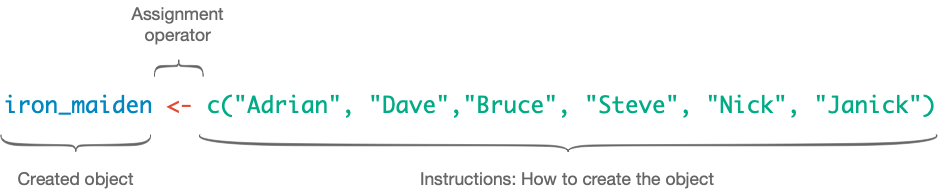
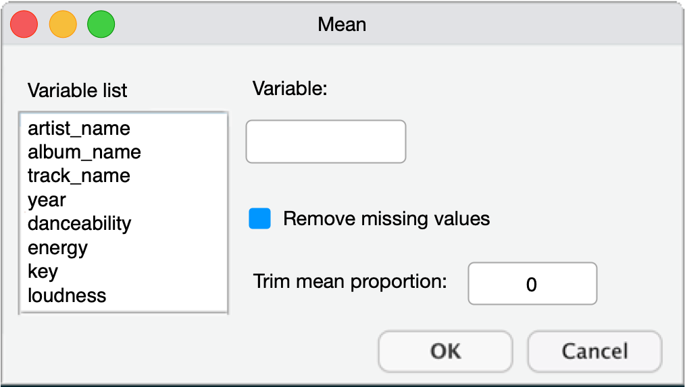
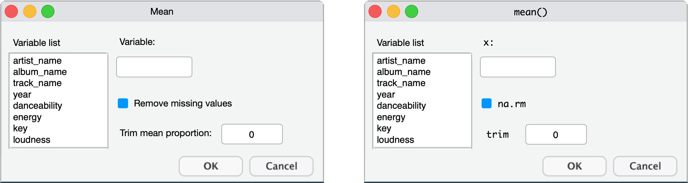
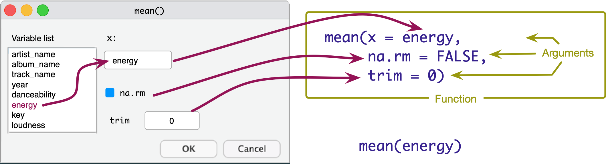
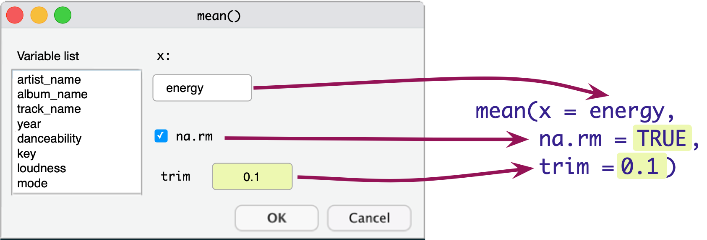
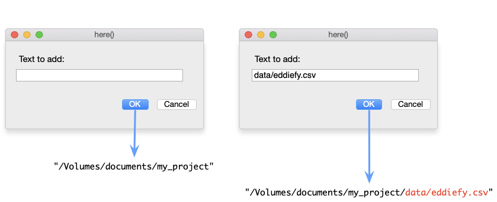
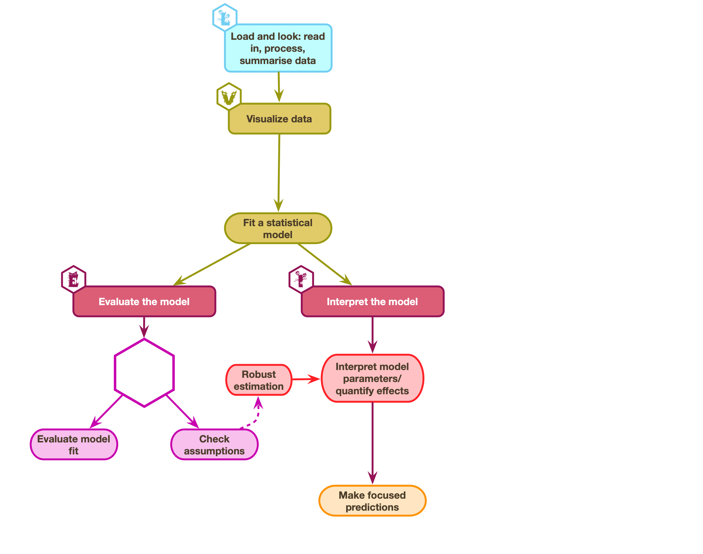
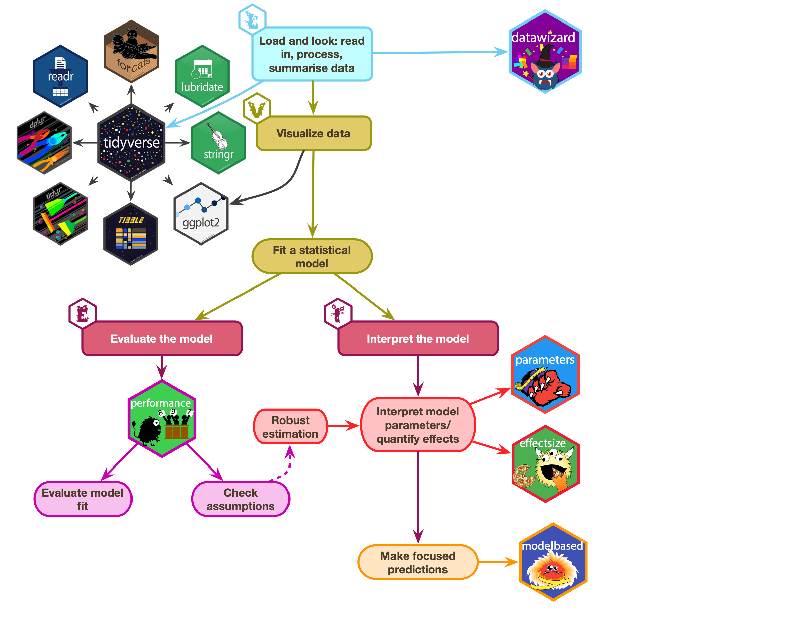
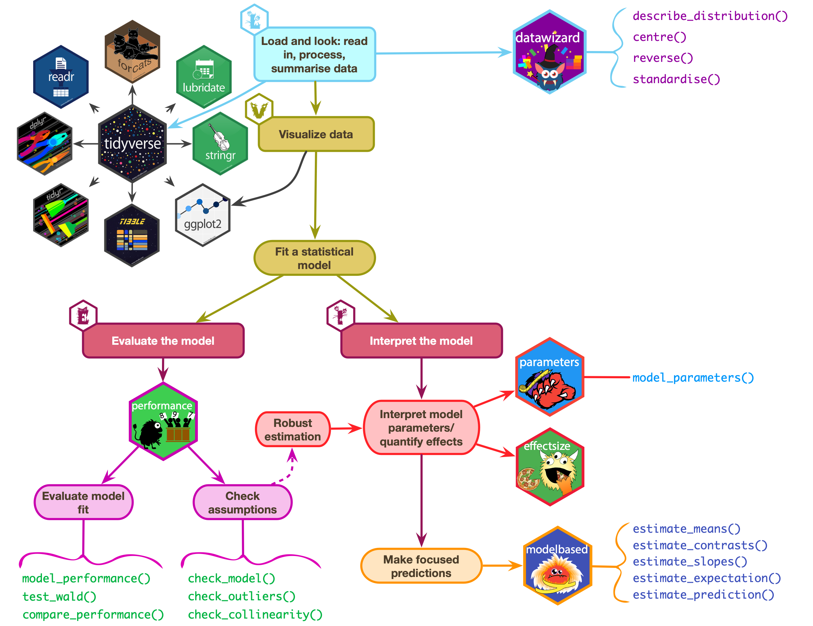

```{r}
#| echo: false

# general
library(easystats)
library(tidyverse)
# specific
# remotes::install_github("hadley/emo")
library(DT)
library(emo)

source("../helpers/discovr_helpers.R")
source("../helpers/easystats_helpers.R")
```

# Packages and Functions

## Functions

- We use functions to do things
  - Inputs: What we put into the function
  - Outputs: what we get out of the function
- Functions look like this (prints the output)

::: txt_xl 
```{r}
#| eval: false

name_of_function(inputs/arguments/options)
```
:::


::: txt_xl 
::: {.callout-tip icon = false}
## `r robot()` Have a go!

- In a code chunk execute 

```{r}
#| eval: false

randomNames(n = 5)
```

:::
:::

{.absolute bottom=150 right=0 height="200"}

##  Packages

- We can't use `randomNames()` because we haven't installed the package from which it comes!
- Installing a package gives you access to functions within it

{fig-align="center"}

##  Installing and loading packages 

- You need to install the package into `r rproj()`'s repository of packages on your computer.
- Every time you update or re-install `r rproj()` you need to re-install packages to use them.

::: txt_xl
```{r}
#| eval: false
install.packages("package_name")
```
:::


::: {.callout-tip icon = false}
## `r cat_space()`: Tip

- **Do NOT include ``install.packages()`` in `r quarto(0.2)` files** or the package will be installed every time you render the document!
    - Use the console and command line to execute `install.packages()` commands

:::


::: fragment
::: {.callout-tip icon = false}
## `r robot()` Have a go!

- Install the package `randomNames` from which the function `randomNames()` comes.

:::txt_xl
```{r}
#| eval: false

install.packages("randomNames")
```
:::

In your code chunk execute: 

:::txt_xl
```{r}
#| eval: false

randomNames(n = 5)
```
:::
:::

{.absolute bottom=100 right=0 height="200"}
:::


## Loading packages

- That also didn't work `r emo::ji("thinking")`
- To use a particular package in a current session you need to load it from the repository on your machine

:::: columns 
::: {.column width="50%"}
::: fragment
### Concise code

- Load packages at the start of your document using `library()`.

::: txt_xl

```{r}
#| eval: false

library(randomNames)
randomNames()
```
:::

- Problematic for function name clashes
- Easy to load packages you don't actually use

:::
:::

::: {.column width="50%"}
::: fragment
### Explicit code

- Refer to functions using the `package::function()` format.

:::txt_xl
```{r}
#| eval: false
randomNames::randomNames()
```
:::

- Problematic for some packages (e.g. `dplyr`, `ggplot2`)
- Less readable
- Longer to type!

:::
:::
::::

## Which to use

I use a mix:

- Concise code for umbrella packages that we (nearly) always use
  - [easystats]{.pkg}, which includes `datawizard`, `effectsize`, `modelbased`, `parameters`, `performance` ...
  - [tidyverse]{.pkg}, which includes `dplyr`, `ggplot2`, `readr`, `stringr`, `tibble`, `tidyr` ... 

- Explicit code style for other packages
  - Helps to remember from where functions come

## Referencing packages
### Concise code style

:::: {.callout-tip icon = false}
## `r robot()` Have a go!

- In your setup code chunk

::: txt_xl
```{r}
#| eval: false

library(easystats)
library(tidyverse)
library(randomNames)
```
:::

- When you use the function:

::: txt_xl
```{r}
#| eval: false

randomNames(n = 5)
```
:::
::::

{.absolute bottom=100 right=0 height="200"}

::::: fragment

### Explicit code style

:::: {.callout-tip icon = false}
## `r robot()` Have a go!

- In your setup code chunk

::: txt_xl
```{r}
#| eval: false

library(easystats)
library(tidyverse)
```
:::

- When you use the function 

::: txt_xl
```{r}
#| eval: false

randomNames::randomNames(n = 5)
```
:::
::::
:::::

# Creating objects in `r rproj()`

##  Creating objects 

\




## The eddiefy data `r ji("zombie")`

::: txt_xl 
```{r}
#| echo: true

eddie_tib <- discovr::eddiefy
```
:::

::: txt_s
```{r}
#| echo: false
datatable(data = eddie_tib ,
          colnames = c('ID' = 1),
          caption = 'Table 1: Spotify data for Iron Maiden',
          extensions = 'Scroller', # to enable scrolling
          options = list(
            dom = 't', # table only displayed
            scrollY = 400,
            scroller = TRUE,
            columnDefs = list(
              list(className = 'dt-center', targets = 1:3)
              ),
            pageLength = 7)
          )
```
:::

## Accessing variables (`$`)

:::txt_xl
```{r}
#| echo: true
#| eval: false

tibble$variable
```
:::

\

::: fragment
```{r}

eddie_tib$energy
```
:::

# Functions
## {background-image="media/function_as_bakery.png" background-size="cover"}


## What are functions?

- We use functions to do things
- [Inputs]{.alt}: what we put into the function
- [Outputs]{.alt}: what we get out of the function
  - A dataframe or tibble
  - One or more values
  - A statistical model
  - A plot
  - A table
  - Multiple things
- Functions look like this (prints the output)

::: txt_xl 
```{r}
#| echo: true
#| eval: false

name_of_function(inputs/arguments/options)
```
:::

- We can use `<-` to store the outputs

::: txt_xl 
```{r}
#| echo: true
#| eval: false

stuff_I_want_to_store <- name_of_function(inputs/arguments/options)
```
:::

## Functions as dialog boxes

::: txt_xl 
```{r}
#| echo: true
#| eval: false

the_mean <- mean(x = name_of_variable, na.rm = FALSE, trim = 0)
```
:::

::: center-h
::: txt_mulberry
Arguments are like inputs in a dialog box
:::
:::

{fig-align="center" height=288}

## The `mean()` function if it were a dialog box

{fig-align="center"}

## The `mean()` function if it were a dialog box

{fig-align="center"}


## The `mean()` function if it were a dialog box

{fig-align="center"}

## Accessing variables (`$`)

:::txt_xl
```{r}
#| echo: true
#| eval: false

tibble$variable
```
:::

\

::: fragment
```{r}

eddie_tib$energy
```
:::

## Have a go!

::: {.callout-tip icon = false}
## `r robot()` Have a go!

- In a code chunk execute 

::: txt_xl
```{r}
#| echo: true
#| eval: false

mean(x = eddie_tib$energy, na.rm = FALSE, trim = 0)
mean(x = eddie_tib$energy)
mean(x = eddie_tib$energy, trim = 0.2)
```
:::
:::

## Storing results

- Sometimes we want to store the results to use later
- We can do this using the assignment operator (`<-`)

::: {.callout-tip icon = false}
## `r robot()` Have a go!

{.absolute top=0 right=0 height="200"}

- In a code chunk type the code below
- Click {height=18} to execute the code in the code chunk.

:::txt_xl
```{r}
#| echo: true
#| eval: false
mean_energy <- mean(eddie_tib$energy)
mean_energy
```
:::
:::

# Using functions and the pipe operator, `|>`

## The eddiefy data `r ji("zombie")`

::: txt_xl 
```{r}
#| echo: true

eddie_tib <- discovr::eddiefy
```
:::

::: txt_s
```{r}
#| echo: false
datatable(data = eddie_tib ,
          colnames = c('ID' = 1),
          caption = 'Table 1: Spotify data for Iron Maiden',
          extensions = 'Scroller', # to enable scrolling
          options = list(
            dom = 't', # table only displayed
            scrollY = 400,
            scroller = TRUE,
            columnDefs = list(
              list(className = 'dt-center', targets = 1:3)
              ),
            pageLength = 7)
          )
```
:::

## Using functions

Let's say we want to

- Retain only the variables `album_name`, `track_name`, `year` and `energy`
- Retain only albums before the year 1990

We can use the [dplyr]{.pkg} functions

- `select()` to choose variables
- `filter()` to retain rows that match a condition

:::txt_xl
```{r}
energy_tib <-  select(.data = eddie_tib, album_name, track_name, year, energy)
classic_tib <- filter(.data = energy_tib, year < 1990)
```
:::

:::: fragment
::: txt_s
```{r}
#| echo: false
datatable(data = classic_tib ,
          colnames = c('ID' = 1),
          extensions = 'Scroller', # to enable scrolling
          options = list(
            dom = 't', # table only displayed
            scrollY = 200,
            scroller = TRUE,
            columnDefs = list(
              list(className = 'dt-center', targets = 1:3)
              ),
            pageLength = 3)
)
```
:::
::::

##  The pipe operator (`|>`)^[Older code uses `%>%`, treat the two pipe symbols as interchangeable]

{fig-align="center" height="450px"}

::: txt_l
```{r}
#| eval: false

eddie_tib |> 
  select(album_name, track_name, year, energy) |> 
  filter(year < 1990)
```

:::


## Try your first pipe 


::: {.callout-tip icon = false}
## `r robot()` Have a go!

{.absolute top=0 right=0 height="200"}

- The pipe operator allows you to combine functions
- Makes code more readable
- Create a new code chunk

:::txt_xl
```{r}
#| echo: true
#| eval: false

energy_tib <- eddie_tib |> 
  select(album_name, track_name, year, energy) |> 
  filter(year < 1990)
```
:::
:::

# Getting data into `r rproj()`
## Reading a CSV file into `r rproj()`

We use two functions:

- `here()` from the [here]{.pkg} package
  - Gets the location of the CSV file on your computer
- `read_csv()` from the [readr]{.pkg} package, which is part of [tidyverse]{.pkg}
  - Imports the CSV file into `r rproj()`
- We connect them with the pipe (`|>`)


## Getting data into `r rproj()`
### The `here()` function

::: txt_xl 
```{r}
#| echo: true
#| eval: false

here::here(text_to_add)
```
:::

\

{fig-align="center" height=288}

:::: fragment

### The `readr` package

- The `read_csv(file = "filepath")` function reads CSV files.

::::

## Getting data into `r rproj()`


::: {.callout-tip icon = false}
## `r robot()` Have a go!

- In your code chunk execute 

:::txt_xl
```{r}
#| echo: true
#| eval: false
eddie_tib <- here::here("data/eddiefy.csv") |> 
  read_csv()

eddie_tib
```
:::
:::

{.absolute top=0 right=0 height="200"}

:::: fragment
::: txt_s
```{r}
#| echo: false
datatable(data = eddie_tib ,
          colnames = c('ID' = 1),
          extensions = 'Scroller', # to enable scrolling
          options = list(
            dom = 't', # table only displayed
            scrollY = 350,
            scroller = TRUE,
            columnDefs = list(
              list(className = 'dt-center', targets = 1:3)
              ),
            pageLength = 3)
)
```
:::
::::


# Statistics is [E.V.I.L.]{.pkg}

## The process of [E.V.I.L.]{.ong_bold}

{fig-align="center"}


## The process of [E.V.I.L.]{.ong_bold}


::: {.callout-important icon = false}
##  [L]{.ong_bold}oad and [L]{.ong_bold}ook 

- [L]{.ong_bold}oad: Get the data into `r rproj()`
- [L]{.ong_bold}oad: Process data
- [L]{.ong_bold}ook: Summarize variables

:::

{.absolute top=100 left=800 height="80"}


:::: fragment
::: {.callout-caution icon = false}
##  [V]{.ong_bold}isualise

- Plot relevant information to understand the data/model/assumptions

:::
{.absolute top=205 left=800 height="80"}
:::

:::: fragment
::: {.callout-warning icon = false}
##  [E]{.ong_bold}valuate

- Fit the model
- Is the model any good?
- Are its assumptions met?
- Does it 'fit' the data?

:::
{.absolute top=360 left=800 height="80"}
:::

:::: fragment
::: {.callout-warning icon = false}
##  [I]{.ong_bold}nterpret

- Use the model to answer your research question
- Interpret parameter estimates, their confidence intervals, 
and associated *p*-values 

:::

{.absolute top=510 left=800 height="80"}
:::


## The process of [E.V.I.L.]{.ong_bold}

::: {.callout-warning icon = false}
##  [E]{.ong_bold}valuate

- Fit the model
- Is the model any good?
- Are its assumptions met?
- Does it 'fit' the data?

:::
{.absolute top=115 left=800 height="80"}


:::: fragment
::: {.callout-caution icon = false}
##  [V]{.ong_bold}isualise

- Plot relevant information to understand the data/model/assumptions

:::
{.absolute top=235 left=800 height="80"}
:::

:::: fragment
::: {.callout-warning icon = false}
##  [I]{.ong_bold}nterpret

- Use the model to answer your research question
- Interpret parameter estimates, their confidence intervals, 
and associated *p*-values 

:::

{.absolute top=350 left=800 height="80"}
:::

:::: fragment
::: {.callout-important icon = false}
##  [L]{.ong_bold}oad and [L]{.ong_bold}ook 

- [L]{.ong_bold}oad: Get the data into `r rproj()`
- [L]{.ong_bold}oad: Process data
- [L]{.ong_bold}ook: Summarize variables

:::

{.absolute top=500 left=800 height="80"}
::::


## The eddiefy data `r ji("zombie")`

::: txt_xl 
```{r}
#| echo: true

eddie_tib <- discovr::eddiefy
```
:::

::: txt_s
```{r}
#| echo: false
datatable(data = eddie_tib ,
          colnames = c('ID' = 1),
          caption = 'Table 1: Spotify data for Iron Maiden',
          extensions = 'Scroller', # to enable scrolling
          options = list(
            dom = 't', # table only displayed
            scrollY = 400,
            scroller = TRUE,
            columnDefs = list(
              list(className = 'dt-center', targets = 1:3)
              ),
            pageLength = 7)
          )
```
:::

## The process of [E.V.I.L.]{.ong_bold}

::: {.callout-caution icon = false}
##  Think about it!

**Hypothesis**

- H~1~: Iron Maiden songs have got longer over time
- H~0~: The length of Iron Maiden songs has not changed over time

**The model**

- Outcome: Song duration in seconds (`song_duration`)
- Predictor: Number of years since the first album (`band_age`)

:::

::: fragment

### [L]{.txt_ong}oad and [L]{.txt_ong}ook

\ 

```{r}
#| echo: false

eddie_tib <- eddie_tib |> 
  mutate(song_duration = song_ms/1000,
         band_age = year - 1980)

eddie_tib |> 
  describe_distribution(select = c(band_age, song_duration)) |> 
  data_remove("n_Missing") |> 
  display()
```

{.absolute top=350 left=800 height="80"}

:::


## 
### [V]{.txt_ong}isualize

```{r}
#| echo: false
#| fig-width: 9
#| fig-height: 6

eddie_tib |> 
  select(band_age, song_duration) |> 
  GGally::ggscatmat()
```

{.absolute top=0 left=800 height="80"}


## 
### [E]{.txt_ong}valuate assumptions

```{r}
#| echo: false
#| message: false
#| warning: false
#| fig-width: 9
#| fig-height: 6

eddie_lm <- lm(song_duration ~ band_age, data = eddie_tib)
check_model(eddie_lm)
```

{.absolute top=0 left=800 height="80"}

## 
### [E]{.txt_ong}valuate fit

\

```{r}
#| echo: false

model_performance(eddie_lm) |> 
  display()
```

{.absolute top=0 left=800 height="80"}

\

::: fragment
### [I]{.txt_ong}nterpret parameter estimates, CIs and tests

```{r}
#| echo: false

model_parameters(eddie_lm) |> 
  display()
```

{.absolute top=200 left=800 height="80"}

:::

## The process of [E.V.I.L.]{.ong_bold} in `r rproj()`

{fig-align="center"}

## The process of [E.V.I.L.]{.ong_bold} in `r rproj()`

{fig-align="center"}

## The process of [E.V.I.L.]{.ong_bold} in `r rproj()`

{fig-align="center"}

